# 📐 Activity Diagram Lengkap — Sistem Informasi Akademik (Part 1)

> Activity Diagram untuk modul: **Super Admin**, **Tata Usaha**, dan **Guru**.

---

## 1. Super Admin

### 1.1 Login & Redirect berdasarkan Role

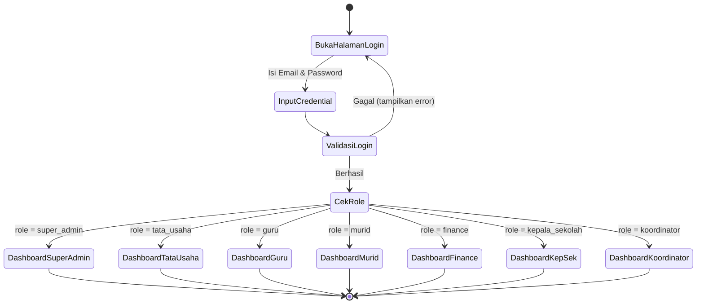
```mermaid
stateDiagram-v2
    [*] --> BukaHalamanLogin
    BukaHalamanLogin --> InputCredential: Isi Email & Password
    InputCredential --> ValidasiLogin
    ValidasiLogin --> CekRole: Berhasil
    ValidasiLogin --> BukaHalamanLogin: Gagal (tampilkan error)
    CekRole --> DashboardSuperAdmin: role = super_admin
    CekRole --> DashboardTataUsaha: role = tata_usaha
    CekRole --> DashboardGuru: role = guru
    CekRole --> DashboardMurid: role = murid
    CekRole --> DashboardFinance: role = finance
    CekRole --> DashboardKepSek: role = kepala_sekolah
    CekRole --> DashboardKoordinator: role = koordinator
    DashboardSuperAdmin --> [*]
    DashboardTataUsaha --> [*]
    DashboardGuru --> [*]
    DashboardMurid --> [*]
    DashboardFinance --> [*]
    DashboardKepSek --> [*]
    DashboardKoordinator --> [*]
```

---

### 1.2 Manajemen User (CRUD)

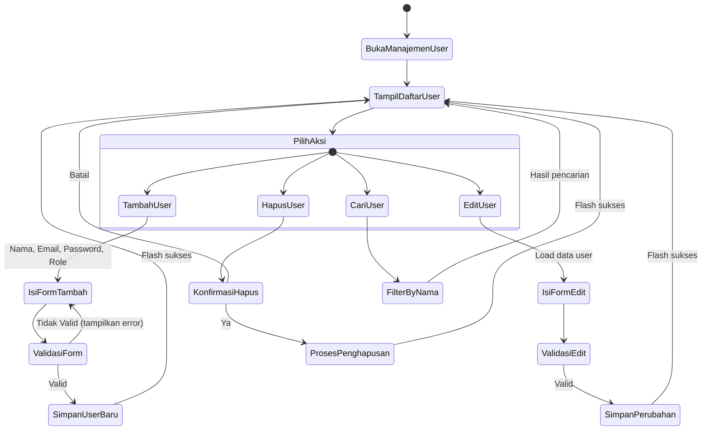
```mermaid
stateDiagram-v2
    [*] --> BukaManajemenUser
    BukaManajemenUser --> TampilDaftarUser
    TampilDaftarUser --> PilihAksi

    state PilihAksi {
        [*] --> TambahUser
        [*] --> EditUser
        [*] --> HapusUser
        [*] --> CariUser
    }

    TambahUser --> IsiFormTambah: Nama, Email, Password, Role
    IsiFormTambah --> ValidasiForm
    ValidasiForm --> SimpanUserBaru: Valid
    ValidasiForm --> IsiFormTambah: Tidak Valid (tampilkan error)
    SimpanUserBaru --> TampilDaftarUser: Flash sukses

    EditUser --> IsiFormEdit: Load data user
    IsiFormEdit --> ValidasiEdit
    ValidasiEdit --> SimpanPerubahan: Valid
    SimpanPerubahan --> TampilDaftarUser: Flash sukses

    HapusUser --> KonfirmasiHapus
    KonfirmasiHapus --> ProsesPenghapusan: Ya
    KonfirmasiHapus --> TampilDaftarUser: Batal
    ProsesPenghapusan --> TampilDaftarUser: Flash sukses

    CariUser --> FilterByNama
    FilterByNama --> TampilDaftarUser: Hasil pencarian
```

---

### 1.3 Manajemen Siswa

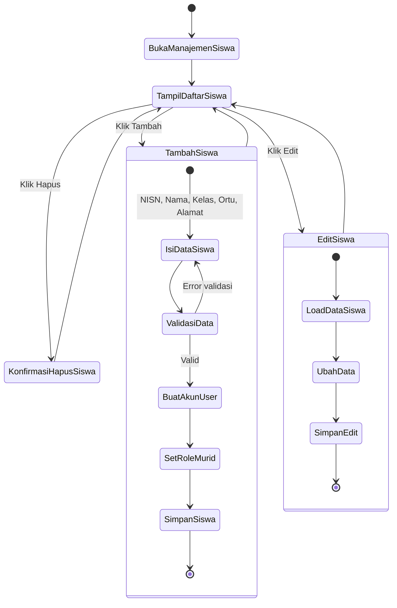
```mermaid
stateDiagram-v2
    [*] --> BukaManajemenSiswa
    BukaManajemenSiswa --> TampilDaftarSiswa

    state TambahSiswa {
        [*] --> IsiDataSiswa: NISN, Nama, Kelas, Ortu, Alamat
        IsiDataSiswa --> ValidasiData
        ValidasiData --> BuatAkunUser: Valid
        ValidasiData --> IsiDataSiswa: Error validasi
        BuatAkunUser --> SetRoleMurid
        SetRoleMurid --> SimpanSiswa
        SimpanSiswa --> [*]
    }

    state EditSiswa {
        [*] --> LoadDataSiswa
        LoadDataSiswa --> UbahData
        UbahData --> SimpanEdit
        SimpanEdit --> [*]
    }

    TampilDaftarSiswa --> TambahSiswa: Klik Tambah
    TampilDaftarSiswa --> EditSiswa: Klik Edit
    TampilDaftarSiswa --> KonfirmasiHapusSiswa: Klik Hapus
    KonfirmasiHapusSiswa --> TampilDaftarSiswa

    TambahSiswa --> TampilDaftarSiswa
    EditSiswa --> TampilDaftarSiswa
```

---

### 1.4 Manajemen Guru

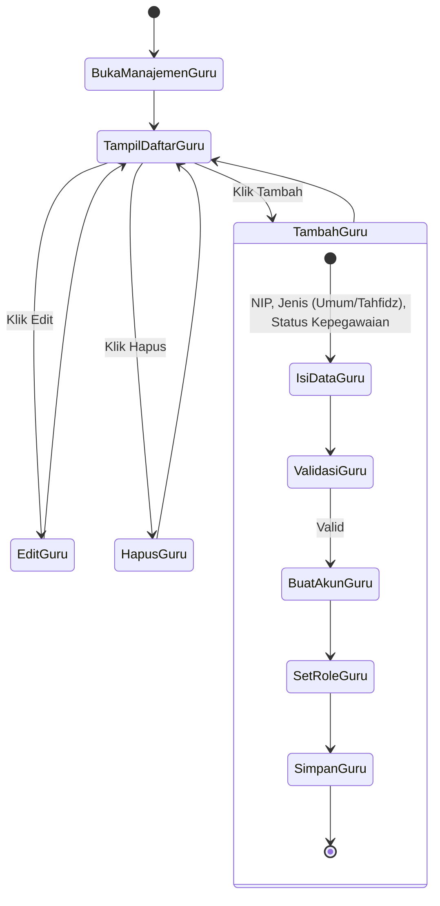
```mermaid
stateDiagram-v2
    [*] --> BukaManajemenGuru
    BukaManajemenGuru --> TampilDaftarGuru

    state TambahGuru {
        [*] --> IsiDataGuru: NIP, Jenis (Umum/Tahfidz), Status Kepegawaian
        IsiDataGuru --> ValidasiGuru
        ValidasiGuru --> BuatAkunGuru: Valid
        BuatAkunGuru --> SetRoleGuru
        SetRoleGuru --> SimpanGuru
        SimpanGuru --> [*]
    }

    TampilDaftarGuru --> TambahGuru: Klik Tambah
    TampilDaftarGuru --> EditGuru: Klik Edit
    TampilDaftarGuru --> HapusGuru: Klik Hapus
    TambahGuru --> TampilDaftarGuru
    EditGuru --> TampilDaftarGuru
    HapusGuru --> TampilDaftarGuru
```

---

### 1.5 Manajemen Kelas

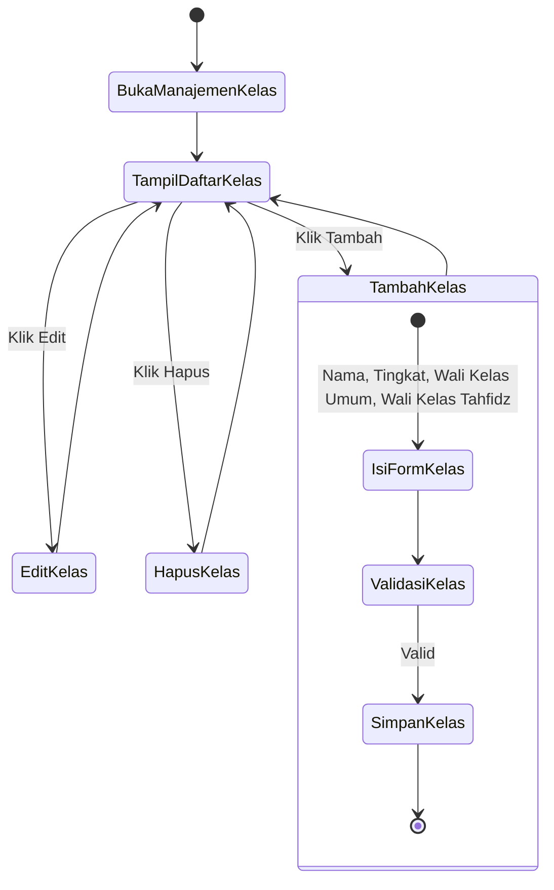
```mermaid
stateDiagram-v2
    [*] --> BukaManajemenKelas
    BukaManajemenKelas --> TampilDaftarKelas

    state TambahKelas {
        [*] --> IsiFormKelas: Nama, Tingkat, Wali Kelas Umum, Wali Kelas Tahfidz
        IsiFormKelas --> ValidasiKelas
        ValidasiKelas --> SimpanKelas: Valid
        SimpanKelas --> [*]
    }

    TampilDaftarKelas --> TambahKelas: Klik Tambah
    TampilDaftarKelas --> EditKelas: Klik Edit
    TampilDaftarKelas --> HapusKelas: Klik Hapus
    TambahKelas --> TampilDaftarKelas
    EditKelas --> TampilDaftarKelas
    HapusKelas --> TampilDaftarKelas
```

---

### 1.6 Manajemen Jadwal Pelajaran

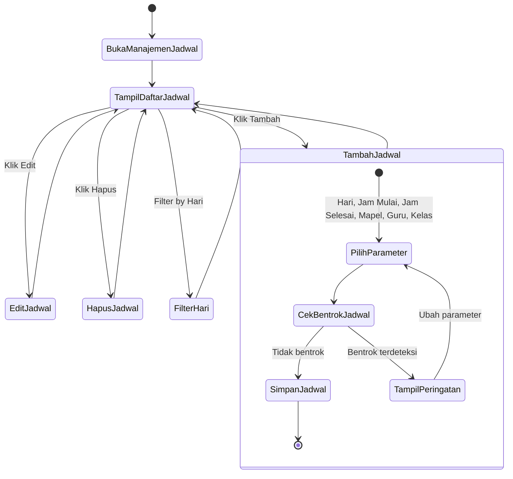
```mermaid
stateDiagram-v2
    [*] --> BukaManajemenJadwal
    BukaManajemenJadwal --> TampilDaftarJadwal

    state TambahJadwal {
        [*] --> PilihParameter: Hari, Jam Mulai, Jam Selesai, Mapel, Guru, Kelas
        PilihParameter --> CekBentrokJadwal
        CekBentrokJadwal --> SimpanJadwal: Tidak bentrok
        CekBentrokJadwal --> TampilPeringatan: Bentrok terdeteksi
        TampilPeringatan --> PilihParameter: Ubah parameter
        SimpanJadwal --> [*]
    }

    TampilDaftarJadwal --> TambahJadwal: Klik Tambah
    TampilDaftarJadwal --> EditJadwal: Klik Edit
    TampilDaftarJadwal --> HapusJadwal: Klik Hapus
    TampilDaftarJadwal --> FilterHari: Filter by Hari
    TambahJadwal --> TampilDaftarJadwal
    EditJadwal --> TampilDaftarJadwal
    HapusJadwal --> TampilDaftarJadwal
    FilterHari --> TampilDaftarJadwal
```

---

### 1.7 Manajemen Mata Pelajaran

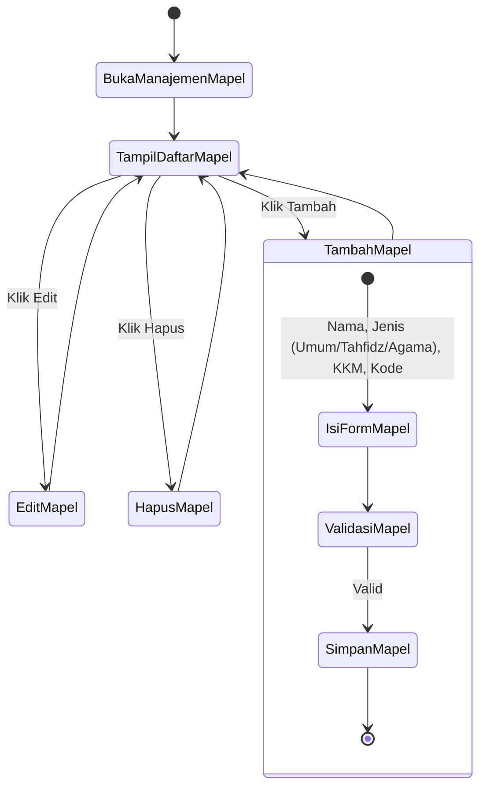
```mermaid
stateDiagram-v2
    [*] --> BukaManajemenMapel
    BukaManajemenMapel --> TampilDaftarMapel

    state TambahMapel {
        [*] --> IsiFormMapel: Nama, Jenis (Umum/Tahfidz/Agama), KKM, Kode
        IsiFormMapel --> ValidasiMapel
        ValidasiMapel --> SimpanMapel: Valid
        SimpanMapel --> [*]
    }

    TampilDaftarMapel --> TambahMapel: Klik Tambah
    TampilDaftarMapel --> EditMapel: Klik Edit
    TampilDaftarMapel --> HapusMapel: Klik Hapus
    TambahMapel --> TampilDaftarMapel
    EditMapel --> TampilDaftarMapel
    HapusMapel --> TampilDaftarMapel
```

---

### 1.8 Manajemen Komponen Nilai

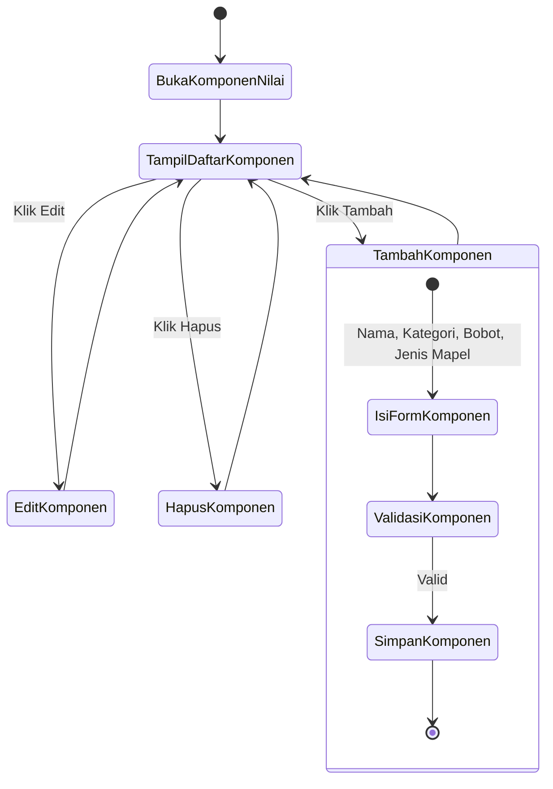
```mermaid
stateDiagram-v2
    [*] --> BukaKomponenNilai
    BukaKomponenNilai --> TampilDaftarKomponen

    state TambahKomponen {
        [*] --> IsiFormKomponen: Nama, Kategori, Bobot, Jenis Mapel
        IsiFormKomponen --> ValidasiKomponen
        ValidasiKomponen --> SimpanKomponen: Valid
        SimpanKomponen --> [*]
    }

    TampilDaftarKomponen --> TambahKomponen: Klik Tambah
    TampilDaftarKomponen --> EditKomponen: Klik Edit
    TampilDaftarKomponen --> HapusKomponen: Klik Hapus
    TambahKomponen --> TampilDaftarKomponen
    EditKomponen --> TampilDaftarKomponen
    HapusKomponen --> TampilDaftarKomponen
```

---

### 1.9 Audit Log

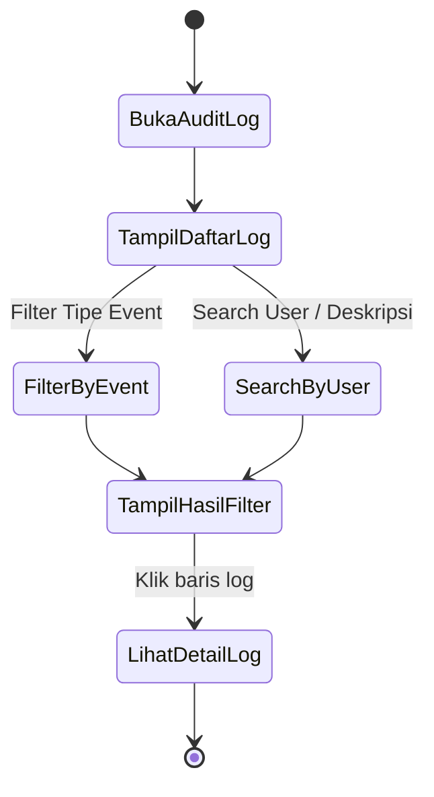
```mermaid
stateDiagram-v2
    [*] --> BukaAuditLog
    BukaAuditLog --> TampilDaftarLog
    TampilDaftarLog --> FilterByEvent: Filter Tipe Event
    TampilDaftarLog --> SearchByUser: Search User / Deskripsi
    FilterByEvent --> TampilHasilFilter
    SearchByUser --> TampilHasilFilter
    TampilHasilFilter --> LihatDetailLog: Klik baris log
    LihatDetailLog --> [*]
```

---

### 1.10 Pengaturan Sistem & TTD Elektronik

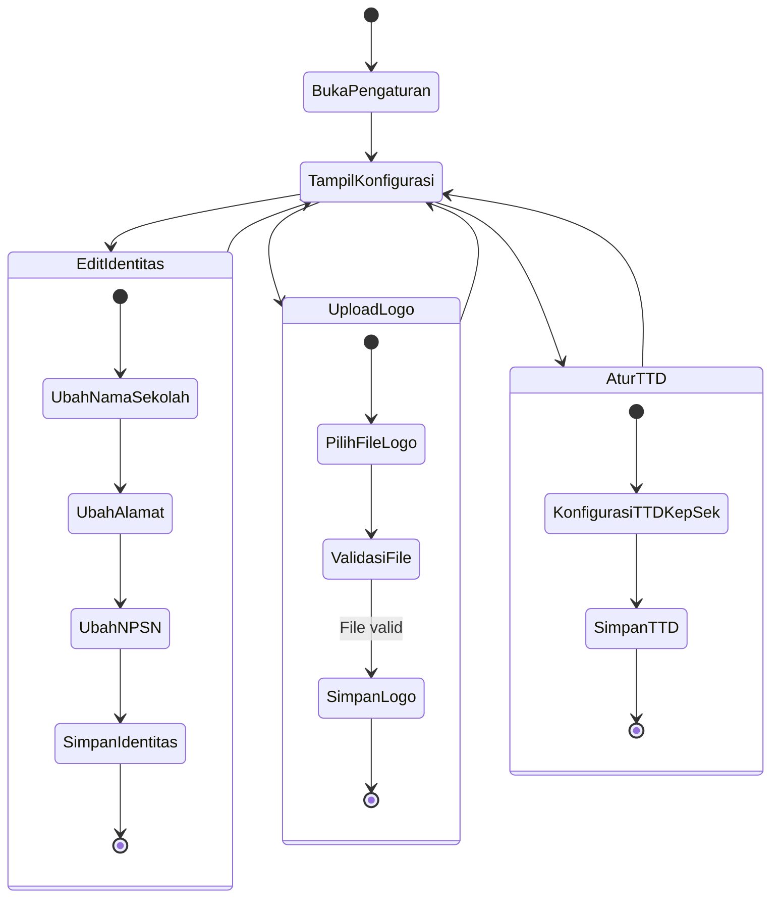
```mermaid
stateDiagram-v2
    [*] --> BukaPengaturan
    BukaPengaturan --> TampilKonfigurasi

    state EditIdentitas {
        [*] --> UbahNamaSekolah
        UbahNamaSekolah --> UbahAlamat
        UbahAlamat --> UbahNPSN
        UbahNPSN --> SimpanIdentitas
        SimpanIdentitas --> [*]
    }

    state UploadLogo {
        [*] --> PilihFileLogo
        PilihFileLogo --> ValidasiFile
        ValidasiFile --> SimpanLogo: File valid
        SimpanLogo --> [*]
    }

    state AturTTD {
        [*] --> KonfigurasiTTDKepSek
        KonfigurasiTTDKepSek --> SimpanTTD
        SimpanTTD --> [*]
    }

    TampilKonfigurasi --> EditIdentitas
    TampilKonfigurasi --> UploadLogo
    TampilKonfigurasi --> AturTTD
    EditIdentitas --> TampilKonfigurasi
    UploadLogo --> TampilKonfigurasi
    AturTTD --> TampilKonfigurasi
```

---

## 2. Tata Usaha

### 2.1 Manajemen Karyawan Non-Guru

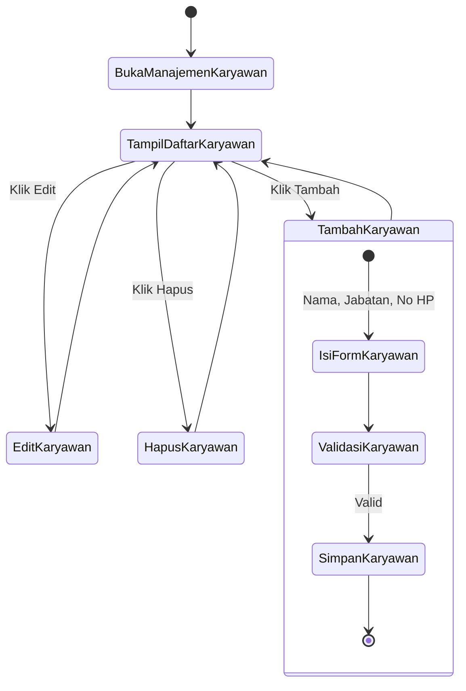
```mermaid
stateDiagram-v2
    [*] --> BukaManajemenKaryawan
    BukaManajemenKaryawan --> TampilDaftarKaryawan

    state TambahKaryawan {
        [*] --> IsiFormKaryawan: Nama, Jabatan, No HP
        IsiFormKaryawan --> ValidasiKaryawan
        ValidasiKaryawan --> SimpanKaryawan: Valid
        SimpanKaryawan --> [*]
    }

    TampilDaftarKaryawan --> TambahKaryawan: Klik Tambah
    TampilDaftarKaryawan --> EditKaryawan: Klik Edit
    TampilDaftarKaryawan --> HapusKaryawan: Klik Hapus
    TambahKaryawan --> TampilDaftarKaryawan
    EditKaryawan --> TampilDaftarKaryawan
    HapusKaryawan --> TampilDaftarKaryawan
```

---

### 2.2 Manajemen Piket Guru

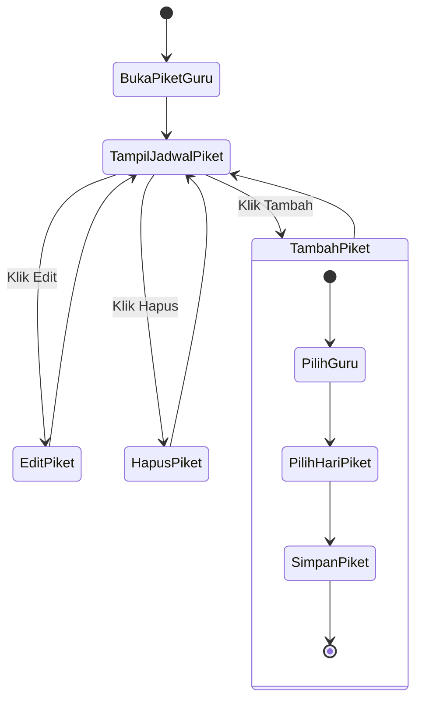
```mermaid
stateDiagram-v2
    [*] --> BukaPiketGuru
    BukaPiketGuru --> TampilJadwalPiket

    state TambahPiket {
        [*] --> PilihGuru
        PilihGuru --> PilihHariPiket
        PilihHariPiket --> SimpanPiket
        SimpanPiket --> [*]
    }

    TampilJadwalPiket --> TambahPiket: Klik Tambah
    TampilJadwalPiket --> EditPiket: Klik Edit
    TampilJadwalPiket --> HapusPiket: Klik Hapus
    TambahPiket --> TampilJadwalPiket
    EditPiket --> TampilJadwalPiket
    HapusPiket --> TampilJadwalPiket
```

---

### 2.3 Kalender Akademik

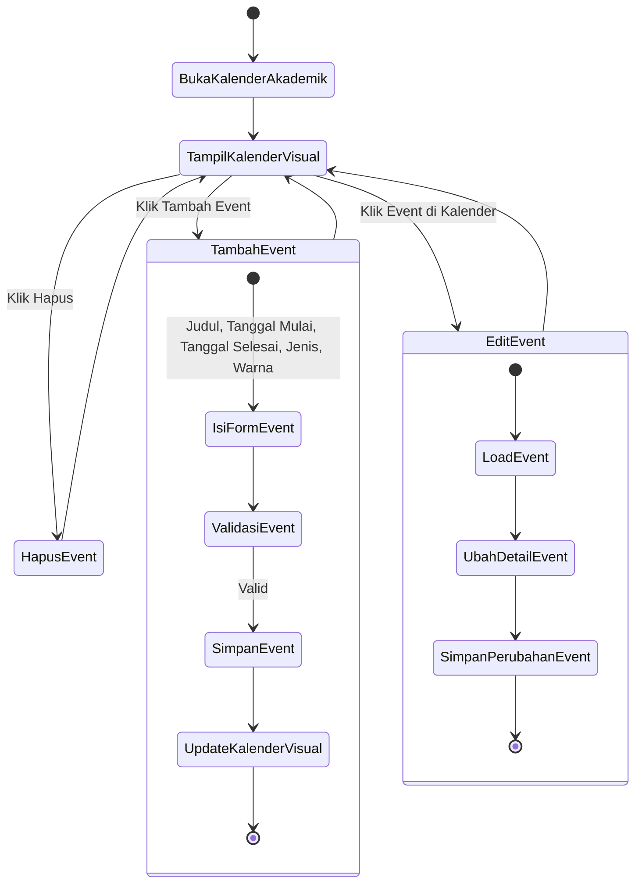
```mermaid
stateDiagram-v2
    [*] --> BukaKalenderAkademik
    BukaKalenderAkademik --> TampilKalenderVisual

    state TambahEvent {
        [*] --> IsiFormEvent: Judul, Tanggal Mulai, Tanggal Selesai, Jenis, Warna
        IsiFormEvent --> ValidasiEvent
        ValidasiEvent --> SimpanEvent: Valid
        SimpanEvent --> UpdateKalenderVisual
        UpdateKalenderVisual --> [*]
    }

    state EditEvent {
        [*] --> LoadEvent
        LoadEvent --> UbahDetailEvent
        UbahDetailEvent --> SimpanPerubahanEvent
        SimpanPerubahanEvent --> [*]
    }

    TampilKalenderVisual --> TambahEvent: Klik Tambah Event
    TampilKalenderVisual --> EditEvent: Klik Event di Kalender
    TampilKalenderVisual --> HapusEvent: Klik Hapus
    TambahEvent --> TampilKalenderVisual
    EditEvent --> TampilKalenderVisual
    HapusEvent --> TampilKalenderVisual
```

---

### 2.4 Proses Kenaikan Kelas & Kelulusan Massal

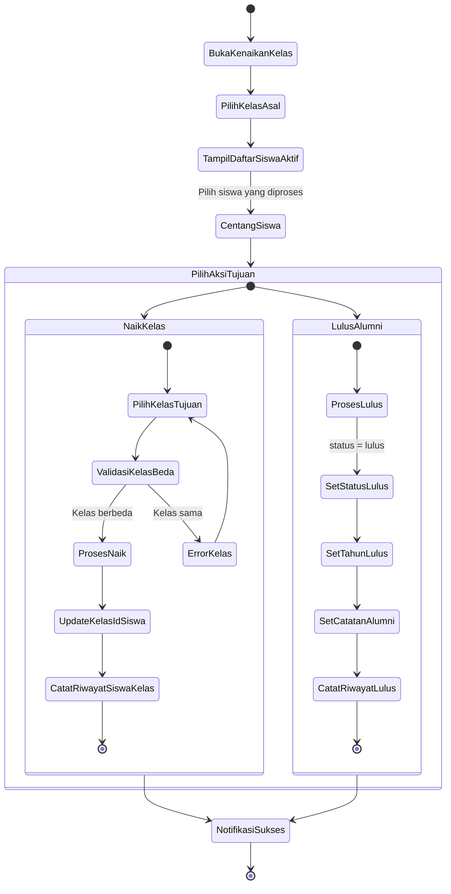
```mermaid
stateDiagram-v2
    [*] --> BukaKenaikanKelas
    BukaKenaikanKelas --> PilihKelasAsal
    PilihKelasAsal --> TampilDaftarSiswaAktif
    TampilDaftarSiswaAktif --> CentangSiswa: Pilih siswa yang diproses
    CentangSiswa --> PilihAksiTujuan

    state PilihAksiTujuan {
        [*] --> NaikKelas
        [*] --> LulusAlumni
    }

    state NaikKelas {
        [*] --> PilihKelasTujuan
        PilihKelasTujuan --> ValidasiKelasBeda
        ValidasiKelasBeda --> ProsesNaik: Kelas berbeda
        ValidasiKelasBeda --> ErrorKelas: Kelas sama
        ErrorKelas --> PilihKelasTujuan
        ProsesNaik --> UpdateKelasIdSiswa
        UpdateKelasIdSiswa --> CatatRiwayatSiswaKelas
        CatatRiwayatSiswaKelas --> [*]
    }

    state LulusAlumni {
        [*] --> ProsesLulus
        ProsesLulus --> SetStatusLulus: status = lulus
        SetStatusLulus --> SetTahunLulus
        SetTahunLulus --> SetCatatanAlumni
        SetCatatanAlumni --> CatatRiwayatLulus
        CatatRiwayatLulus --> [*]
    }

    NaikKelas --> NotifikasiSukses
    LulusAlumni --> NotifikasiSukses
    NotifikasiSukses --> [*]
```

---

### 2.5 Rekap Absensi Siswa & Ekspor PDF

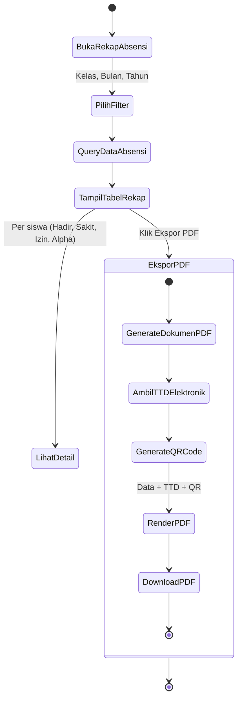
```mermaid
stateDiagram-v2
    [*] --> BukaRekapAbsensi
    BukaRekapAbsensi --> PilihFilter: Kelas, Bulan, Tahun
    PilihFilter --> QueryDataAbsensi
    QueryDataAbsensi --> TampilTabelRekap
    TampilTabelRekap --> LihatDetail: Per siswa (Hadir, Sakit, Izin, Alpha)

    state EksporPDF {
        [*] --> GenerateDokumenPDF
        GenerateDokumenPDF --> AmbilTTDElektronik
        AmbilTTDElektronik --> GenerateQRCode
        GenerateQRCode --> RenderPDF: Data + TTD + QR
        RenderPDF --> DownloadPDF
        DownloadPDF --> [*]
    }

    TampilTabelRekap --> EksporPDF: Klik Ekspor PDF
    EksporPDF --> [*]
```

---

### 2.6 Rekap Absensi Guru

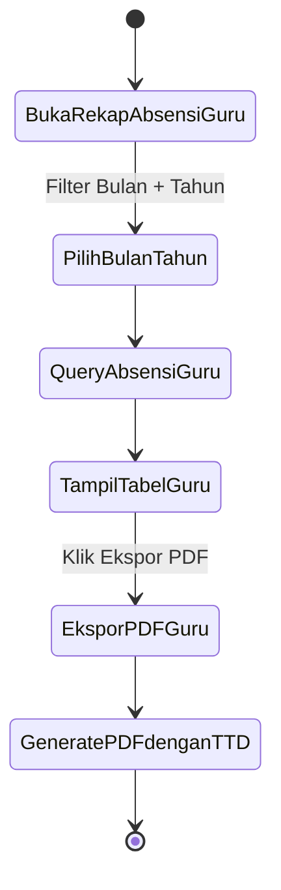
```mermaid
stateDiagram-v2
    [*] --> BukaRekapAbsensiGuru
    BukaRekapAbsensiGuru --> PilihBulanTahun: Filter Bulan + Tahun
    PilihBulanTahun --> QueryAbsensiGuru
    QueryAbsensiGuru --> TampilTabelGuru
    TampilTabelGuru --> EksporPDFGuru: Klik Ekspor PDF
    EksporPDFGuru --> GeneratePDFdenganTTD
    GeneratePDFdenganTTD --> [*]
```

---

### 2.7 Rekap Nilai Akademik

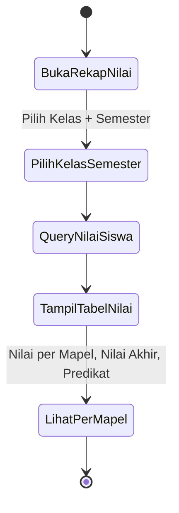
```mermaid
stateDiagram-v2
    [*] --> BukaRekapNilai
    BukaRekapNilai --> PilihKelasSemester: Pilih Kelas + Semester
    PilihKelasSemester --> QueryNilaiSiswa
    QueryNilaiSiswa --> TampilTabelNilai
    TampilTabelNilai --> LihatPerMapel: Nilai per Mapel, Nilai Akhir, Predikat
    LihatPerMapel --> [*]
```

---

## 3. Guru

### 3.1 Absensi Diri Guru

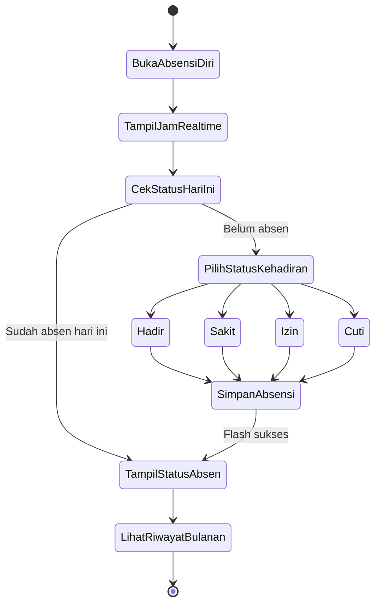
```mermaid
stateDiagram-v2
    [*] --> BukaAbsensiDiri
    BukaAbsensiDiri --> TampilJamRealtime
    TampilJamRealtime --> CekStatusHariIni

    state CekStatusHariIni <<choice>>
    CekStatusHariIni --> TampilStatusAbsen: Sudah absen hari ini
    CekStatusHariIni --> PilihStatusKehadiran: Belum absen

    PilihStatusKehadiran --> Hadir
    PilihStatusKehadiran --> Sakit
    PilihStatusKehadiran --> Izin
    PilihStatusKehadiran --> Cuti

    Hadir --> SimpanAbsensi
    Sakit --> SimpanAbsensi
    Izin --> SimpanAbsensi
    Cuti --> SimpanAbsensi

    SimpanAbsensi --> TampilStatusAbsen: Flash sukses
    TampilStatusAbsen --> LihatRiwayatBulanan
    LihatRiwayatBulanan --> [*]
```

---

### 3.2 Absensi Siswa oleh Guru

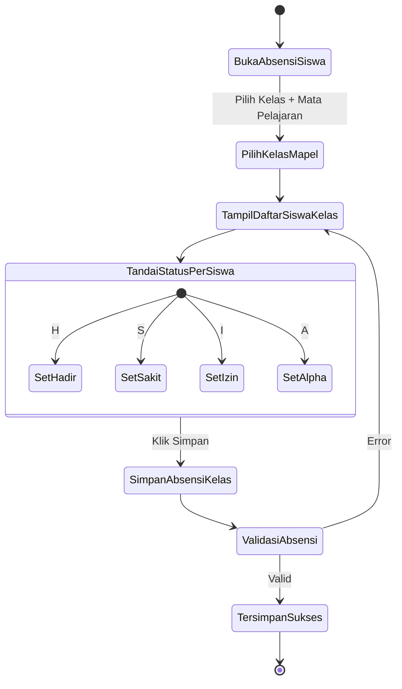
```mermaid
stateDiagram-v2
    [*] --> BukaAbsensiSiswa
    BukaAbsensiSiswa --> PilihKelasMapel: Pilih Kelas + Mata Pelajaran
    PilihKelasMapel --> TampilDaftarSiswaKelas
    TampilDaftarSiswaKelas --> TandaiStatusPerSiswa

    state TandaiStatusPerSiswa {
        [*] --> SetHadir: H
        [*] --> SetSakit: S
        [*] --> SetIzin: I
        [*] --> SetAlpha: A
    }

    TandaiStatusPerSiswa --> SimpanAbsensiKelas: Klik Simpan
    SimpanAbsensiKelas --> ValidasiAbsensi
    ValidasiAbsensi --> TersimpanSukses: Valid
    ValidasiAbsensi --> TampilDaftarSiswaKelas: Error
    TersimpanSukses --> [*]
```

---

### 3.3 Input Nilai Siswa

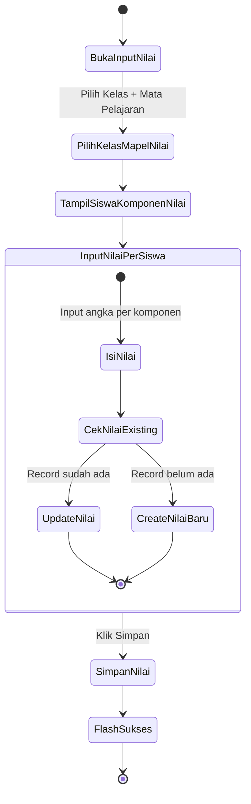
```mermaid
stateDiagram-v2
    [*] --> BukaInputNilai
    BukaInputNilai --> PilihKelasMapelNilai: Pilih Kelas + Mata Pelajaran
    PilihKelasMapelNilai --> TampilSiswaKomponenNilai
    TampilSiswaKomponenNilai --> InputNilaiPerSiswa

    state InputNilaiPerSiswa {
        [*] --> IsiNilai: Input angka per komponen
        IsiNilai --> CekNilaiExisting
        CekNilaiExisting --> UpdateNilai: Record sudah ada
        CekNilaiExisting --> CreateNilaiBaru: Record belum ada
        UpdateNilai --> [*]
        CreateNilaiBaru --> [*]
    }

    InputNilaiPerSiswa --> SimpanNilai: Klik Simpan
    SimpanNilai --> FlashSukses
    FlashSukses --> [*]
```

---

### 3.4 Pengaturan Bobot Nilai

```mermaid
stateDiagram-v2
    [*] --> BukaPengaturanBobot
    BukaPengaturanBobot --> TampilKomponenBobot: Daftar komponen + bobot default
    TampilKomponenBobot --> EditBobot: Ubah bobot per komponen
    EditBobot --> ValidasiTotalBobot

    state ValidasiTotalBobot <<choice>>
    ValidasiTotalBobot --> SimpanBobot: Total = 100%
    ValidasiTotalBobot --> TampilPeringatan: Total != 100%

    TampilPeringatan --> EditBobot: Koreksi bobot
    SimpanBobot --> [*]
```

---

### 3.5 Jadwal Mengajar Guru

```mermaid
stateDiagram-v2
    [*] --> BukaJadwalMengajar
    BukaJadwalMengajar --> AmbilGuruLogin: Identifikasi guru login
    AmbilGuruLogin --> QueryJadwalGuru
    QueryJadwalGuru --> TampilTabelJadwalMingguan
    TampilTabelJadwalMingguan --> LihatDetail: Hari, Jam, Kelas, Mapel
    LihatDetail --> [*]
```

---

### 3.6 Kelola & Terbitkan Rapor Siswa

```mermaid
stateDiagram-v2
    [*] --> BukaKelolaRapor
    BukaKelolaRapor --> PilihKelas
    PilihKelas --> PilihTipeRapor: Umum / Tahfizh
    PilihTipeRapor --> PilihSiswa
    PilihSiswa --> SistemHitungNilaiOtomatis

    state SistemHitungNilaiOtomatis {
        [*] --> AmbilSemuaNilaiSiswa
        AmbilSemuaNilaiSiswa --> HitungRataPerKategori: Pengetahuan, Keterampilan, Sikap, Keagamaan
        HitungRataPerKategori --> HitungNilaiAkhirBerbobot
        HitungNilaiAkhirBerbobot --> TentukanPredikat
        TentukanPredikat --> A_Predikat: >= 90
        TentukanPredikat --> B_Predikat: >= 80
        TentukanPredikat --> C_Predikat: >= 70
        TentukanPredikat --> D_Predikat: >= 60
        TentukanPredikat --> E_Predikat: < 60
        A_Predikat --> [*]
        B_Predikat --> [*]
        C_Predikat --> [*]
        D_Predikat --> [*]
        E_Predikat --> [*]
    }

    SistemHitungNilaiOtomatis --> PreviewRapor: Tampilkan preview
    PreviewRapor --> IsiCatatanWaliKelas
    IsiCatatanWaliKelas --> SetTanggalTerbit
    SetTanggalTerbit --> KlikTerbitkanRapor

    state ProsesTerbitRapor {
        [*] --> SimpanRaporHeader: updateOrCreate Rapor
        SimpanRaporHeader --> SimpanRaporDetail: updateOrCreate per Mapel
        SimpanRaporDetail --> KirimNotifikasiSiswa: Notifikasi rapor terbit
        KirimNotifikasiSiswa --> [*]
    }

    KlikTerbitkanRapor --> ProsesTerbitRapor
    ProsesTerbitRapor --> FlashBerhasil
    FlashBerhasil --> [*]
```

---

### 3.7 Pengajuan Koreksi Nilai (dari sisi Guru)

```mermaid
stateDiagram-v2
    [*] --> GuruDeteksiKesalahanNilai
    GuruDeteksiKesalahanNilai --> BukaFormKoreksi
    BukaFormKoreksi --> IsiFormKoreksi: Nilai Lama, Nilai Baru, Alasan
    IsiFormKoreksi --> SubmitPengajuan
    SubmitPengajuan --> StatusPending: status = pending
    StatusPending --> MenungguReviewKoordinator
    MenungguReviewKoordinator --> TerimaNotifikasi: Disetujui / Ditolak
    TerimaNotifikasi --> [*]
```

---

> **Lanjutan:** Lihat `activity-diagram-part2.md` untuk Activity Diagram modul **Murid**, **Finance**, **Kepala Sekolah**, **Koordinator**, dan **Shared**.
