# 📐 Activity Diagram Lengkap — Sistem Informasi Akademik (Part 2)

> Activity Diagram untuk modul: **Murid**, **Finance**, **Kepala Sekolah**, **Koordinator**, dan **Shared**.

---

## 4. Murid / Portal Siswa

### 4.1 Lihat Jadwal Pelajaran

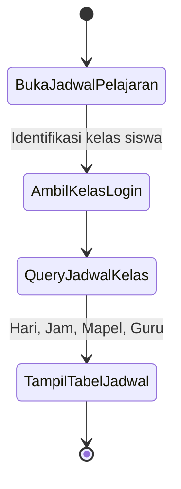

---

### 4.2 Lihat Kehadiran Saya

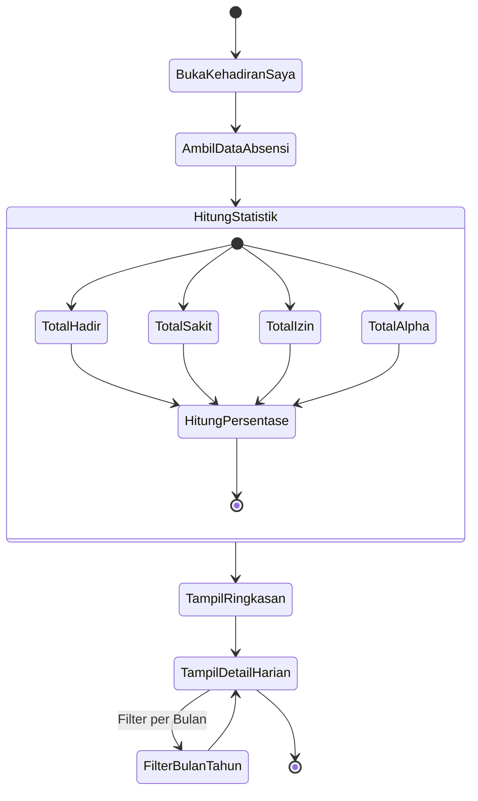

---

### 4.3 Lihat Rapor & Nilai

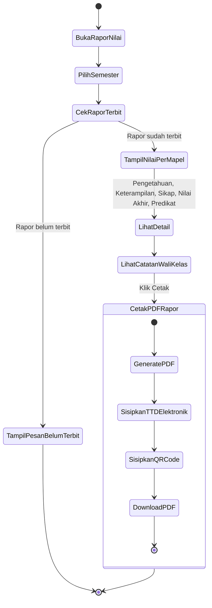

---

### 4.4 Lihat Tagihan SPP & Keuangan

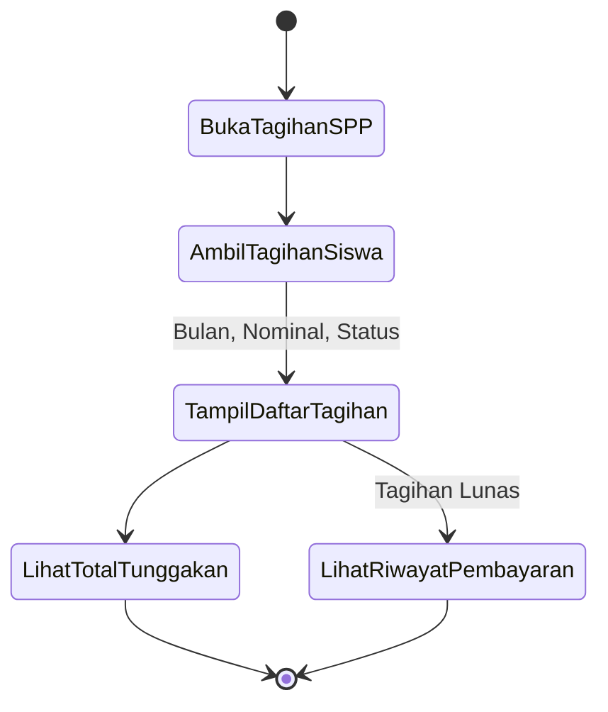

---

### 4.5 Ekstrakurikuler Saya

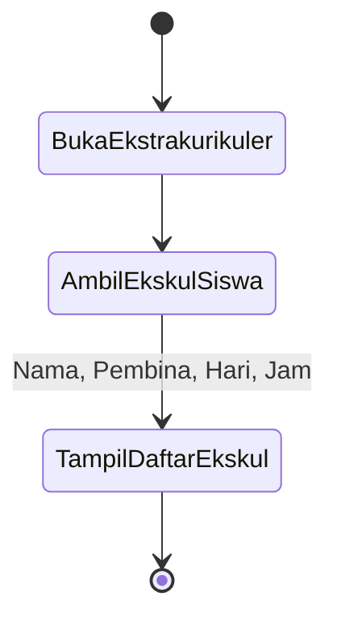

---

### 4.6 Riwayat Aktivitas Akun

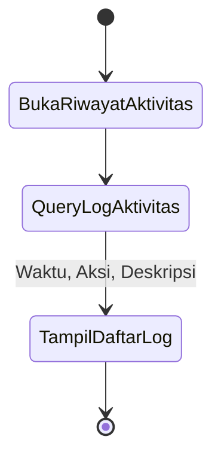

---

## 5. Finance / Keuangan

### 5.1 Dashboard Keuangan

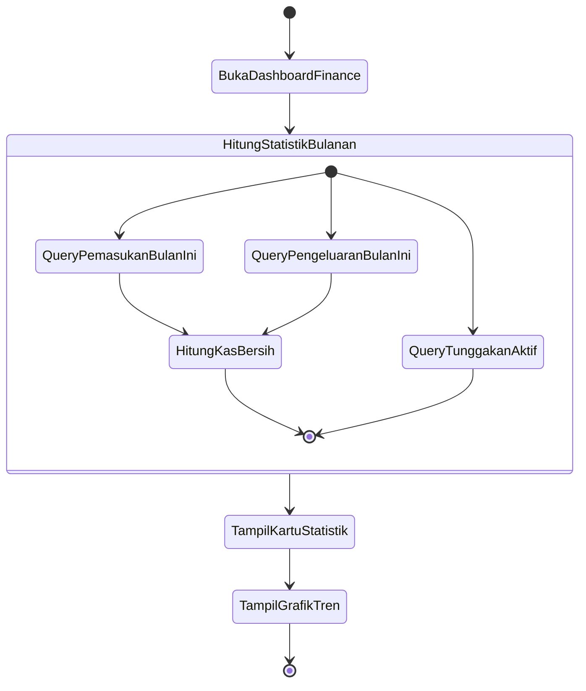

---

### 5.2 Overview Pembayaran Siswa

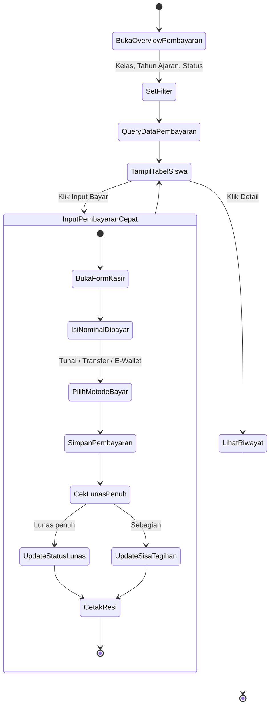

---

### 5.3 Manajemen Tagihan SPP

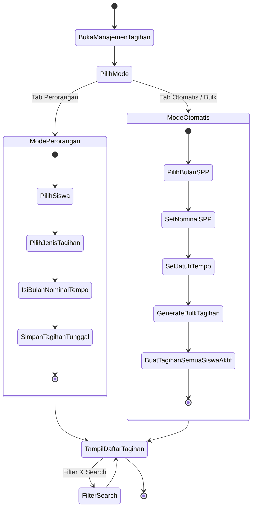

---

### 5.4 Input Pembayaran (Kasir)

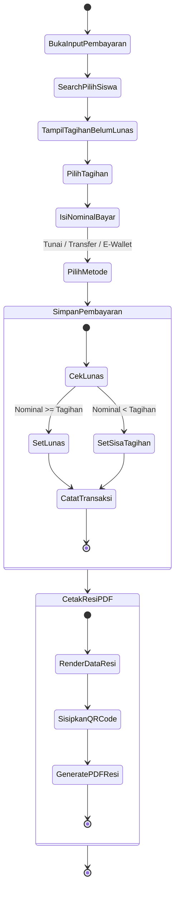

---

### 5.5 Arus Kas Masuk Non-SPP

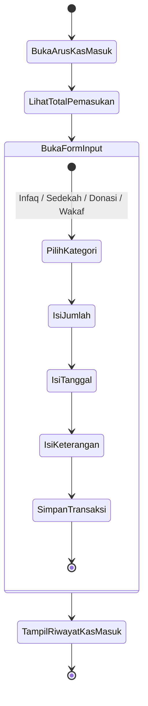

---

### 5.6 Arus Kas Keluar (Pengeluaran)

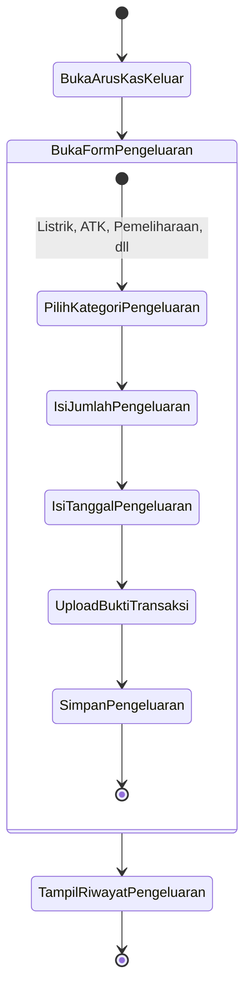

---

### 5.7 Pengajuan Dana (Approval Bertingkat)

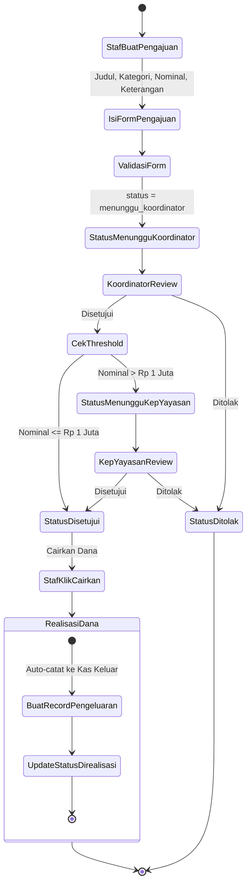

---

### 5.8 Manajemen Gaji Guru (Payroll)

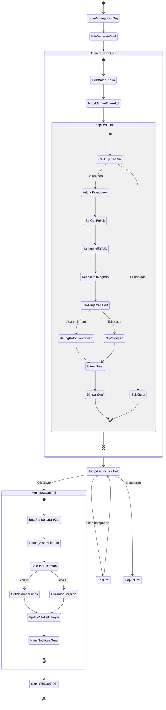

---

### 5.9 Manajemen Peminjaman / Kasbon Guru

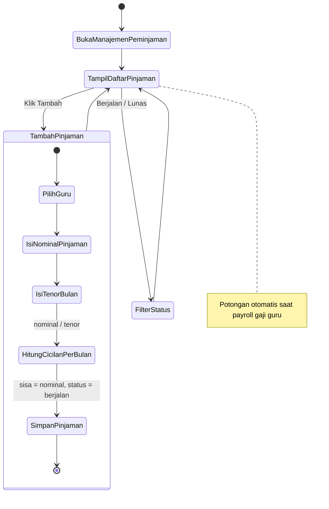

---

### 5.10 Laporan Pemasukan

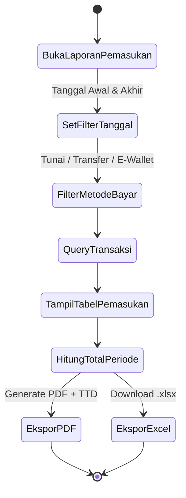

---

### 5.11 Laporan Pengeluaran

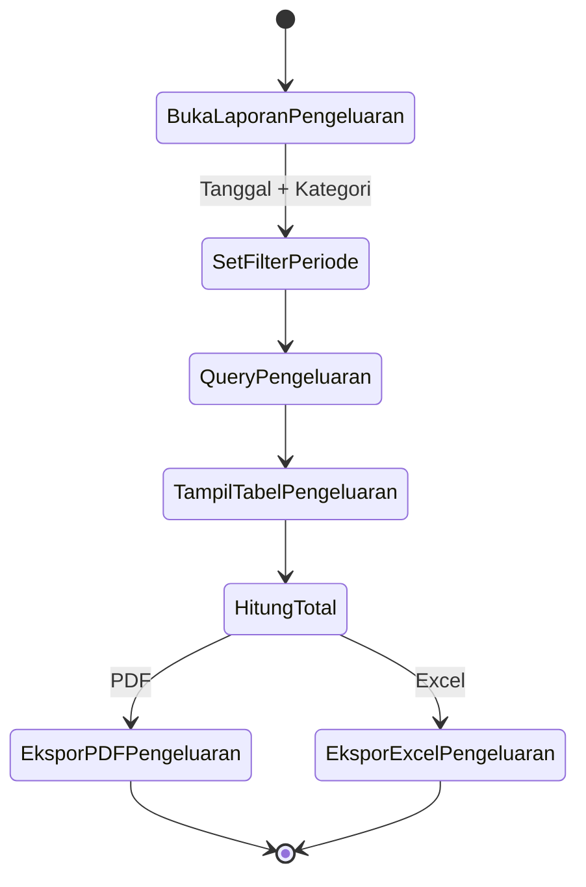

---

### 5.12 Laporan Tunggakan Siswa

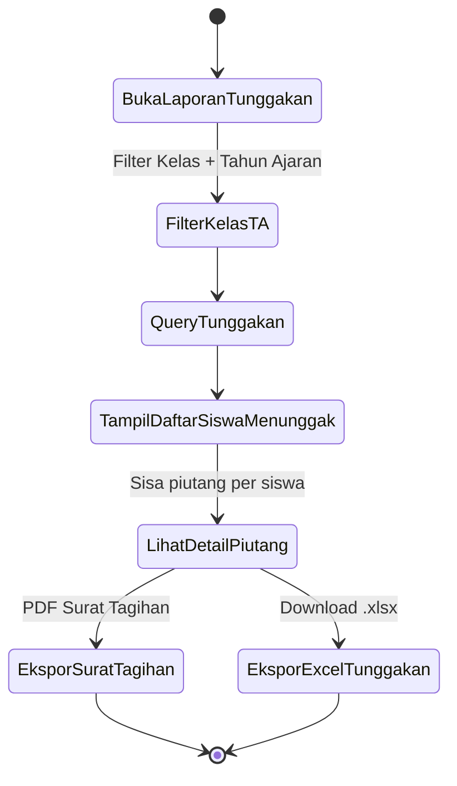

---

## 6. Kepala Sekolah

### 6.1 Dashboard Pemantauan Eksekutif

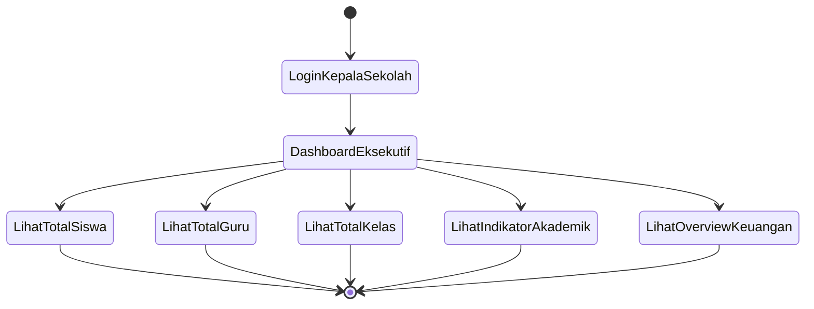

---

## 7. Koordinator

### 7.1 Persetujuan Koreksi Nilai Siswa

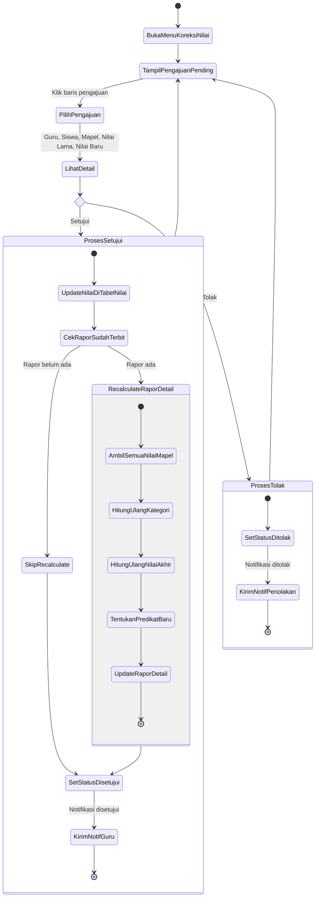

---

## 8. Shared / Umum

### 8.1 Profil Saya & Tanda Tangan Digital

```mermaid
stateDiagram-v2
    [*] --> BukaProfilSaya
    BukaProfilSaya --> TampilDataProfil

    state EditProfil {
        [*] --> UbahNama
        UbahNama --> UbahEmail
        UbahEmail --> UbahPassword
        UbahPassword --> SimpanProfil
        SimpanProfil --> [*]
    }

    state UploadFoto {
        [*] --> PilihFileGambar
        PilihFileGambar --> ValidasiFile
        ValidasiFile --> SimpanFotoProfil
        SimpanFotoProfil --> [*]
    }

    state TTDDigital {
        [*] --> PilihMetodeTTD
        PilihMetodeTTD --> UploadGambarTTD: Upload file
        PilihMetodeTTD --> GambarDiCanvas: Tanda tangan di web
        UploadGambarTTD --> SimpanTTD
        GambarDiCanvas --> SimpanTTD
        SimpanTTD --> [*]
    }

    TampilDataProfil --> EditProfil
    TampilDataProfil --> UploadFoto
    TampilDataProfil --> TTDDigital
    EditProfil --> TampilDataProfil
    UploadFoto --> TampilDataProfil
    TTDDigital --> TampilDataProfil
```

---

### 8.2 Verifikasi Dokumen Elektronik (Publik)

```mermaid
stateDiagram-v2
    [*] --> PihakKetigaScanQR
    PihakKetigaScanQR --> BukaURLVerifikasi: /verifikasi-dokumen/{code}
    BukaURLVerifikasi --> SistemCariDokumen

    state SistemCariDokumen <<choice>>
    SistemCariDokumen --> TampilInfoDokumen: Dokumen ditemukan
    SistemCariDokumen --> TampilTidakDitemukan: Dokumen tidak ada

    TampilInfoDokumen --> TampilStatusValid: Tanda tangan sah
    TampilTidakDitemukan --> [*]
    TampilStatusValid --> [*]
```

---

### 8.3 Generate Laporan PDF dengan TTD Elektronik

```mermaid
stateDiagram-v2
    [*] --> UserRequestCetakPDF
    UserRequestCetakPDF --> SistemGenerateDokumen

    state SistemGenerateDokumen {
        [*] --> AmbilDataLaporan
        AmbilDataLaporan --> AmbilTTDElektronik: Dari DB e_signatures
        AmbilTTDElektronik --> GenerateQRCodeVerifikasi: URL publik verifikasi
        GenerateQRCodeVerifikasi --> RenderPDF: Data + TTD + QR
        RenderPDF --> [*]
    }

    SistemGenerateDokumen --> UserDownloadPDF
    UserDownloadPDF --> [*]
```

---

> **Dokumen ini mencakup Activity Diagram untuk seluruh 52 menu** dalam Sistem Informasi Akademik, dibagi ke dalam 2 file:
> - `activity-diagram-part1.md` — Super Admin, Tata Usaha, Guru
> - `activity-diagram-part2.md` — Murid, Finance, Kepala Sekolah, Koordinator, Shared
