# 📘 Dokumentasi Lengkap Fungsi Menu & Flowchart — Sistem Informasi Akademik

> Dokumen ini menjelaskan fungsi dari masing-masing menu beserta flowchart alur kerjanya.

---

## Daftar Isi

- [1. Super Admin](#1-super-admin)
- [2. Tata Usaha](#2-tata-usaha)
- [3. Guru](#3-guru)
- [4. Murid / Portal Siswa](#4-murid--portal-siswa) *(lihat Part 2)*
- [5. Finance / Keuangan](#5-finance--keuangan) *(lihat Part 2)*
- [6. Kepala Sekolah](#6-kepala-sekolah) *(lihat Part 2)*
- [7. Koordinator](#7-koordinator) *(lihat Part 2)*
- [8. Shared / Umum](#8-shared--umum) *(lihat Part 2)*

---

## 1. Super Admin

### 1.1 Dashboard Super Admin
**Fungsi:** Pusat pemantauan statistik seluruh sistem — jumlah siswa, guru, kelas, dan ringkasan aktivitas terkini.

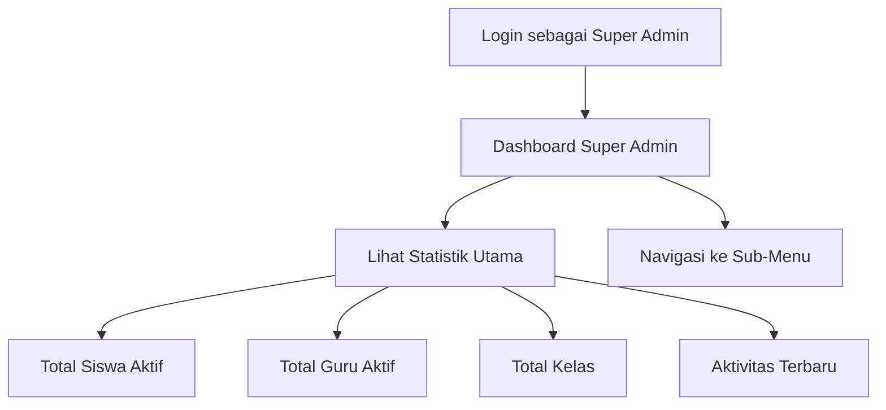
```mermaid
flowchart TD
    A[Login sebagai Super Admin] --> B[Dashboard Super Admin]
    B --> C[Lihat Statistik Utama]
    C --> D[Total Siswa Aktif]
    C --> E[Total Guru Aktif]
    C --> F[Total Kelas]
    C --> G[Aktivitas Terbaru]
    B --> H[Navigasi ke Sub-Menu]
```

---

### 1.2 Manajemen User
**Fungsi:** CRUD akun pengguna sistem — membuat, mengedit, menghapus akun beserta penetapan role (super_admin, tata_usaha, guru, murid, finance, koordinator, kepala_sekolah).

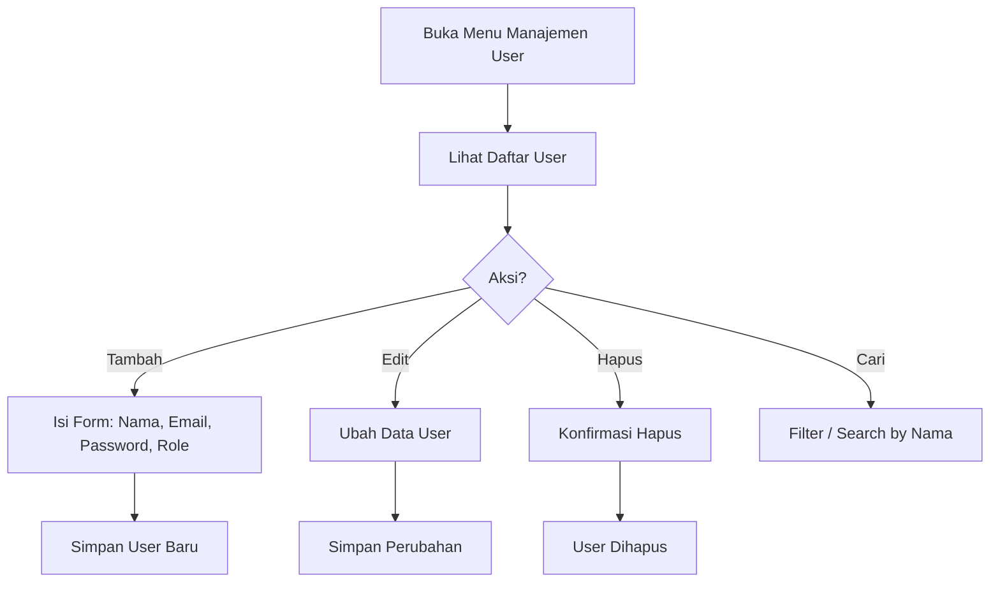
```mermaid
flowchart TD
    A[Buka Menu Manajemen User] --> B[Lihat Daftar User]
    B --> C{Aksi?}
    C -->|Tambah| D[Isi Form: Nama, Email, Password, Role]
    D --> E[Simpan User Baru]
    C -->|Edit| F[Ubah Data User]
    F --> G[Simpan Perubahan]
    C -->|Hapus| H[Konfirmasi Hapus]
    H --> I[User Dihapus]
    C -->|Cari| J[Filter / Search by Nama]
```

---

### 1.3 Manajemen Siswa
**Fungsi:** CRUD data siswa — NISN, kelas, status (aktif/lulus/keluar), data orang tua, alamat, dan foto.

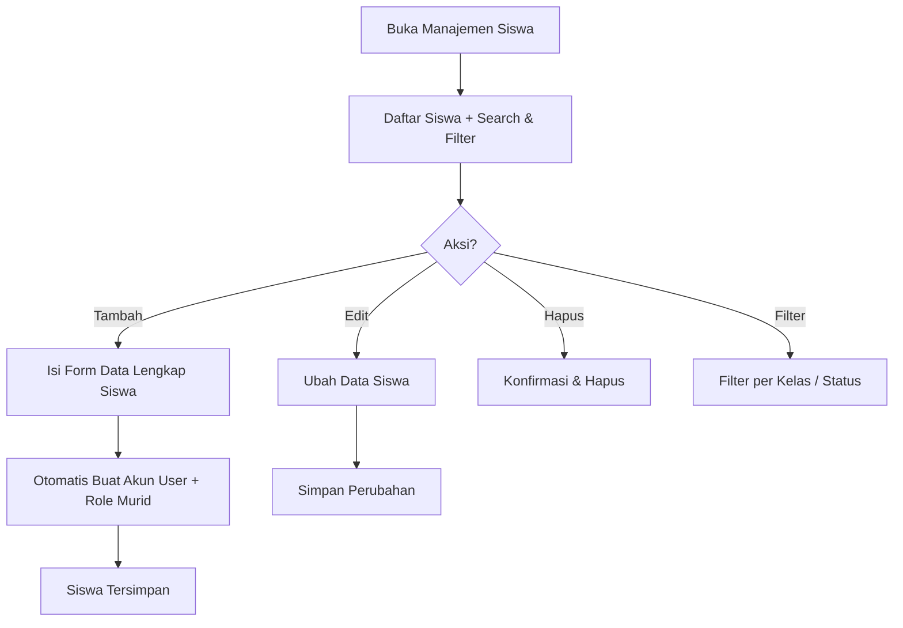
```mermaid
flowchart TD
    A[Buka Manajemen Siswa] --> B[Daftar Siswa + Search & Filter]
    B --> C{Aksi?}
    C -->|Tambah| D[Isi Form Data Lengkap Siswa]
    D --> E[Otomatis Buat Akun User + Role Murid]
    E --> F[Siswa Tersimpan]
    C -->|Edit| G[Ubah Data Siswa]
    G --> H[Simpan Perubahan]
    C -->|Hapus| I[Konfirmasi & Hapus]
    C -->|Filter| J[Filter per Kelas / Status]
```

---

### 1.4 Manajemen Guru
**Fungsi:** CRUD data guru — NIP, jenis guru (Umum/Tahfidz), status kepegawaian (Tetap/Honorer/Kontrak), bidang keahlian, dan data kontak.

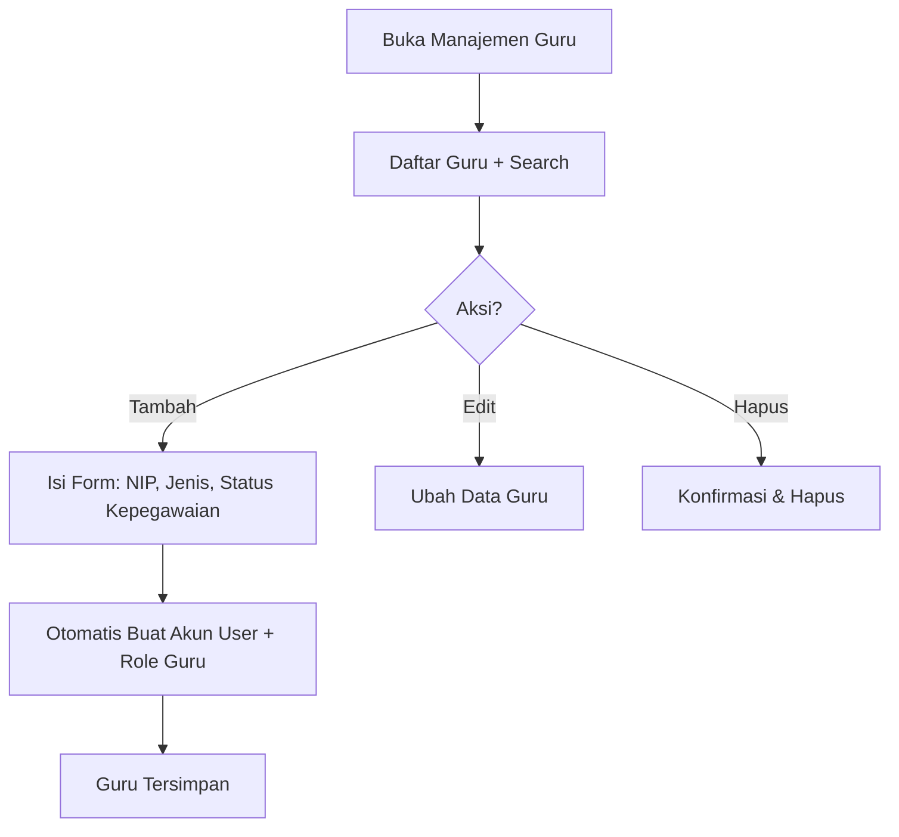
```mermaid
flowchart TD
    A[Buka Manajemen Guru] --> B[Daftar Guru + Search]
    B --> C{Aksi?}
    C -->|Tambah| D[Isi Form: NIP, Jenis, Status Kepegawaian]
    D --> E[Otomatis Buat Akun User + Role Guru]
    E --> F[Guru Tersimpan]
    C -->|Edit| G[Ubah Data Guru]
    C -->|Hapus| H[Konfirmasi & Hapus]
```

---

### 1.5 Manajemen Kelas
**Fungsi:** CRUD kelas — nama kelas, tingkat, wali kelas (guru umum & guru tahfidz), dan kapasitas.

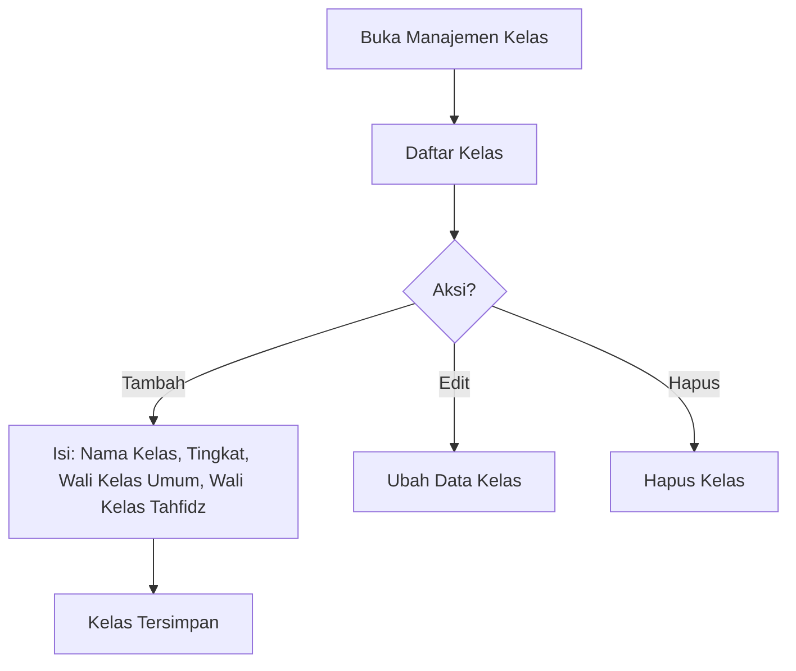
```mermaid
flowchart TD
    A[Buka Manajemen Kelas] --> B[Daftar Kelas]
    B --> C{Aksi?}
    C -->|Tambah| D[Isi: Nama Kelas, Tingkat, Wali Kelas Umum, Wali Kelas Tahfidz]
    D --> E[Kelas Tersimpan]
    C -->|Edit| F[Ubah Data Kelas]
    C -->|Hapus| G[Hapus Kelas]
```

---

### 1.6 Manajemen Jadwal
**Fungsi:** CRUD jadwal pelajaran — hari, jam mulai/selesai, mata pelajaran, guru pengampu, dan kelas.

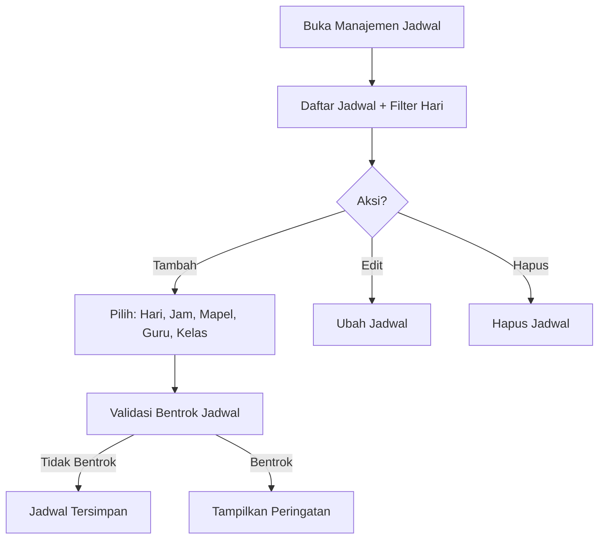
```mermaid
flowchart TD
    A[Buka Manajemen Jadwal] --> B[Daftar Jadwal + Filter Hari]
    B --> C{Aksi?}
    C -->|Tambah| D[Pilih: Hari, Jam, Mapel, Guru, Kelas]
    D --> E[Validasi Bentrok Jadwal]
    E -->|Tidak Bentrok| F[Jadwal Tersimpan]
    E -->|Bentrok| G[Tampilkan Peringatan]
    C -->|Edit| H[Ubah Jadwal]
    C -->|Hapus| I[Hapus Jadwal]
```

---

### 1.7 Manajemen Mata Pelajaran
**Fungsi:** CRUD mata pelajaran — nama mapel, jenis (Umum/Tahfidz/Agama), KKM, dan kode mapel.

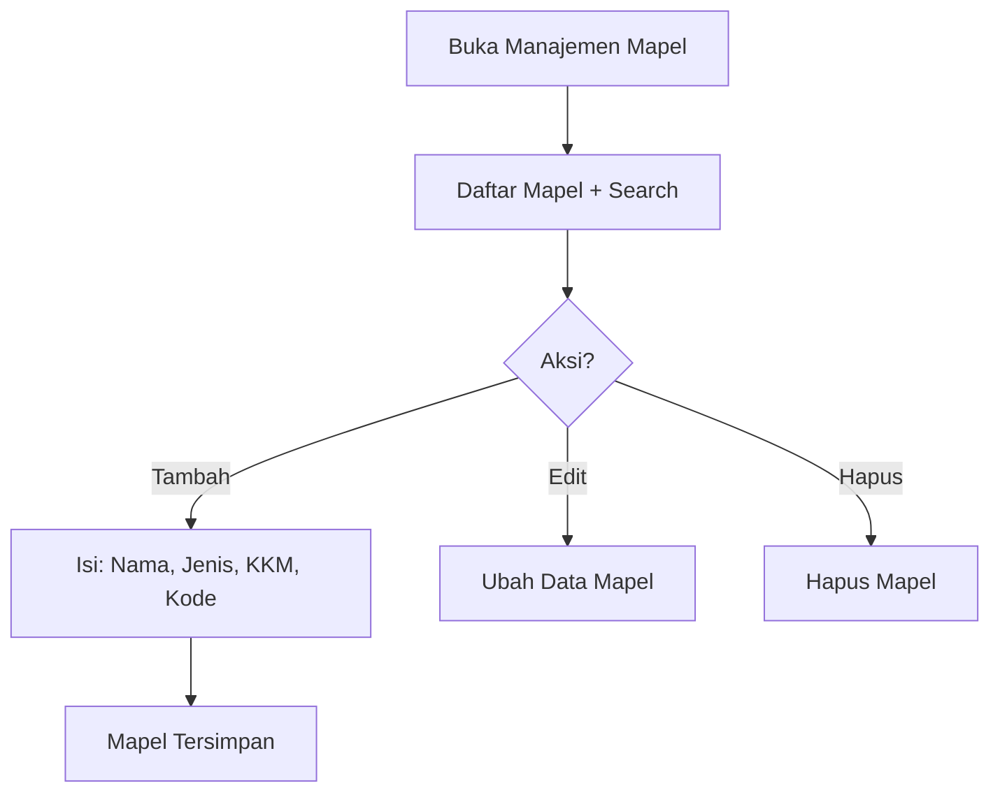
```mermaid
flowchart TD
    A[Buka Manajemen Mapel] --> B[Daftar Mapel + Search]
    B --> C{Aksi?}
    C -->|Tambah| D[Isi: Nama, Jenis, KKM, Kode]
    D --> E[Mapel Tersimpan]
    C -->|Edit| F[Ubah Data Mapel]
    C -->|Hapus| G[Hapus Mapel]
```

---

### 1.8 Manajemen Komponen Nilai
**Fungsi:** CRUD komponen penilaian — nama komponen, kategori (Pengetahuan/Keterampilan/Sikap/Keagamaan), bobot default, dan jenis mapel terkait.

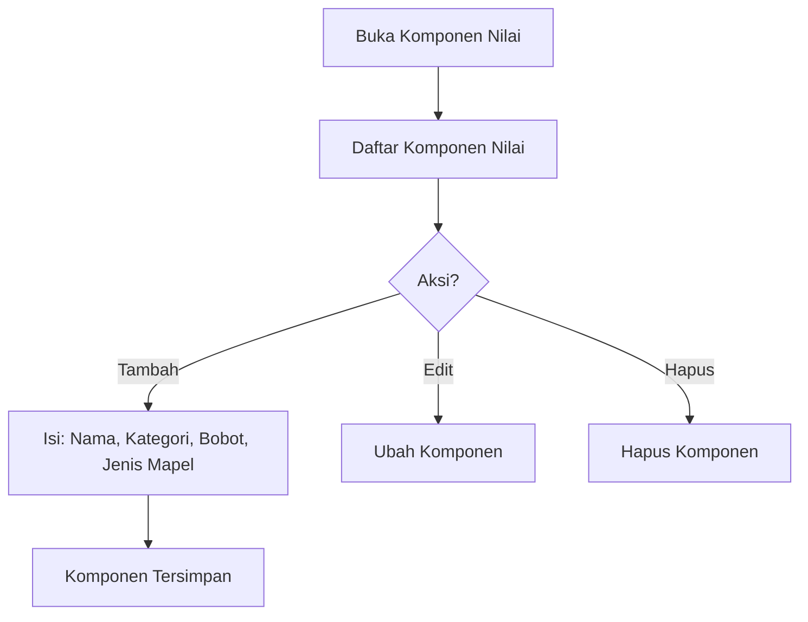
```mermaid
flowchart TD
    A[Buka Komponen Nilai] --> B[Daftar Komponen Nilai]
    B --> C{Aksi?}
    C -->|Tambah| D[Isi: Nama, Kategori, Bobot, Jenis Mapel]
    D --> E[Komponen Tersimpan]
    C -->|Edit| F[Ubah Komponen]
    C -->|Hapus| G[Hapus Komponen]
```

---

### 1.9 Audit Log Aktivitas
**Fungsi:** Melihat jejak audit seluruh aktivitas pengguna — login, perubahan data, dan event penting sistem.

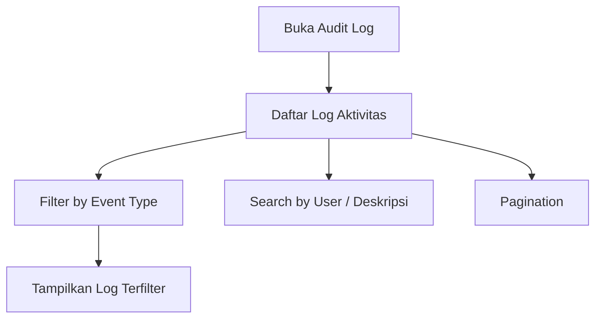
```mermaid
flowchart TD
    A[Buka Audit Log] --> B[Daftar Log Aktivitas]
    B --> C[Filter by Event Type]
    B --> D[Search by User / Deskripsi]
    B --> E[Pagination]
    C --> F[Tampilkan Log Terfilter]
```

---

### 1.10 Manajemen Pengaturan Sistem & TTD
**Fungsi:** Konfigurasi identitas sekolah — nama, alamat, logo, NPSN, dan pengaturan tanda tangan elektronik kepala sekolah.

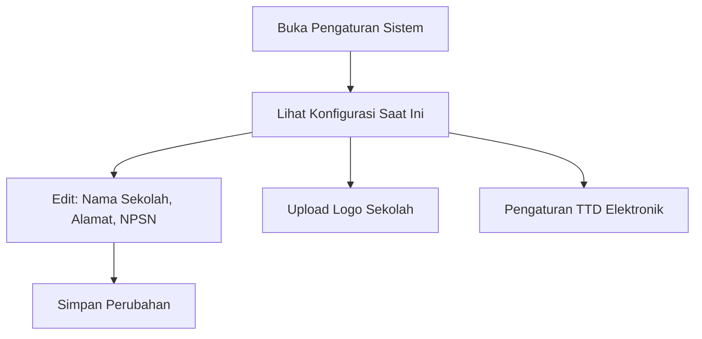
```mermaid
flowchart TD
    A[Buka Pengaturan Sistem] --> B[Lihat Konfigurasi Saat Ini]
    B --> C[Edit: Nama Sekolah, Alamat, NPSN]
    B --> D[Upload Logo Sekolah]
    B --> E[Pengaturan TTD Elektronik]
    C --> F[Simpan Perubahan]
```

---

## 2. Tata Usaha

### 2.1 Dashboard Tata Usaha
**Fungsi:** Ringkasan data akademik — jumlah siswa, guru, kelas aktif, dan pintasan ke menu operasional harian.

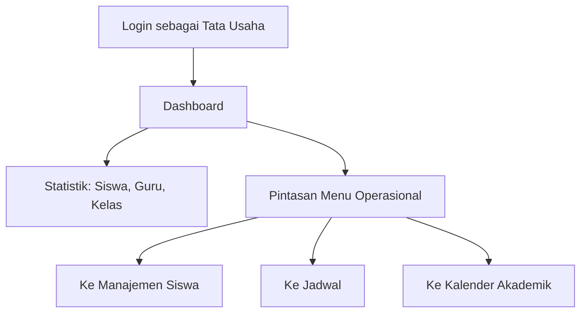
```mermaid
flowchart TD
    A[Login sebagai Tata Usaha] --> B[Dashboard]
    B --> C[Statistik: Siswa, Guru, Kelas]
    B --> D[Pintasan Menu Operasional]
    D --> E[Ke Manajemen Siswa]
    D --> F[Ke Jadwal]
    D --> G[Ke Kalender Akademik]
```

---

### 2.2 Manajemen Siswa, Guru, Kelas, Jadwal, Mapel, Komponen Nilai
**Fungsi:** Sama dengan modul Super Admin (data master shared), tetapi diakses dari prefix `/tata-usaha/`.

---

### 2.3 Manajemen Karyawan
**Fungsi:** CRUD data karyawan non-guru — satpam, cleaning service, tenaga administrasi.

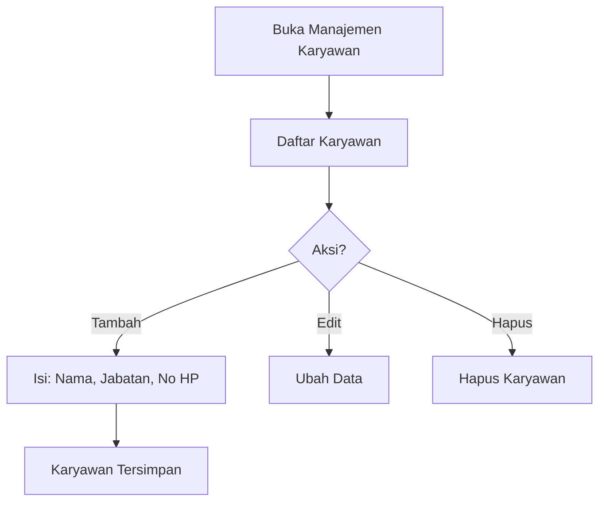
```mermaid
flowchart TD
    A[Buka Manajemen Karyawan] --> B[Daftar Karyawan]
    B --> C{Aksi?}
    C -->|Tambah| D[Isi: Nama, Jabatan, No HP]
    D --> E[Karyawan Tersimpan]
    C -->|Edit| F[Ubah Data]
    C -->|Hapus| G[Hapus Karyawan]
```

---

### 2.4 Manajemen Piket Guru
**Fungsi:** Mengatur jadwal piket harian guru — siapa yang bertugas menjaga pada hari tertentu.

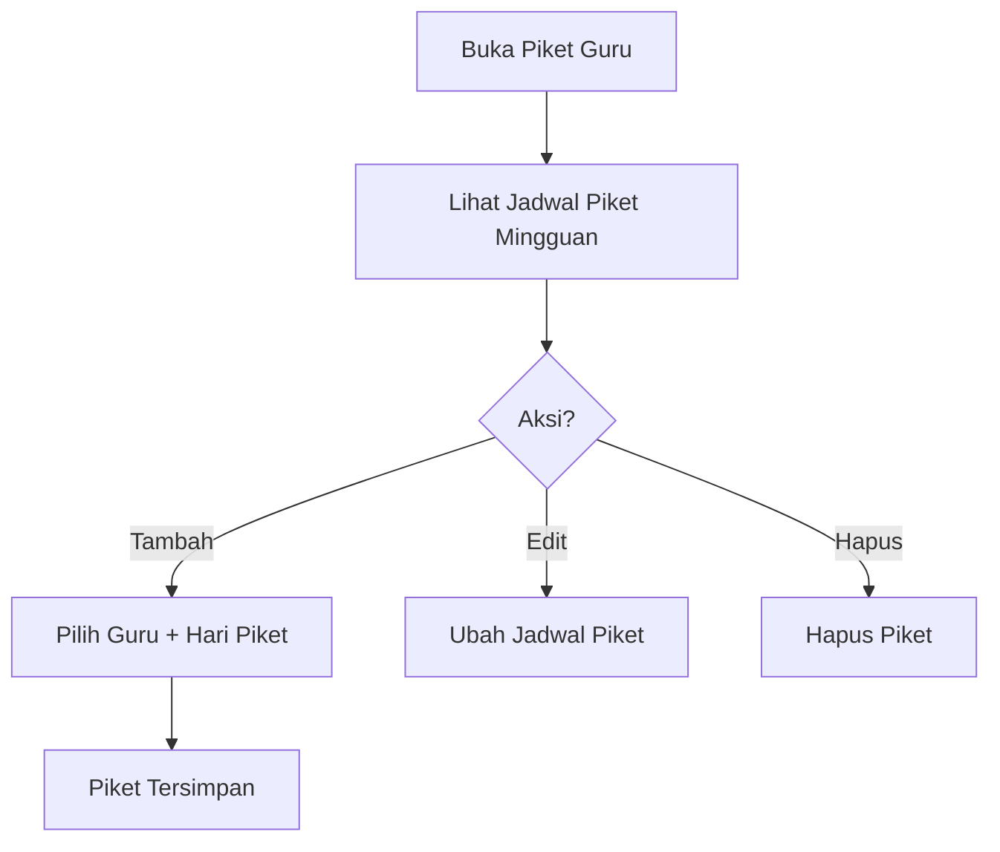
```mermaid
flowchart TD
    A[Buka Piket Guru] --> B[Lihat Jadwal Piket Mingguan]
    B --> C{Aksi?}
    C -->|Tambah| D[Pilih Guru + Hari Piket]
    D --> E[Piket Tersimpan]
    C -->|Edit| F[Ubah Jadwal Piket]
    C -->|Hapus| G[Hapus Piket]
```

---

### 2.5 Kalender Akademik
**Fungsi:** CRUD event kalender akademik — hari libur, UTS, UAS, penerimaan rapor, kegiatan sekolah. Menampilkan kalender visual interaktif.

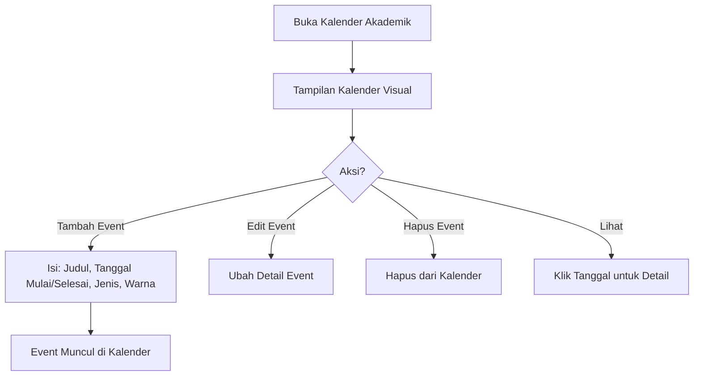
```mermaid
flowchart TD
    A[Buka Kalender Akademik] --> B[Tampilan Kalender Visual]
    B --> C{Aksi?}
    C -->|Tambah Event| D[Isi: Judul, Tanggal Mulai/Selesai, Jenis, Warna]
    D --> E[Event Muncul di Kalender]
    C -->|Edit Event| F[Ubah Detail Event]
    C -->|Hapus Event| G[Hapus dari Kalender]
    C -->|Lihat| H[Klik Tanggal untuk Detail]
```

---

### 2.6 Proses Kenaikan Kelas & Kelulusan
**Fungsi:** Memproses kenaikan kelas massal atau kelulusan siswa menjadi alumni.

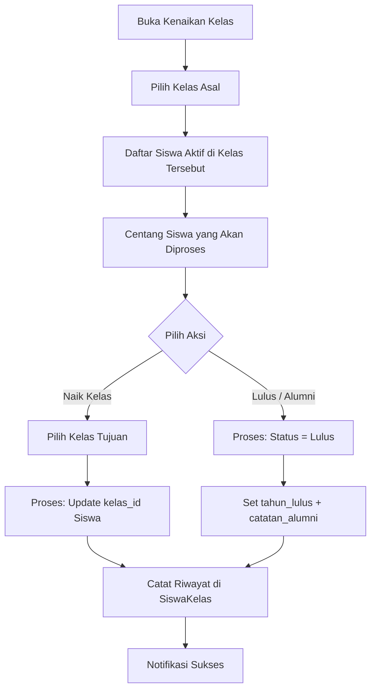
```mermaid
flowchart TD
    A[Buka Kenaikan Kelas] --> B[Pilih Kelas Asal]
    B --> C[Daftar Siswa Aktif di Kelas Tersebut]
    C --> D[Centang Siswa yang Akan Diproses]
    D --> E{Pilih Aksi}
    E -->|Naik Kelas| F[Pilih Kelas Tujuan]
    F --> G[Proses: Update kelas_id Siswa]
    G --> H[Catat Riwayat di SiswaKelas]
    E -->|Lulus / Alumni| I[Proses: Status = Lulus]
    I --> J[Set tahun_lulus + catatan_alumni]
    J --> H
    H --> K[Notifikasi Sukses]
```

---

### 2.7 Data Alumni
**Fungsi:** Melihat daftar siswa yang telah berstatus "lulus" — tahun lulus, catatan alumni, dan riwayat kelas.

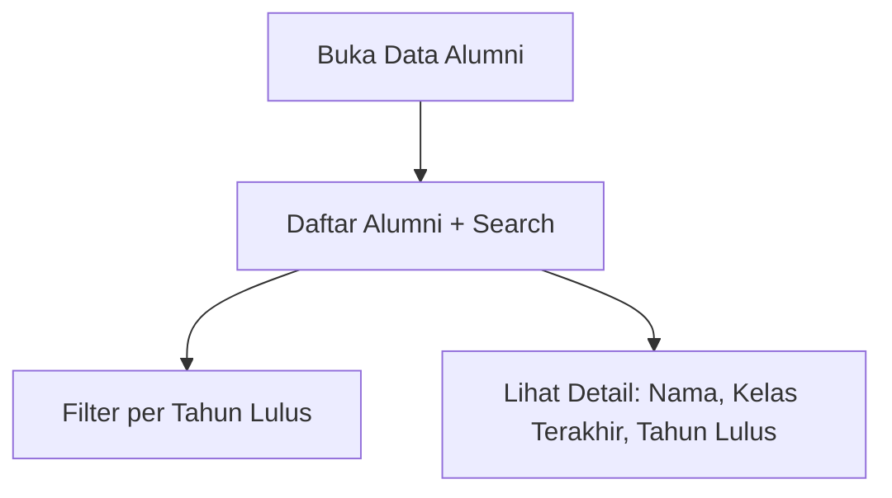
```mermaid
flowchart TD
    A[Buka Data Alumni] --> B[Daftar Alumni + Search]
    B --> C[Filter per Tahun Lulus]
    B --> D[Lihat Detail: Nama, Kelas Terakhir, Tahun Lulus]
```

---

### 2.8 Rekap Absensi Siswa
**Fungsi:** Melihat rekap kehadiran siswa per kelas, per bulan. Bisa diekspor ke PDF dengan tanda tangan elektronik.

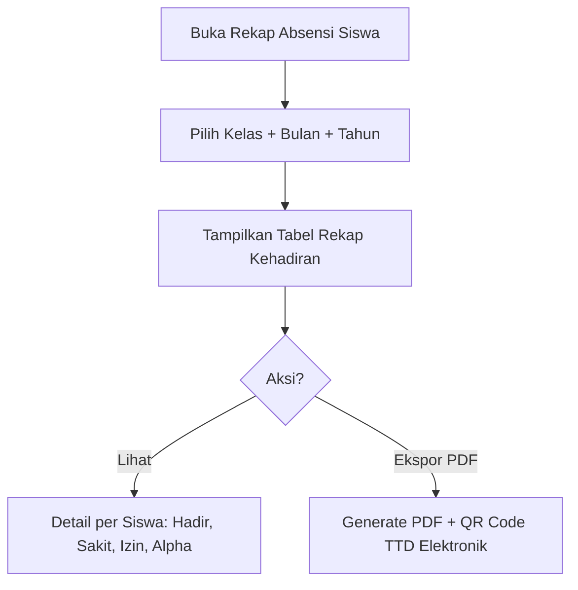
```mermaid
flowchart TD
    A[Buka Rekap Absensi Siswa] --> B[Pilih Kelas + Bulan + Tahun]
    B --> C[Tampilkan Tabel Rekap Kehadiran]
    C --> D{Aksi?}
    D -->|Lihat| E[Detail per Siswa: Hadir, Sakit, Izin, Alpha]
    D -->|Ekspor PDF| F[Generate PDF + QR Code TTD Elektronik]
```

---

### 2.9 Rekap Absensi Guru
**Fungsi:** Melihat rekap kehadiran guru per bulan. Bisa diekspor ke PDF.

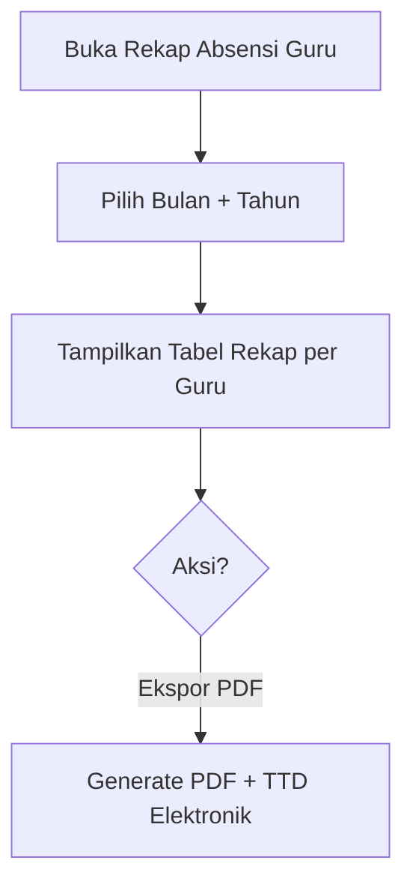
```mermaid
flowchart TD
    A[Buka Rekap Absensi Guru] --> B[Pilih Bulan + Tahun]
    B --> C[Tampilkan Tabel Rekap per Guru]
    C --> D{Aksi?}
    D -->|Ekspor PDF| E[Generate PDF + TTD Elektronik]
```

---

### 2.10 Rekap Nilai
**Fungsi:** Melihat rekapitulasi nilai akademik siswa per kelas per semester.

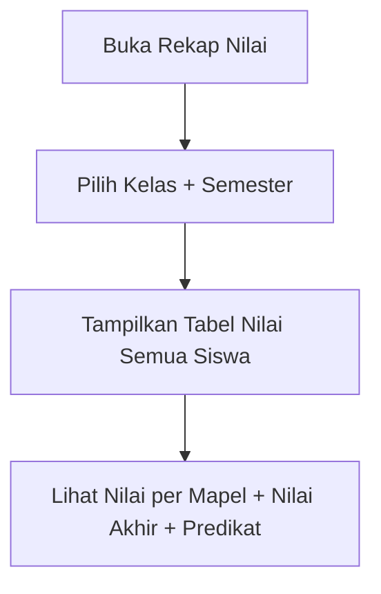
```mermaid
flowchart TD
    A[Buka Rekap Nilai] --> B[Pilih Kelas + Semester]
    B --> C[Tampilkan Tabel Nilai Semua Siswa]
    C --> D[Lihat Nilai per Mapel + Nilai Akhir + Predikat]
```

---

## 3. Guru

### 3.1 Dashboard Guru
**Fungsi:** Ringkasan aktivitas guru — jumlah kelas yang diajar, jadwal hari ini, absensi terakhir, dan pintasan cepat.

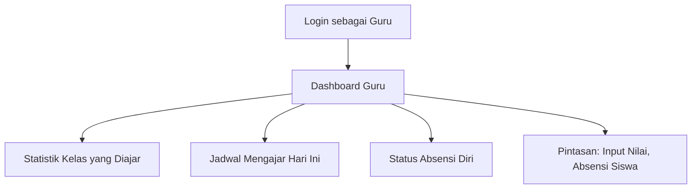
```mermaid
flowchart TD
    A[Login sebagai Guru] --> B[Dashboard Guru]
    B --> C[Statistik Kelas yang Diajar]
    B --> D[Jadwal Mengajar Hari Ini]
    B --> E[Status Absensi Diri]
    B --> F[Pintasan: Input Nilai, Absensi Siswa]
```

---

### 3.2 Absensi Diri Guru
**Fungsi:** Guru mencatat kehadirannya sendiri setiap hari — Hadir, Sakit, Izin, Cuti. Menampilkan jam real-time dan riwayat kehadiran bulanan.

```mermaid
flowchart TD
    A[Buka Absensi Diri] --> B[Lihat Tanggal & Jam Real-time]
    B --> C{Sudah Absen Hari Ini?}
    C -->|Belum| D[Pilih Status: Hadir / Sakit / Izin / Cuti]
    D --> E[Simpan Absensi]
    E --> F[Status Terekam]
    C -->|Sudah| G[Tampilkan Status Hari Ini]
    B --> H[Lihat Riwayat Absensi Bulanan]
```

---

### 3.3 Absensi Siswa
**Fungsi:** Guru mengabsen siswa di kelas yang diampu — pilih kelas dan mapel, lalu tandai status kehadiran (Hadir/Sakit/Izin/Alpha).

```mermaid
flowchart TD
    A[Buka Absensi Siswa] --> B[Pilih Kelas + Mata Pelajaran]
    B --> C[Tampilkan Daftar Siswa]
    C --> D[Tandai Status: H / S / I / A per Siswa]
    D --> E[Simpan Absensi Kelas]
    E --> F[Data Tersimpan + Flash Sukses]
```

---

### 3.4 Input Nilai Siswa
**Fungsi:** Guru menginput nilai siswa per mata pelajaran, per komponen nilai (UTS, UAS, Tugas, dll), per kelas.

```mermaid
flowchart TD
    A[Buka Input Nilai] --> B[Pilih Kelas + Mata Pelajaran]
    B --> C[Tampilkan Daftar Siswa + Komponen Nilai]
    C --> D[Input Nilai per Siswa per Komponen]
    D --> E{Nilai Sudah Ada?}
    E -->|Ya, Update| F[Update Nilai di DB]
    E -->|Belum, Create| G[Buat Record Nilai Baru]
    F --> H[Flash Sukses]
    G --> H
```

---

### 3.5 Pengaturan Bobot Nilai
**Fungsi:** Guru menyesuaikan bobot persentase komponen nilai yang berlaku untuk mata pelajaran yang diampu.

```mermaid
flowchart TD
    A[Buka Pengaturan Bobot] --> B[Lihat Komponen Nilai + Bobot Default]
    B --> C[Edit Bobot per Komponen]
    C --> D[Validasi Total Bobot = 100%]
    D -->|Valid| E[Simpan Bobot]
    D -->|Tidak Valid| F[Tampilkan Peringatan]
```

---

### 3.6 Jadwal Mengajar
**Fungsi:** Menampilkan jadwal mengajar mingguan guru — hari, jam, kelas, dan mata pelajaran.

```mermaid
flowchart TD
    A[Buka Jadwal Mengajar] --> B[Ambil Data Jadwal berdasarkan Guru Login]
    B --> C[Tampilkan Tabel Jadwal per Hari]
    C --> D[Lihat: Jam, Kelas, Mapel]
```

---

### 3.7 Kelola & Terbitkan Rapor
**Fungsi:** Guru wali kelas menerbitkan rapor siswa — menghitung nilai akhir otomatis dari komponen nilai, menentukan predikat (A-E), dan mengirim notifikasi ke siswa.

```mermaid
flowchart TD
    A[Buka Kelola Rapor] --> B[Pilih Kelas + Tipe Rapor]
    B --> C[Pilih Siswa]
    C --> D[Sistem Hitung Otomatis Nilai Akhir]
    D --> E[Preview: Nilai per Mapel + Predikat]
    E --> F[Isi Catatan Wali Kelas + Tanggal Terbit]
    F --> G[Klik Terbitkan Rapor]
    G --> H[Simpan Rapor Header + Detail]
    H --> I[Kirim Notifikasi ke Siswa]
    I --> J[Rapor Berhasil Diterbitkan]
```
