# 📘 Dokumentasi Fungsi Menu & Flowchart — Part 2

> Lanjutan dari Part 1: Murid, Finance, Kepala Sekolah, Koordinator, Shared.

---

## 4. Murid / Portal Siswa

### 4.1 Dashboard Murid
**Fungsi:** Ringkasan informasi siswa — profil, jadwal hari ini, status kehadiran, tagihan SPP, dan notifikasi terbaru.

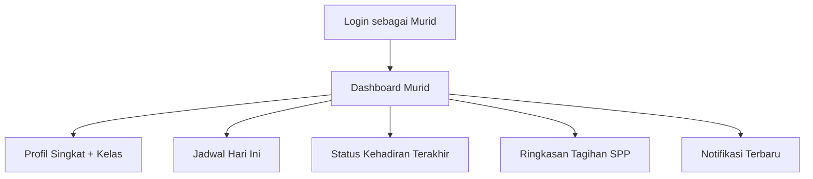

---

### 4.2 Jadwal Pelajaran Saya
**Fungsi:** Menampilkan jadwal pelajaran mingguan siswa berdasarkan kelas yang terdaftar.

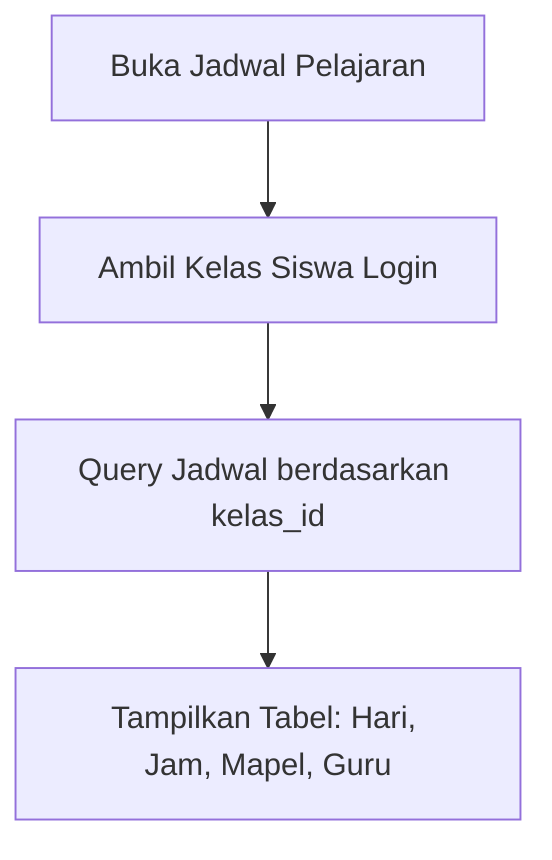

---

### 4.3 Kehadiran Saya
**Fungsi:** Melihat riwayat absensi pribadi — statistik Hadir/Sakit/Izin/Alpha, persentase kehadiran, dan detail harian.

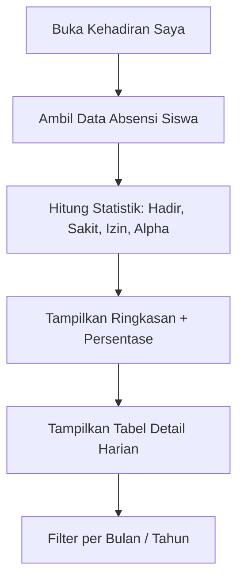

---

### 4.4 Rapor & Nilai
**Fungsi:** Melihat rapor yang telah diterbitkan — nilai per mata pelajaran, predikat, catatan wali kelas, dan opsi cetak PDF.

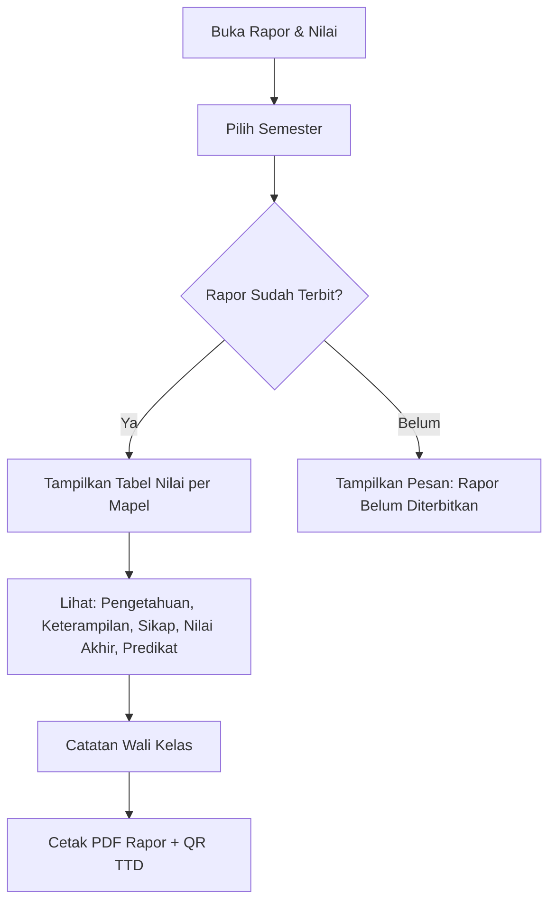

---

### 4.5 Tagihan SPP & Keuangan
**Fungsi:** Melihat daftar tagihan SPP, status pembayaran (Lunas/Belum Lunas), riwayat pembayaran, dan total tunggakan.

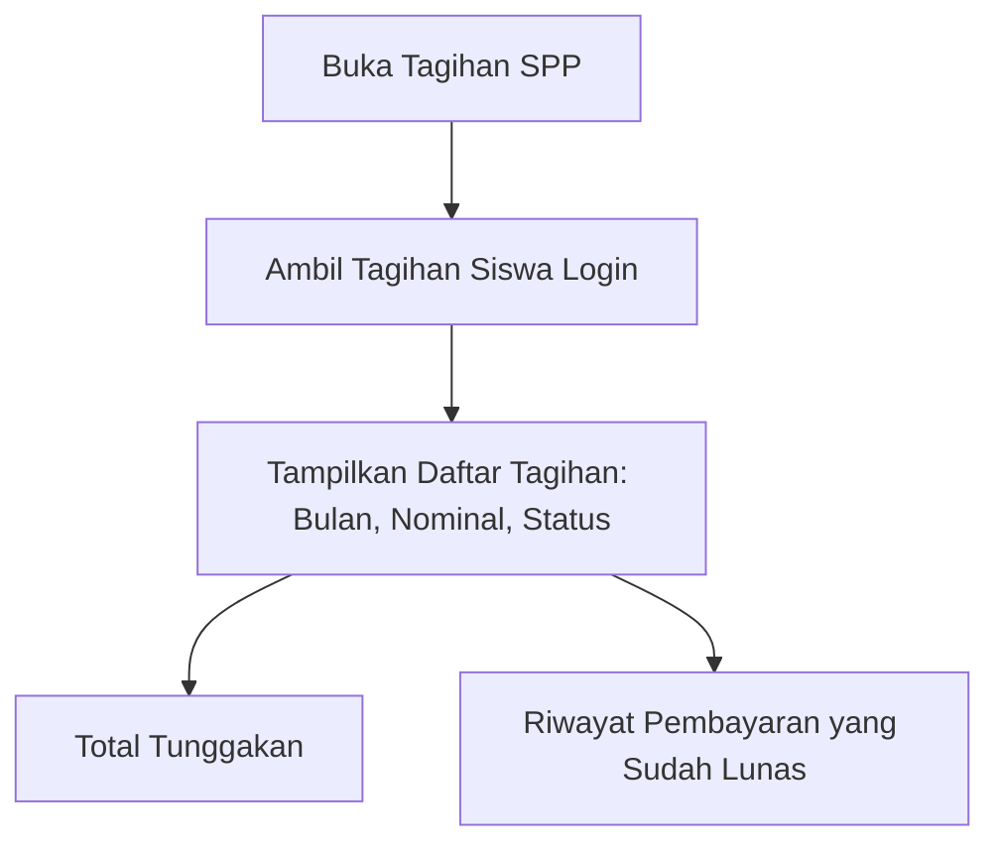

---

### 4.6 Ekstrakurikuler Saya
**Fungsi:** Menampilkan daftar kegiatan ekstrakurikuler yang diikuti siswa — nama ekskul, pembina, jadwal.

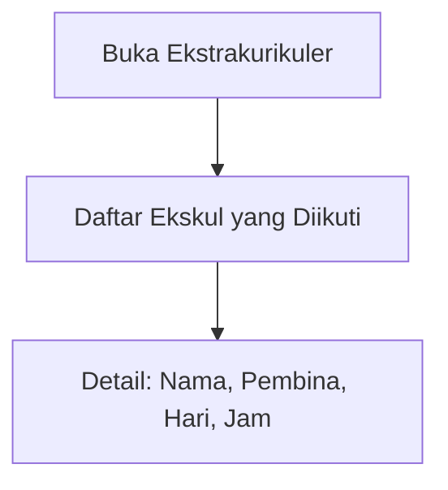

---

### 4.7 Riwayat Aktivitas
**Fungsi:** Melihat log aktivitas akun siswa — login, lihat rapor, dan aktivitas lainnya.

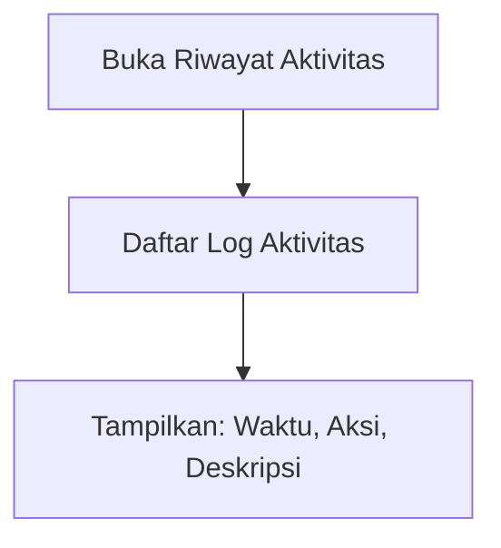

---

## 5. Finance / Keuangan

### 5.1 Dashboard Keuangan
**Fungsi:** Pusat pemantauan arus kas — pemasukan bulan ini, pengeluaran, kas bersih, dan total tunggakan SPP aktif.

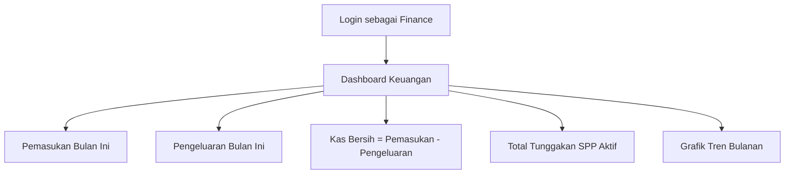

---

### 5.2 Overview Pembayaran Siswa
**Fungsi:** Melihat status pembayaran SPP seluruh siswa — filter per kelas, tahun ajaran, dan status (Lunas/Menunggak). Bisa langsung input pembayaran.

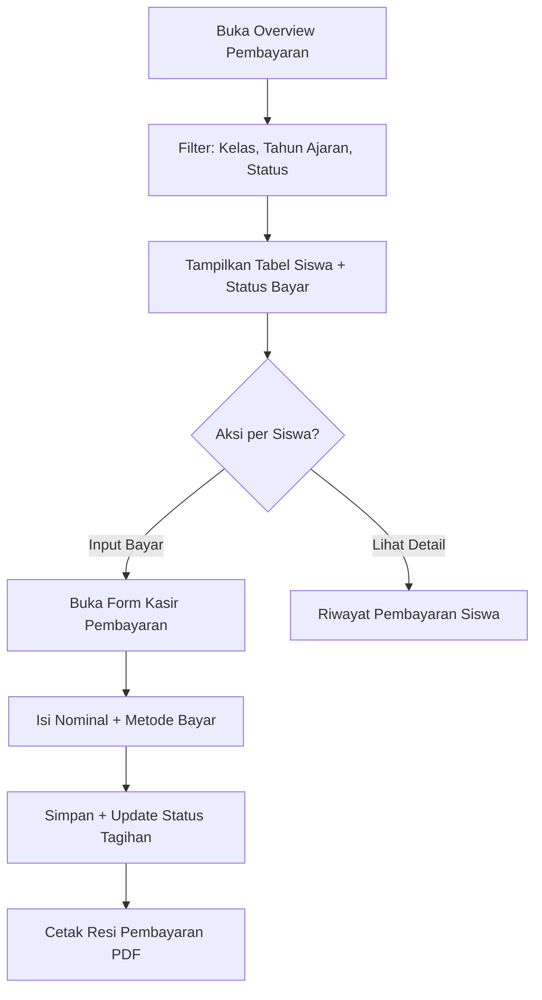

---

### 5.3 Manajemen Tagihan
**Fungsi:** Membuat tagihan SPP/biaya siswa — mode perorangan (satu siswa) atau mode otomatis (bulk generate SPP seluruh siswa per bulan).

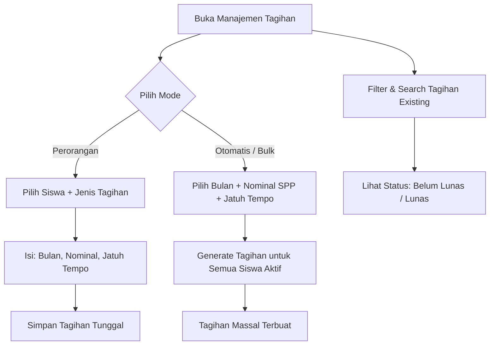

---

### 5.4 Input Pembayaran
**Fungsi:** Kasir keuangan memproses pembayaran tagihan siswa — cari siswa, pilih tagihan, input nominal, dan cetak resi.

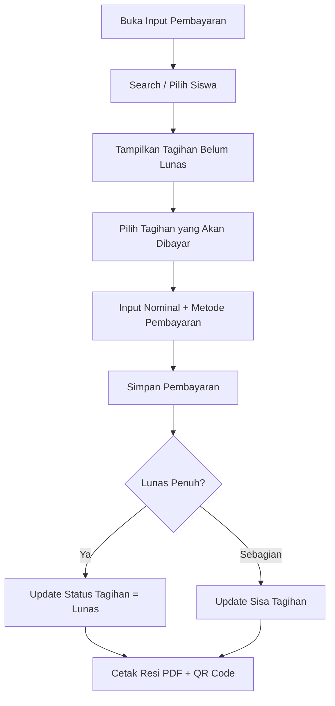

---

### 5.5 Arus Kas Masuk (Non-SPP)
**Fungsi:** Mencatat penerimaan kas non-SPP — Infaq Subuh, Sedekah Maghrib Mengaji, Donasi Donatur, Wakaf.

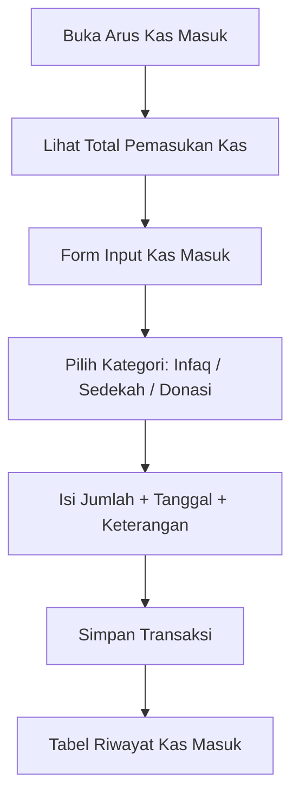

---

### 5.6 Arus Kas Keluar (Pengeluaran)
**Fungsi:** Mencatat pengeluaran operasional — Listrik/Air, Pemeliharaan, ATK, dan biaya operasional lainnya.

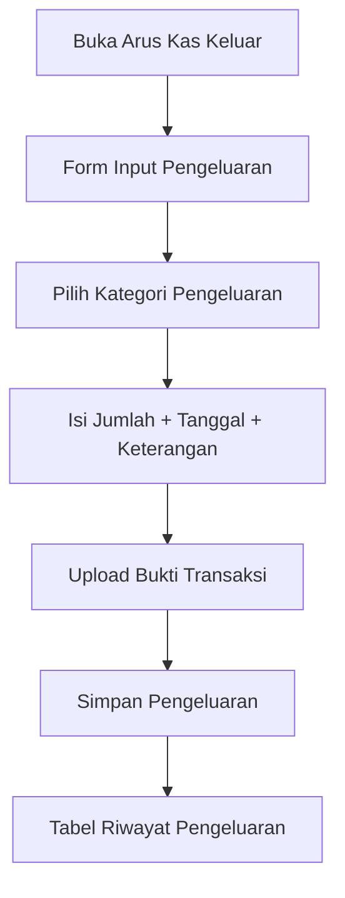

---

### 5.7 Pengajuan Dana
**Fungsi:** Alur persetujuan bertingkat untuk pengadaan barang/kegiatan. Threshold: ≤ Rp1 Juta → ACC Koordinator saja; > Rp1 Juta → ACC Koordinator + Kepala Yayasan.

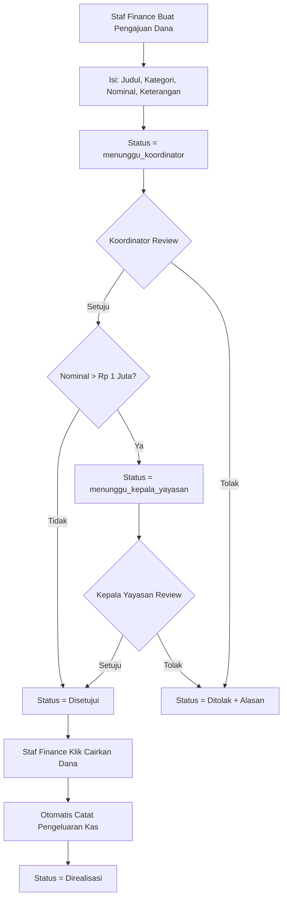

---

### 5.8 Dana BOS
**Fungsi:** Pencatatan dan pemantauan dana Bantuan Operasional Sekolah (BOS).

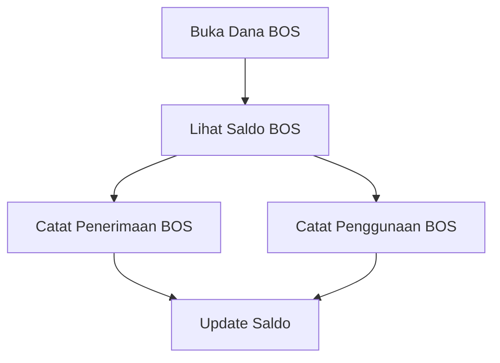

---

### 5.9 Manajemen Gaji Guru (Payroll)
**Fungsi:** Generate draf slip gaji bulanan seluruh guru aktif, edit insentif/potongan, lalu proses pembayaran.

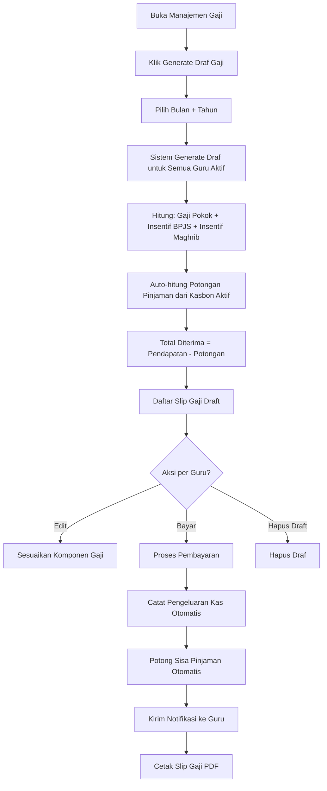

---

### 5.10 Manajemen Peminjaman / Kasbon Guru
**Fungsi:** Mencatat pinjaman kasbon guru — nominal, tenor cicilan, dan tracking sisa pinjaman. Potongan otomatis saat pembayaran gaji.

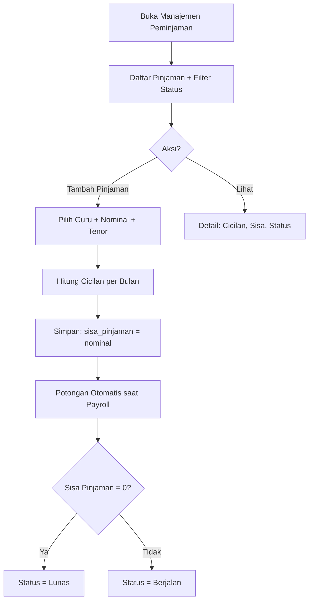

---

### 5.11 Laporan Pemasukan
**Fungsi:** Rekap seluruh transaksi pemasukan (SPP + Kas Masuk) dalam rentang tanggal tertentu. Ekspor ke PDF dan Excel.

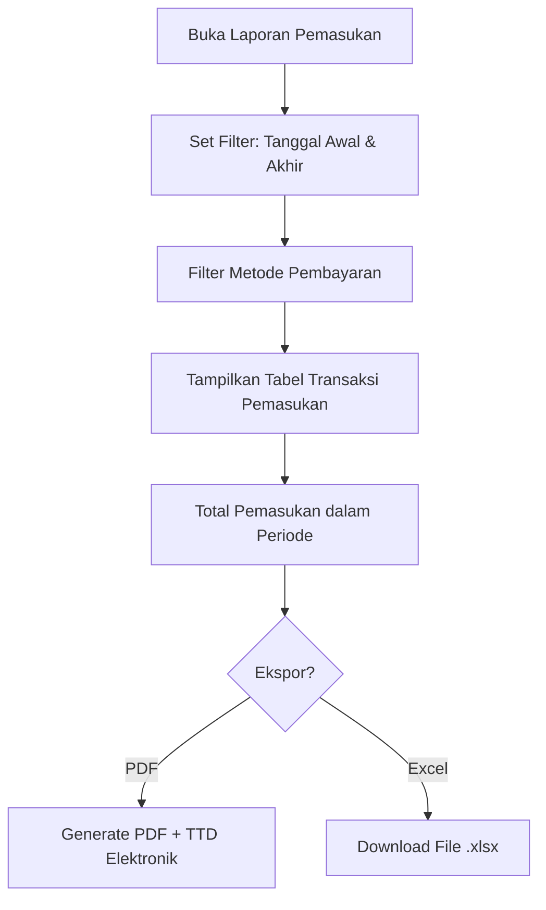

---

### 5.12 Laporan Pengeluaran
**Fungsi:** Rekap seluruh transaksi pengeluaran (operasional, gaji, pengajuan dana) dalam rentang tanggal. Ekspor ke PDF dan Excel.

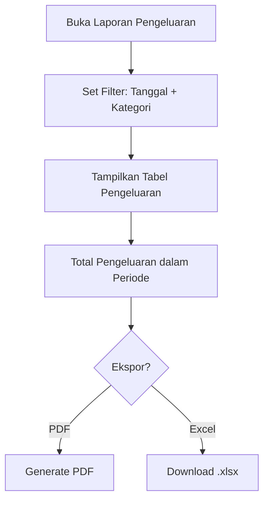

---

### 5.13 Laporan Tunggakan Siswa
**Fungsi:** Rekap piutang/tunggakan SPP per siswa, per kelas. Untuk koordinasi penagihan ke wali murid.

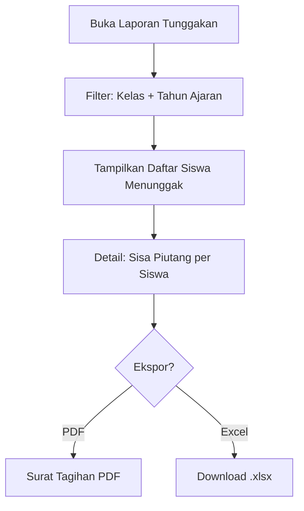

---

## 6. Kepala Sekolah

### 6.1 Dashboard Pemantauan Eksekutif
**Fungsi:** Dashboard read-only untuk kepala sekolah — ringkasan total siswa, guru, kelas, dan indikator kinerja akademik.

```mermaid
flowchart TD
    A[Login sebagai Kepala Sekolah] --> B[Dashboard Eksekutif]
    B --> C[Total Siswa Aktif]
    B --> D[Total Guru Aktif]
    B --> E[Total Kelas]
    B --> F[Indikator Akademik]
    B --> G[Overview Status Keuangan]
```

---

## 7. Koordinator

### 7.1 Persetujuan Koreksi Nilai Siswa
**Fungsi:** Meninjau dan menyetujui/menolak pengajuan koreksi nilai dari guru. Jika disetujui, nilai otomatis diperbarui dan rapor dihitung ulang.

```mermaid
flowchart TD
    A[Guru Ajukan Koreksi Nilai] --> B[Status = Pending]
    B --> C[Koordinator Buka Menu Koreksi Nilai]
    C --> D[Lihat Daftar Pengajuan Pending]
    D --> E{Keputusan?}
    E -->|Setujui| F[Update Nilai di Tabel Nilai]
    F --> G{Rapor Sudah Terbit?}
    G -->|Ya| H[Auto-recalculate RaporDetail]
    G -->|Tidak| I[Selesai]
    H --> I
    I --> J[Kirim Notifikasi ke Guru]
    E -->|Tolak| K[Status = Ditolak]
    K --> L[Kirim Notifikasi Penolakan ke Guru]
```

---

## 8. Shared / Umum

### 8.1 Profil Saya & Tanda Tangan Digital
**Fungsi:** Setiap pengguna bisa mengelola profil akun — ubah password, upload foto profil, dan mengelola tanda tangan digital (upload gambar TTD atau tanda tangan langsung di canvas web).

```mermaid
flowchart TD
    A[Buka Profil Saya] --> B[Lihat Data Profil]
    B --> C{Aksi?}
    C -->|Edit Profil| D[Ubah Nama, Email, Password]
    D --> E[Simpan]
    C -->|Upload Foto| F[Pilih File Gambar]
    F --> G[Simpan Foto Profil]
    C -->|TTD Digital| H{Metode TTD?}
    H -->|Upload Gambar| I[Upload File TTD]
    H -->|Tanda Tangan di Canvas| J[Gambar TTD di Web Canvas]
    I --> K[Simpan TTD ke Storage]
    J --> K
```

---

### 8.2 Notifikasi
**Fungsi:** Melihat daftar notifikasi sistem — rapor terbit, gaji dibayar, tagihan baru, dan pemberitahuan lainnya.

```mermaid
flowchart TD
    A[Buka Notifikasi] --> B[Daftar Notifikasi Terbaru]
    B --> C[Filter: Dibaca / Belum Dibaca]
    C --> D[Klik untuk Tandai Sudah Dibaca]
```

---

### 8.3 Laporan PDF dengan Tanda Tangan Elektronik
**Fungsi:** Semua laporan PDF (Absensi, Rapor, Resi, Slip Gaji, Laporan Keuangan) dilengkapi QR Code verifikasi dan tanda tangan elektronik resmi.

```mermaid
flowchart TD
    A[User Request Cetak PDF] --> B[Sistem Generate Dokumen]
    B --> C[Ambil TTD Elektronik dari DB]
    C --> D[Generate QR Code Verifikasi]
    D --> E[Render PDF: Data + TTD + QR]
    E --> F[User Download / Print PDF]
    F --> G[Pihak Ketiga Scan QR Code]
    G --> H[Verifikasi Keaslian Dokumen via URL Publik]
```

---

## Ringkasan Arsitektur Alur Sistem

```mermaid
flowchart TD
    subgraph AUTH["🔐 Autentikasi"]
        LOGIN[Login] --> ROLE{Cek Role User}
    end

    subgraph SA["👑 Super Admin"]
        SA_DASH[Dashboard]
        SA_USER[Manajemen User]
        SA_MASTER[Data Master: Siswa, Guru, Kelas, Jadwal, Mapel]
        SA_AUDIT[Audit Log]
        SA_SETTING[Pengaturan Sistem]
    end

    subgraph TU["📋 Tata Usaha"]
        TU_DASH[Dashboard]
        TU_MASTER[Data Master Shared]
        TU_KARYAWAN[Manajemen Karyawan]
        TU_PIKET[Piket Guru]
        TU_KALENDER[Kalender Akademik]
        TU_NAIK[Kenaikan Kelas]
        TU_ALUMNI[Data Alumni]
        TU_REKAP[Rekap Absensi & Nilai]
    end

    subgraph GURU["👨‍🏫 Guru"]
        G_DASH[Dashboard]
        G_ABSEN_DIRI[Absensi Diri]
        G_ABSEN_SISWA[Absensi Siswa]
        G_NILAI[Input Nilai]
        G_BOBOT[Pengaturan Bobot]
        G_JADWAL[Jadwal Mengajar]
        G_RAPOR[Terbitkan Rapor]
    end

    subgraph MURID["🎓 Portal Siswa"]
        M_DASH[Dashboard]
        M_JADWAL[Jadwal Pelajaran]
        M_HADIR[Kehadiran Saya]
        M_RAPOR[Rapor & Nilai]
        M_SPP[Tagihan SPP]
        M_EKSKUL[Ekstrakurikuler]
    end

    subgraph FINANCE["💰 Finance"]
        F_DASH[Dashboard Keuangan]
        F_OVERVIEW[Overview Pembayaran]
        F_TAGIHAN[Manajemen Tagihan]
        F_INPUT[Input Pembayaran]
        F_KAS_IN[Arus Kas Masuk]
        F_KAS_OUT[Arus Kas Keluar]
        F_GAJI[Payroll Gaji Guru]
        F_PINJAM[Peminjaman Kasbon]
        F_PENGAJUAN[Pengajuan Dana]
        F_LAPORAN[Laporan Keuangan]
    end

    subgraph KEPSEK["🏫 Kepala Sekolah"]
        KS_DASH[Dashboard Eksekutif]
    end

    subgraph KOORD["📝 Koordinator"]
        KO_KOREKSI[Persetujuan Koreksi Nilai]
    end

    ROLE -->|super_admin| SA_DASH
    ROLE -->|tata_usaha| TU_DASH
    ROLE -->|guru| G_DASH
    ROLE -->|murid| M_DASH
    ROLE -->|finance| F_DASH
    ROLE -->|kepala_sekolah| KS_DASH
    ROLE -->|koordinator| KO_KOREKSI
```

---

> **Catatan:** Dokumen ini di-generate berdasarkan analisis kode sumber sistem. Untuk detail teknis implementasi, lihat file Livewire component di `app/Livewire/` dan view Blade di `resources/views/livewire/`.
