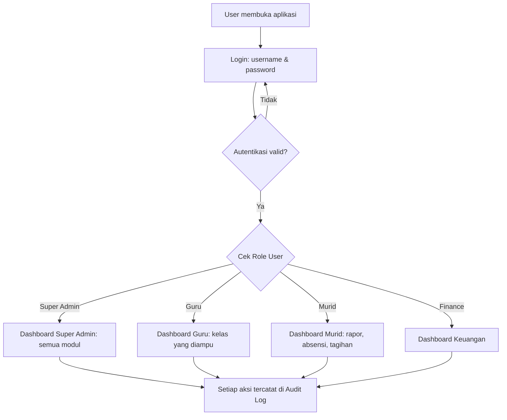
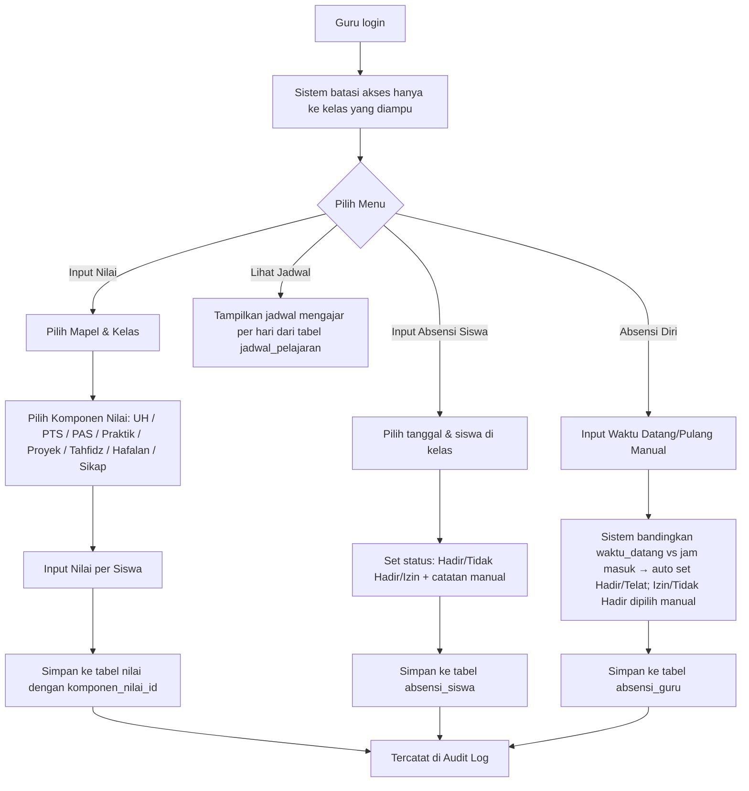
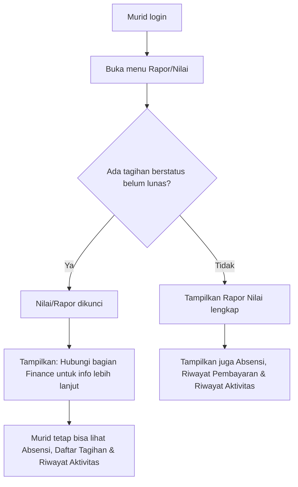
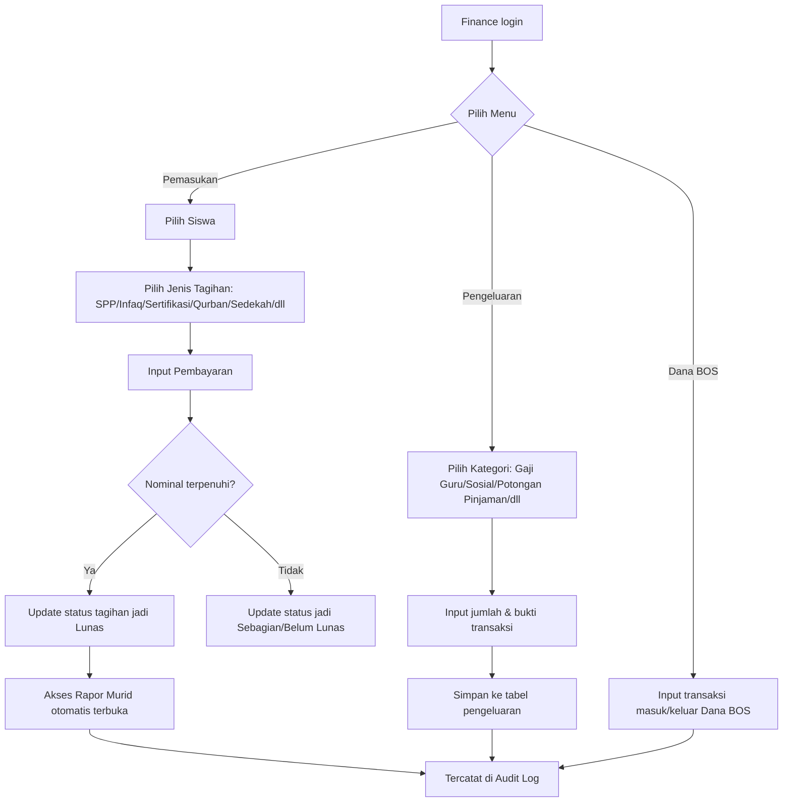
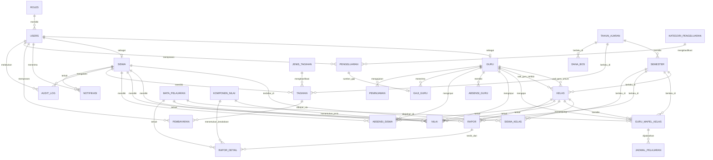

# Perencanaan Sistem Informasi Akademik & Keuangan Yayasan

Dokumen ini merangkum kebutuhan yang sudah dijelaskan, lalu diturunkan menjadi arsitektur informasi, flowchart proses bisnis, desain database (ERD), dan roadmap MVP.

---

## 1. Ringkasan Kebutuhan

### 1.1 Aktor (Role Pengguna)

| Role                             | Hak Akses                                                                             |
| -------------------------------- | ------------------------------------------------------------------------------------- |
| **Super Admin / Kepala Yayasan** | Akses ke seluruh modul, termasuk Manajemen User dan Log Aktivitas/Audit di semua menu |
| **Guru** (Umum & Tahfidz)        | Hanya bisa mengakses Input Nilai & Absensi, terbatas pada kelas yang ia ampu saja     |
| **Murid**                        | Melihat rapor nilai, absensi, dan status tagihan miliknya sendiri                     |
| **Finance / Bendahara**          | Hanya bisa mengakses modul Keuangan (seluruh datanya)                                 |

### 1.2 Modul Utama

1. **Tata Kelola Umum** (master data) — data siswa, data guru, data mata pelajaran, data kelas & tahun ajaran, penugasan guru ke kelas & mata pelajaran, **jadwal pelajaran**
2. **Akademik** — Input Nilai (per komponen: UH, PTS, PAS, Praktik, Proyek, Tahfidz, Hafalan, Sikap) & Absensi, dikerjakan guru
3. **Portal Murid** — Rapor Nilai, Absensi, Status Tagihan, **Riwayat Aktivitas**, **Notifikasi**
4. **Keuangan** — Pemasukan per siswa, Pengeluaran, Dana BOS
5. **Manajemen User & Audit Log** — khusus Super Admin, tapi log tercatat otomatis di semua modul
6. **Notifikasi** — notifikasi in-app untuk semua role (tunggakan, rapor terbit, pengumuman); integrasi WA/Email di Fase 2
7. **Laporan / Report** — rekap absensi, rekap nilai, laporan keuangan, slip gaji — scope bertahap per fase (lihat §6)

### 1.3 Aturan Bisnis Kunci

- Setiap kelas **hanya punya 2 guru**: 1 Guru Umum + 1 Guru Tahfidz.
- Guru hanya bisa melihat/menginput data untuk kelas yang ia ampu.
- **Absensi Guru**: 4 status — Hadir, Tidak Hadir, Izin, Telat — **diinput manual oleh guru sendiri (self check-in) melalui aplikasi, tanpa mesin Fingerprint**. Guru mencatat `waktu_datang`/`waktu_pulang`; status **Hadir/Telat** dihitung otomatis oleh sistem dengan membandingkan `waktu_datang` terhadap jam masuk yang dikonfigurasi Super Admin, sedangkan **Izin/Tidak Hadir** tetap dipilih manual oleh guru (atau diinputkan oleh Super Admin bila guru berhalangan lapor). Lihat 9.1 untuk catatan kontrol tambahan.
- **Absensi Murid**: 3 status — Hadir, Tidak Hadir, Izin — plus catatan bebas, diinput **manual oleh guru**. Absensi bersifat **harian** (1 record per siswa per hari), bukan per mata pelajaran.
- **Blocking Rapor / Nilai**:
    - Murid tidak bisa mengakses nilai/rapor jika ada tagihan **bertipe blocking** (`jenis_tagihan.is_blocking = true`) yang berstatus belum lunas.
    - Pengecekan hanya pada tagihan di **tahun ajaran aktif**.
    - Berlaku untuk **semua tagihan belum lunas** terlepas dari jatuh tempo.
    - Sistem menampilkan pesan untuk menghubungi bagian Finance.
- **Akun Murid & Wali**: 1 akun murid = 1 akun wali. Tidak ada role `wali` terpisah — akun `murid` bisa digunakan langsung oleh siswa atau diwakilkan oleh orang tua/wali. Relasi 1 anak : 1 akun.
- Setiap modul wajib punya log aktivitas/audit trail.
- **Soft Delete**: Tabel-tabel krusial (`users`, `guru`, `siswa`, `kelas`, `tagihan`, `pembayaran`, `pengeluaran`, `gaji_guru`) menggunakan soft delete (`deleted_at`) agar data yang dihapus tetap bisa diaudit.
- **Timestamps**: Semua tabel wajib memiliki `created_at` dan `updated_at` (Laravel `$timestamps = true`).
- **Jadwal Pelajaran**: Jadwal bersifat **tetap per semester** (tidak berubah mingguan). Dikelola oleh Super Admin (fungsi Tata Usaha). Sistem harus memvalidasi **bentrok jadwal** — seorang guru tidak boleh mengajar di 2 kelas pada jam yang sama, dan 1 kelas tidak boleh punya 2 mapel di jam yang sama.
- **Komponen Nilai**: Jenis penilaian (UH, PTS, PAS, Praktik, Proyek, Tahfidz, Hafalan, Sikap) dikelola sebagai **master data** (`komponen_nilai`), bukan ENUM — agar bisa ditambah/diubah tanpa migrasi database. Setiap komponen punya bobot (persentase) untuk perhitungan nilai akhir rapor. **Bobot seragam untuk semua mata pelajaran**. Komponen "Sikap" berupa **predikat angka** (nilai numerik yang dipetakan ke predikat: Sangat Baik / Baik / Cukup / Kurang).
- **Notifikasi**: Notifikasi in-app tersedia sejak MVP untuk semua role. Channel WA/Email ditambahkan di Fase 2. Jenis notifikasi: tunggakan pembayaran, rapor terbit, pengumuman, absensi, dan lainnya.
- Kategori **pemasukan** per siswa:
    - Rutin: SPP, Infaq, Sertifikasi, Qurban, Sedekah Subuh & Maghrib Mengaji
    - Sekali di awal masuk: Uang Pembangunan, Uang Seragam, Uang Pendaftaran
    - Tahunan: Uang Buku, Uang Tahunan (ekskul, dll)
- Kategori **pengeluaran**: Gaji Guru (dengan insentif BPJS & Maghrib Mengaji), Sosial, Potongan Peminjaman, Dana BOS, Lainnya.
- **Sinkronisasi Pembayaran → Tagihan**: Setiap kali `pembayaran` dibuat/diupdate/dihapus, service layer otomatis menghitung ulang `tagihan.status` berdasarkan `SUM(pembayaran.nominal_dibayar)` vs `tagihan.nominal`. Field `tagihan.total_dibayar` digunakan sebagai cached column.

---

## 2. Arsitektur Informasi (Sitemap per Role)

```mermaid
flowchart TD
    ROOT[Sistem Informasi Akademik & Keuangan]
    ROOT --> SA[Super Admin / Kepala Yayasan]
    ROOT --> GR[Guru]
    ROOT --> MU[Murid]
    ROOT --> FI[Finance / Bendahara]

    SA --> SA1[Tata Kelola Umum]
    SA1 --> SA1a[Data Siswa]
    SA1 --> SA1b[Data Guru]
    SA1 --> SA1c[Data Mata Pelajaran]
    SA1 --> SA1d[Data Kelas & Tahun Ajaran]
    SA1 --> SA1e[Penugasan Guru - Kelas - Mapel]
    SA1 --> SA1f[Jadwal Pelajaran]
    SA1 --> SA1g[Komponen Nilai]
    SA --> SA2[Akademik Semua Kelas]
    SA --> SA3[Keuangan Semua Data]
    SA --> SA4[Manajemen User]
    SA --> SA5[Log Aktivitas / Audit Semua Modul]
    SA --> SA6[Laporan: Absensi, Nilai, Keuangan]
    SA --> SA7[Notifikasi & Pengumuman]

    GR --> GR1[Kelas yang Diampu]
    GR1 --> GR1a[Input Nilai per Komponen: UH, PTS, PAS, Praktik, Proyek, Tahfidz, Hafalan, Sikap]
    GR1 --> GR1b[Input Absensi Siswa Manual]
    GR --> GR2[Absensi Diri: Self Check-in Manual]
    GR --> GR3[Lihat Jadwal Mengajar]
    GR --> GR4[Laporan: Rekap Absensi, Rekap Nilai]
    GR --> GR5[Notifikasi]

    MU --> MU1{Cek Tunggakan}
    MU1 -- Lunas --> MU2[Rapor Nilai: Breakdown per Komponen]
    MU1 -- Ada Tunggakan --> MU3[Notifikasi: Hubungi Finance]
    MU --> MU4[Riwayat Absensi]
    MU --> MU5[Status Tagihan/Pembayaran]
    MU --> MU6[Riwayat Aktivitas]
    MU --> MU7[Jadwal Pelajaran Kelas]
    MU --> MU8[Notifikasi]

    FI --> FI1[Data Siswa & SPP]
    FI --> FI2[Infaq, Sertifikasi, Qurban, Sedekah]
    FI --> FI3[Uang Masuk Sekali di Awal]
    FI --> FI4[Uang Buku & Uang Tahunan]
    FI --> FI5[Pengeluaran: Gaji, Insentif, Sosial, Potongan]
    FI --> FI6[Dana BOS]
    FI --> FI7[Laporan Keuangan & Slip Gaji]
    FI --> FI8[Notifikasi]
```



---

## 3. Flowchart Proses Bisnis

### 3.1 Alur Login & Routing Berdasarkan Role



### 3.2 Alur Guru: Input Nilai & Absensi



### 3.3 Alur Murid: Akses Rapor dengan Cek Tunggakan



### 3.4 Alur Finance: Pemasukan, Pengeluaran, Dana BOS



---

## 4. Desain Database (ERD Lengkap)

### 4.1 Diagram Relasi Antar Tabel



### 4.2 Detail Struktur Tabel

#### Grup A — User & Master Data

**roles**
| Field | Tipe | Keterangan |
|---|---|---|
| id | BIGINT PK | |
| nama | VARCHAR | super_admin, guru, murid, finance |

**users**
| Field | Tipe | Keterangan |
|---|---|---|
| id | BIGINT PK | |
| nama | VARCHAR | single source of truth untuk nama (guru, siswa, staff) |
| username | VARCHAR | UNIQUE |
| email | VARCHAR | UNIQUE, nullable |
| password | VARCHAR (hashed) | |
| role_id | BIGINT FK → roles.id | |
| no_hp | VARCHAR nullable | data kontak, tersedia untuk semua role |
| alamat | TEXT nullable | data alamat, tersedia untuk semua role |
| status | ENUM('aktif','nonaktif') | |
| deleted_at | DATETIME nullable | soft delete |

> **Catatan**: Field `no_hp` dan `alamat` ditambahkan di level `users` (bukan tabel `pegawai` terpisah) karena: (1) Finance/Admin tidak punya proses bisnis yang membutuhkan tabel profil tersendiri, (2) menghindari layer join tambahan (`users → pegawai → guru`), (3) field ini nullable sehingga role yang tidak membutuhkannya tidak perlu mengisinya. Untuk Guru, `no_hp` dan `alamat` **tetap ada juga di tabel `guru`** karena data guru lebih detail dan bisa jadi berbeda konteksnya (alamat domisili vs alamat KTP).

**guru**
| Field | Tipe | Keterangan |
|---|---|---|
| id | BIGINT PK | |
| user_id | BIGINT FK → users.id | nullable jika belum aktif login. Nama diambil dari `users.nama` |
| nip | VARCHAR | UNIQUE |
| jenis_guru | ENUM('umum','tahfidz') | menentukan slot di kelas |
| no_hp, alamat | VARCHAR/TEXT | |
| tanggal_masuk | DATE | |
| status_aktif | BOOLEAN | |
| deleted_at | DATETIME nullable | soft delete |

> **Catatan**: Field `nama` dihapus dari tabel ini. Gunakan `users.nama` via relasi `user_id`. Untuk guru yang belum punya akun (`user_id = NULL`), nama sementara bisa disimpan di `users` saat akun dibuat.

**siswa**
| Field | Tipe | Keterangan |
|---|---|---|
| id | BIGINT PK | |
| user_id | BIGINT FK → users.id | login murid/wali (1 akun = 1 siswa = 1 wali), nullable |
| nis, nisn | VARCHAR | UNIQUE |
| jenis_kelamin, tempat_lahir, tanggal_lahir | VARCHAR/DATE | |
| alamat | TEXT | |
| nama_wali, no_hp_wali | VARCHAR | |
| kelas_id | BIGINT FK → kelas.id nullable | **cache** kelas aktif saat ini. Riwayat lengkap ada di `siswa_kelas` |
| tanggal_masuk | DATE | acuan uang masuk one-time |
| status | ENUM('aktif','lulus','pindah','keluar') | |
| deleted_at | DATETIME nullable | soft delete |

> **Catatan**: Field `nama` dihapus dari tabel ini. Gunakan `users.nama` via relasi `user_id`.

**tahun_ajaran**
| Field | Tipe | Keterangan |
|---|---|---|
| id | BIGINT PK | |
| nama | VARCHAR | contoh: 2025/2026 |
| status_aktif | BOOLEAN | hanya 1 yang aktif di satu waktu |

> **Catatan**: Field `semester`, `tanggal_mulai`, `tanggal_selesai` dipindahkan ke tabel `semester` (Opsi A). Tabel ini sekarang murni representasi 1 tahun ajaran penuh.

**semester**
| Field | Tipe | Keterangan |
|---|---|---|
| id | BIGINT PK | |
| tahun_ajaran_id | BIGINT FK → tahun_ajaran.id | |
| semester | ENUM('ganjil','genap') | |
| tanggal_mulai, tanggal_selesai | DATE | |
| status_aktif | BOOLEAN | hanya 1 semester aktif di satu waktu |

> **Catatan**: Tabel baru. Setiap `tahun_ajaran` memiliki 2 record semester. Tabel yang butuh context per-semester (kelas, nilai, rapor, guru_mapel_kelas) menggunakan `semester_id`. Tabel yang cukup tahunan (tagihan, dana_bos) tetap menggunakan `tahun_ajaran_id`.

**siswa_kelas** _(tabel pivot: riwayat kelas siswa per semester)_
| Field | Tipe | Keterangan |
|---|---|---|
| id | BIGINT PK | |
| siswa_id | BIGINT FK → siswa.id | |
| kelas_id | BIGINT FK → kelas.id | |
| semester_id | BIGINT FK → semester.id | |
| status | ENUM('aktif','pindah','naik_kelas') | |

> **Catatan**: Tabel baru. Menyimpan riwayat lengkap kelas yang pernah ditempati siswa. `UNIQUE(siswa_id, semester_id)` — 1 siswa hanya di 1 kelas per semester.

**kelas**
| Field | Tipe | Keterangan |
|---|---|---|
| id | BIGINT PK | |
| nama_kelas | VARCHAR | |
| tingkat | VARCHAR | |
| semester_id | BIGINT FK → semester.id | kelas dibuat per semester |
| guru_umum_id | BIGINT FK → guru.id | wajib jenis_guru='umum' |
| guru_tahfidz_id | BIGINT FK → guru.id | wajib jenis_guru='tahfidz' |
| deleted_at | DATETIME nullable | soft delete |

**mata_pelajaran**
| Field | Tipe | Keterangan |
|---|---|---|
| id | BIGINT PK | |
| nama_mapel | VARCHAR | |
| jenis | ENUM('umum','tahfidz') | |
| deskripsi | TEXT | |

**guru_mapel_kelas** _(tabel pivot: guru mengajar mapel apa di kelas mana)_
| Field | Tipe | Keterangan |
|---|---|---|
| id | BIGINT PK | |
| guru_id | BIGINT FK | |
| kelas_id | BIGINT FK | |
| mapel_id | BIGINT FK | |
| semester_id | BIGINT FK → semester.id | |

> **Constraint**: `UNIQUE(guru_id, kelas_id, mapel_id, semester_id)` — mencegah assign guru ke mapel yang sama di kelas yang sama 2x.

**jadwal_pelajaran** _(tabel baru — jadwal tetap per semester, dikelola Super Admin / TU)_
| Field | Tipe | Keterangan |
|---|---|---|
| id | BIGINT PK | |
| guru_mapel_kelas_id | BIGINT FK → guru_mapel_kelas.id | siapa mengajar mapel apa di kelas mana |
| hari | ENUM('senin','selasa','rabu','kamis','jumat') | |
| jam_mulai | TIME | |
| jam_selesai | TIME | |

> **Constraint**: `UNIQUE(guru_mapel_kelas_id, hari, jam_mulai)` — mencegah duplikasi jadwal.
> **Validasi aplikasi** (bukan constraint SQL): (1) Seorang guru tidak boleh mengajar di 2 kelas pada jam yang sama di hari yang sama. (2) Satu kelas tidak boleh punya 2 mapel di jam yang tumpang tindih di hari yang sama. Kedua validasi ini harus dicek di service layer saat create/update jadwal.
> **Catatan**: Relasi ke `guru_mapel_kelas` (bukan langsung ke `guru_id` + `kelas_id` + `mapel_id`) karena data penugasan sudah ada di sana — tidak perlu duplikasi FK. Jadwal bersifat tetap per semester; karena `guru_mapel_kelas` sudah punya `semester_id`, jadwal otomatis terikat ke semester yang benar.

**komponen_nilai** _(tabel baru — master data jenis penilaian, dikelola Super Admin)_
| Field | Tipe | Keterangan |
|---|---|---|
| id | BIGINT PK | |
| nama | VARCHAR | "UH", "PTS", "PAS", "Praktik", "Proyek", "Tahfidz", "Hafalan", "Sikap" |
| kategori | ENUM('pengetahuan','keterampilan','sikap','keagamaan') | untuk grouping di rapor |
| bobot | DECIMAL(5,2) | persentase bobot untuk nilai akhir, misal 30.00 = 30% |
| berlaku_untuk | ENUM('umum','tahfidz','semua') | UH/PTS/PAS untuk mapel umum, Hafalan untuk tahfidz, Sikap untuk semua |
| urutan | INT | urutan tampil di rapor dan form input |

> **Catatan**: Bobot **seragam untuk semua mata pelajaran** (sesuai keputusan). Total bobot semua komponen per kategori `berlaku_untuk` harus = 100%. Divalidasi di service layer saat Super Admin mengubah bobot. Komponen bisa ditambah/diubah tanpa migrasi database.
> **Seed data default**:
> | Nama | Kategori | Bobot | Berlaku Untuk |
> |---|---|---|---|
> | UH (Ulangan Harian) | pengetahuan | 25.00 | umum |
> | PTS (Penilaian Tengah Semester) | pengetahuan | 25.00 | umum |
> | PAS (Penilaian Akhir Semester) | pengetahuan | 30.00 | umum |
> | Praktik | keterampilan | 10.00 | umum |
> | Proyek | keterampilan | 10.00 | umum |
> | Tahfidz | keagamaan | 50.00 | tahfidz |
> | Hafalan | keagamaan | 50.00 | tahfidz |
> | Sikap | sikap | 100.00 | semua |
>
> Bobot di atas adalah contoh awal — Super Admin bisa mengubah via menu Komponen Nilai.

**pengaturan** _(tabel baru — key-value config, dipakai Super Admin untuk atur parameter sistem tanpa perlu ubah kode)_
| Field | Tipe | Keterangan |
|---|---|---|
| id | BIGINT PK | |
| key | VARCHAR UNIQUE | contoh: `jam_masuk_guru`, `toleransi_telat_menit` |
| value | VARCHAR | contoh: `07:00`, `15` |
| keterangan | VARCHAR nullable | deskripsi singkat untuk UI pengaturan |

> **Catatan**: Dipakai antara lain oleh service layer absensi guru untuk menentukan ambang batas **Telat** (`waktu_datang > jam_masuk_guru + toleransi_telat_menit`) — lihat 4.2 Grup B `absensi_guru`. Tidak perlu relasi FK ke tabel lain, cukup dibaca via key di kode.

#### Grup B — Akademik

**nilai**
| Field | Tipe | Keterangan |
|---|---|---|
| id | BIGINT PK | |
| siswa_id, mapel_id, guru_id, kelas_id | BIGINT FK | |
| semester_id | BIGINT FK → semester.id | |
| komponen_nilai_id | BIGINT FK → komponen_nilai.id | menggantikan `jenis_nilai` ENUM — lebih fleksibel |
| tanggal | DATE | |
| nilai | DECIMAL(5,2) | |
| catatan | TEXT nullable | |

> **Catatan perubahan**: Field `jenis_nilai ENUM('harian','mingguan')` **diganti** dengan `komponen_nilai_id FK` yang merujuk ke tabel master `komponen_nilai`. Ini memungkinkan Super Admin menambah/mengubah jenis penilaian (UH, PTS, PAS, Praktik, Proyek, Tahfidz, Hafalan, Sikap) tanpa migrasi database.

**rapor** _(header — snapshot 1x per siswa per semester, direkomendasikan sebagai tabel tersendiri, bukan hitung on-the-fly, agar riwayat tidak berubah kalau nilai direvisi)_
| Field | Tipe | Keterangan |
|---|---|---|
| id | BIGINT PK | |
| siswa_id | BIGINT FK | |
| semester_id | BIGINT FK → semester.id | |
| kelas_id | BIGINT FK → kelas.id | kelas siswa saat rapor dibuat |
| catatan_wali_kelas | TEXT nullable | |
| tanggal_terbit | DATE | |

> **Constraint**: `UNIQUE(siswa_id, semester_id)` — 1 siswa hanya punya 1 rapor per semester.

**rapor_detail** _(baris nilai per mata pelajaran dalam 1 rapor — diperluas untuk breakdown per kategori)_
| Field | Tipe | Keterangan |
|---|---|---|
| id | BIGINT PK | |
| rapor_id | BIGINT FK → rapor.id | |
| mapel_id | BIGINT FK | |
| nilai_pengetahuan | DECIMAL(5,2) nullable | agregat weighted dari komponen kategori 'pengetahuan' (UH, PTS, PAS) |
| nilai_keterampilan | DECIMAL(5,2) nullable | agregat weighted dari komponen kategori 'keterampilan' (Praktik, Proyek) |
| nilai_sikap | DECIMAL(5,2) nullable | predikat angka dari komponen kategori 'sikap', dipetakan ke teks: ≥90 = Sangat Baik, ≥75 = Baik, ≥60 = Cukup, <60 = Kurang |
| nilai_keagamaan | DECIMAL(5,2) nullable | agregat dari komponen kategori 'keagamaan' (Tahfidz, Hafalan) — hanya terisi untuk mapel tahfidz |
| nilai_akhir | DECIMAL(5,2) | weighted average dari semua komponen yang berlaku untuk mapel ini |
| predikat | VARCHAR nullable | A/B/C/D, dihitung dari `nilai_akhir` |

> **Constraint**: `UNIQUE(rapor_id, mapel_id)` — 1 mapel hanya muncul 1x per rapor.
> **Alasan normalisasi**: Pada desain sebelumnya, `catatan_wali_kelas` dan `tanggal_terbit` disimpan berulang di **setiap baris mapel** milik siswa+semester yang sama — padahal nilainya identik untuk semua mapel siswa tsb (dependensi parsial terhadap sebagian primary key, melanggar 2NF: nilai itu bergantung ke `(siswa_id, semester_id)`, bukan ke `(siswa_id, semester_id, mapel_id)` secara utuh). Efeknya: kalau wali kelas edit catatan, harus update N baris (N = jumlah mapel) dan rawan data tidak konsisten antar baris. Dengan header/detail: `catatan_wali_kelas` & `tanggal_terbit` disimpan **sekali** di `rapor` (header), sementara `nilai_akhir`/`predikat` per mapel ada di `rapor_detail` — pola ini identik dengan invoice header/invoice-line yang sudah lazim dipakai. `nilai_akhir` & `predikat` sendiri tetap sengaja **di-snapshot** (bukan dihitung real-time dari tabel `nilai`) karena itu keputusan bisnis yang disengaja (riwayat rapor tidak boleh berubah kalau nilai harian direvisi belakangan) — bukan pelanggaran normalisasi.

**absensi_guru**
| Field | Tipe | Keterangan |
|---|---|---|
| id | BIGINT PK | |
| guru_id | BIGINT FK | |
| tanggal | DATE | |
| waktu_datang, waktu_pulang | TIME nullable | diisi guru sendiri saat self check-in |
| status | ENUM('hadir','tidak_hadir','izin','telat') | `hadir`/`telat` **dihitung otomatis** oleh service layer (bandingkan `waktu_datang` vs `pengaturan.jam_masuk_guru`); `izin`/`tidak_hadir` dipilih manual |
| catatan | TEXT nullable | alasan izin/tidak hadir |
| diinput_oleh | BIGINT FK → users.id nullable | isi otomatis `user_id` guru ybs saat self check-in; diisi Super Admin jika guru tidak sempat lapor (nilainya beda dari `guru_id` → jadi penanda "diinputkan admin", berguna untuk audit) |

> **Constraint**: `UNIQUE(guru_id, tanggal)` — mencegah double absensi guru di hari yang sama.
> **Catatan (pengganti Fingerprint)**: Tanpa mesin biometrik, kontrol kedisiplinan dipindah ke: (1) perhitungan status Hadir/Telat otomatis dari `waktu_datang` vs jam masuk yang dikonfigurasi (bukan klaim sepihak guru), dan (2) Super Admin/Kepala Yayasan bisa melihat & mengoreksi rekap absensi guru dari dashboard — setiap koreksi tetap tercatat di `audit_log`. Lihat diskusi lebih lanjut di bagian 9.1.

**absensi_siswa**
| Field | Tipe | Keterangan |
|---|---|---|
| id | BIGINT PK | |
| siswa_id, kelas_id | BIGINT FK | |
| guru_id | BIGINT FK | guru yang menginput |
| tanggal | DATE | |
| status | ENUM('hadir','tidak_hadir','izin') | |
| catatan | TEXT nullable | manual dari guru |

> **Constraint**: `UNIQUE(siswa_id, kelas_id, tanggal)` — mencegah double absensi siswa di hari yang sama. Absensi bersifat **harian**, bukan per mata pelajaran.

#### Grup C — Keuangan

**jenis_tagihan** _(referensi jenis pemasukan)_
| Field | Tipe | Keterangan |
|---|---|---|
| id | BIGINT PK | |
| nama | VARCHAR | SPP, Infaq, Sertifikasi, Qurban, Sedekah Subuh, Sedekah Maghrib Mengaji, Uang Pembangunan, Uang Seragam, Uang Pendaftaran, Uang Buku, Uang Tahunan |
| kategori | ENUM('rutin','one_time','tahunan') | |
| default_nominal | DECIMAL(12,2) | |
| is_blocking | BOOLEAN default true | jika true, tagihan bertipe ini yang belum lunas akan memblokir akses rapor/nilai murid |

> **Catatan**: Field `is_blocking` ditambahkan agar bisa dikonfigurasi per jenis tagihan. Misalnya, SPP bersifat blocking, tapi Sedekah/Qurban bisa diset non-blocking sesuai kebijakan yayasan.

**tagihan**
| Field | Tipe | Keterangan |
|---|---|---|
| id | BIGINT PK | |
| siswa_id | BIGINT FK | |
| jenis_tagihan_id | BIGINT FK | |
| tahun_ajaran_id | BIGINT FK | tagihan bersifat tahunan, bukan per semester |
| bulan | VARCHAR nullable | untuk item rutin bulanan |
| nominal | DECIMAL(12,2) | |
| total_dibayar | DECIMAL(12,2) default 0 | cached column, di-update otomatis oleh service layer setiap ada pembayaran |
| status | ENUM('belum_bayar','sebagian','lunas') | di-update otomatis berdasarkan total_dibayar vs nominal |
| jatuh_tempo | DATE | |
| deleted_at | DATETIME nullable | soft delete |

> **Catatan**: 1 tagihan bisa memiliki N pembayaran (cicilan). Status otomatis dihitung: jika `total_dibayar >= nominal` → lunas, jika `total_dibayar > 0` → sebagian, jika `total_dibayar = 0` → belum_bayar. **Blocking rapor** hanya memeriksa tagihan di tahun ajaran aktif (`tahun_ajaran.status_aktif = true`) yang `jenis_tagihan.is_blocking = true` dan `status != 'lunas'`.

**pembayaran**
| Field | Tipe | Keterangan |
|---|---|---|
| id | BIGINT PK | |
| tagihan_id | BIGINT FK | |
| tanggal_bayar | DATE | |
| nominal_dibayar | DECIMAL(12,2) | |
| metode_bayar | VARCHAR | tunai/transfer/dll |
| bukti_bayar | VARCHAR | path file |
| petugas_id | BIGINT FK → users.id | staf finance yang input |
| deleted_at | DATETIME nullable | soft delete |

**kategori_pengeluaran**
| Field | Tipe | Keterangan |
|---|---|---|
| id | BIGINT PK | |
| nama | VARCHAR | Gaji Guru, Insentif BPJS, Insentif Maghrib Mengaji, Sosial, Potongan Peminjaman, Lainnya |
| jenis | VARCHAR | |

**pengeluaran**
| Field | Tipe | Keterangan |
|---|---|---|
| id | BIGINT PK | |
| kategori_pengeluaran_id | BIGINT FK | |
| jumlah | DECIMAL(12,2) | |
| tanggal | DATE | |
| keterangan | TEXT | |
| petugas_id | BIGINT FK → users.id | |
| bukti | VARCHAR nullable | |
| deleted_at | DATETIME nullable | soft delete |

**gaji_guru** _(rincian khusus penggajian, terhubung ke pengeluaran)_
| Field | Tipe | Keterangan |
|---|---|---|
| id | BIGINT PK | |
| guru_id | BIGINT FK | |
| pengeluaran_id | BIGINT FK → pengeluaran.id nullable | link ke record pengeluaran, di-generate otomatis saat gaji dibayarkan |
| bulan, tahun | VARCHAR/INT | |
| gaji_pokok | DECIMAL(12,2) | |
| insentif_bpjs | DECIMAL(12,2) | |
| insentif_maghrib_mengaji | DECIMAL(12,2) | |
| potongan_peminjaman | DECIMAL(12,2) | |
| potongan_lainnya | DECIMAL(12,2) | |
| total_diterima | DECIMAL(12,2) | kolom terhitung |
| tanggal_bayar | DATE | |
| status | ENUM('draft','dibayar') | |
| deleted_at | DATETIME nullable | soft delete |

> **Constraint**: `UNIQUE(guru_id, bulan, tahun)` — mencegah pembayaran gaji ganda di bulan yang sama.
> **Mekanisme**: Saat `gaji_guru.status` diubah menjadi `dibayar`, service layer otomatis membuat record di tabel `pengeluaran` (kategori: Gaji Guru) dan menyimpan ID-nya di `pengeluaran_id`. Ini memastikan laporan keuangan selalu konsisten.

**peminjaman** _(kasbon guru, sumber potongan_peminjaman)_
| Field | Tipe | Keterangan |
|---|---|---|
| id | BIGINT PK | |
| guru_id | BIGINT FK | |
| tanggal_pinjam | DATE | |
| nominal | DECIMAL(12,2) | |
| tenor_bulan | INT | |
| cicilan_per_bulan | DECIMAL(12,2) | |
| sisa_pinjaman | DECIMAL(12,2) | |
| status | ENUM('berjalan','lunas') | |

**dana_bos**
| Field | Tipe | Keterangan |
|---|---|---|
| id | BIGINT PK | |
| tahun_ajaran_id | BIGINT FK | tetap tahun ajaran, bukan semester |
| jenis | ENUM('masuk','keluar') | |
| tanggal | DATE | |
| nominal | DECIMAL(12,2) | |
| kategori | VARCHAR | peruntukan dana |
| keterangan | TEXT | |
| bukti | VARCHAR nullable | |

#### Grup D — Sistem

**audit_log**
| Field | Tipe | Keterangan |
|---|---|---|
| id | BIGINT PK | |
| user_id | BIGINT FK → users.id | pelaku aksi (guru/finance/admin yang menginput) |
| siswa_id | BIGINT FK → siswa.id nullable | **kolom baru** — diisi otomatis oleh service layer kalau `tabel_terkait` adalah record milik seorang siswa (nilai, absensi_siswa, tagihan/pembayaran, rapor, siswa_kelas). Denormalisasi yang disengaja: mempercepat query "semua aktivitas milik siswa X" tanpa join berlapis ke tiap tabel via `tabel_terkait`+`data_id_terkait` |
| modul | VARCHAR | Akademik, Keuangan, Tata Kelola Umum, dll |
| aksi | ENUM('create','update','delete','view') | |
| tabel_terkait, data_id_terkait | VARCHAR | |
| data_before, data_after | JSON nullable | |
| ip_address | VARCHAR | |
| timestamp | DATETIME | |

**notifikasi** _(tabel baru — notifikasi in-app untuk MVP, WA/Email di Fase 2)_
| Field | Tipe | Keterangan |
|---|---|---|
| id | BIGINT PK | |
| user_id | BIGINT FK → users.id | penerima notifikasi |
| siswa_id | BIGINT FK → siswa.id nullable | jika terkait siswa tertentu (misal notif tunggakan) |
| judul | VARCHAR | judul singkat notifikasi |
| isi_pesan | TEXT | konten lengkap notifikasi |
| jenis | VARCHAR | 'tunggakan', 'rapor_terbit', 'absensi', 'pengumuman', 'sistem' |
| channel | ENUM('in_app','whatsapp','email') | untuk MVP, hanya 'in_app' |
| status_kirim | ENUM('pending','terkirim','gagal') | untuk in_app, langsung 'terkirim' |
| dibaca_pada | DATETIME nullable | timestamp saat user membuka notifikasi (untuk in-app) |
| dikirim_pada | DATETIME nullable | timestamp pengiriman aktual (untuk WA/Email) |
| tabel_terkait | VARCHAR nullable | opsional: tabel sumber yang memicu notifikasi (misal 'tagihan', 'rapor') |
| data_id_terkait | BIGINT nullable | opsional: ID record sumber, untuk deep-link ke halaman terkait |

> **Catatan MVP**: Di Fase 1, hanya channel `in_app` yang diimplementasikan — notifikasi tampil sebagai dropdown dari bell icon (🔔) di topbar. User bisa melihat daftar notifikasi dan menandai sudah dibaca. `status_kirim` langsung `terkirim` untuk in-app.
> **Fase 2 (WA/Email)**: Channel `whatsapp` dan `email` ditambahkan. `status_kirim` menjadi penting untuk retry logic (kalau API WA/SMTP down, notifikasi tetap tersimpan sebagai `pending` dan dicoba ulang via scheduled job). Provider WA API belum ditentukan.
> **Trigger otomatis** (diproses via Laravel Event/Observer):
> - Tagihan mendekati jatuh tempo → notifikasi ke murid/wali
> - Tagihan belum lunas melewati jatuh tempo → notifikasi ke murid/wali + finance
> - Rapor diterbitkan → notifikasi ke murid/wali
> - Nilai baru diinput → notifikasi ke murid/wali
> - Pengumuman dari Super Admin → broadcast ke role tertentu

### 4.3 Catatan Constraint Penting

- `kelas.guru_umum_id` dan `kelas.guru_tahfidz_id` harus divalidasi di level aplikasi agar sesuai `guru.jenis_guru` — constraint "2 guru per kelas" ini lebih aman ditegakkan lewat validasi aplikasi/service layer daripada murni constraint SQL.
- **Blocking Rapor/Nilai**: Akses menu Rapor/Nilai murid harus mengecek:
  ```sql
  EXISTS(
    tagihan t
    JOIN jenis_tagihan jt ON t.jenis_tagihan_id = jt.id
    JOIN tahun_ajaran ta ON t.tahun_ajaran_id = ta.id
    WHERE t.siswa_id = ? AND t.status != 'lunas'
    AND jt.is_blocking = true AND ta.status_aktif = true
  )
  ```
- **Unique Constraints** (ditegakkan di level database):
    - `guru_mapel_kelas`: `UNIQUE(guru_id, kelas_id, mapel_id, semester_id)`
    - `jadwal_pelajaran`: `UNIQUE(guru_mapel_kelas_id, hari, jam_mulai)`
    - `absensi_siswa`: `UNIQUE(siswa_id, kelas_id, tanggal)`
    - `absensi_guru`: `UNIQUE(guru_id, tanggal)`
    - `siswa_kelas`: `UNIQUE(siswa_id, semester_id)`
    - `gaji_guru`: `UNIQUE(guru_id, bulan, tahun)`
    - `rapor`: `UNIQUE(siswa_id, semester_id)`
    - `rapor_detail`: `UNIQUE(rapor_id, mapel_id)`
- **Validasi Aplikasi** (service layer, bukan constraint SQL):
    - `jadwal_pelajaran`: Bentrok jadwal guru (guru tidak boleh di 2 kelas di jam tumpang tindih) dan bentrok kelas (kelas tidak boleh punya 2 mapel di jam tumpang tindih). Dicek saat create/update jadwal.
    - `nilai`: Validasi bahwa `komponen_nilai.berlaku_untuk` sesuai dengan `mata_pelajaran.jenis` (komponen tahfidz tidak boleh dipakai untuk mapel umum, dan sebaliknya).
- **Index** disarankan pada: `nilai(siswa_id, semester_id)`, `nilai(komponen_nilai_id)`, `tagihan(siswa_id, status)`, `absensi_siswa(kelas_id, tanggal)`, `absensi_guru(guru_id, tanggal)`, `siswa_kelas(siswa_id, semester_id)`, `rapor_detail(rapor_id)`, `audit_log(siswa_id, timestamp)`, `notifikasi(user_id, dibaca_pada)`, `notifikasi(siswa_id)`, `jadwal_pelajaran(guru_mapel_kelas_id, hari)` — index `notifikasi` penting untuk performa dropdown bell icon (query notif belum dibaca) dan halaman notifikasi.
- **Soft Delete**: Tabel dengan `deleted_at` menggunakan Laravel `SoftDeletes` trait. Query default otomatis mengecualikan record yang sudah dihapus.
- **Timestamps**: Semua tabel menggunakan `created_at` dan `updated_at` via Laravel `$timestamps = true` (default). Tidak perlu dicantumkan eksplisit di setiap tabel.

### 4.4 Riwayat Aktivitas Murid (Activity History) — Fitur Baru

Ini **bukan** tabel baru, melainkan **cara pakai berbeda atas `audit_log` yang sama** — jadi tidak menambah beban maintenance data ganda:

- **Sumber data**: satu-satunya sumber tetap `audit_log` (ditulis otomatis oleh `spatie/laravel-activitylog` setiap ada create/update pada `nilai`, `absensi_siswa`, `tagihan`/`pembayaran`, `rapor`, `siswa_kelas`). Kolom `siswa_id` baru (lihat 4.2 Grup D) membuat query "aktivitas milik siswa X" tinggal `WHERE siswa_id = ? ORDER BY timestamp DESC`, tanpa join ke 5 tabel berbeda.
- **Perbedaan dengan menu "Log Aktivitas/Audit" milik Super Admin**:
  | | Audit Log (Super Admin) | Riwayat Aktivitas (Murid) |
  |---|---|---|
  | Scope | Semua user, semua modul | Difilter `siswa_id` = siswa yang login |
  | Isi | Termasuk `view`, `data_before`/`data_after` JSON mentah, `ip_address` | Hanya `create`/`update` yang relevan ke siswa; JSON teknis **disembunyikan** |
  | Bahasa | Teknis (nama tabel, field) | **Ramah**, di-generate dari template per `modul`+`aksi`, mis. "Nilai Matematika kamu baru saja diinput oleh Bu Sarah", "Pembayaran SPP bulan Juli tercatat", "Rapor Semester Ganjil 2025/2026 sudah terbit" |
  | Tujuan | Audit & investigasi teknis | Transparansi ke siswa/wali |
- **Cara render "ramah"**: template teks dipetakan dari kombinasi `modul` + `aksi` + `tabel_terkait` di kode (bukan disimpan sebagai teks di database) — supaya kalau template ingin diubah nanti, cukup ubah kode, tidak perlu migrasi data.
- **Ikon per jenis aktivitas** (dipetakan dari `tabel_terkait`): nilai → 📝, absensi_siswa → 📅, tagihan/pembayaran → 💳, rapor → 📄, siswa_kelas → 🎓.

---

## 5. Desain Web (UI/UX Design System)

Bagian ini melengkapi rancangan agar tampilan **konsisten di seluruh modul dan role** — satu shell, satu set komponen, satu bahasa warna — selaras dengan tech stack (Livewire + Tailwind CSS, lihat bagian 7).

### 5.1 Prinsip Desain

- **Satu sistem, empat sudut pandang** — Super Admin, Guru, Murid, dan Finance memakai *shell* (topbar + sidebar + content area) dan komponen yang sama persis. Yang berbeda hanya menu & data yang ditampilkan, bukan gaya visualnya.
- **Status = warna, di mana pun status itu muncul** — `lunas`, `hadir`, `sebagian`, `izin`, dll sudah didefinisikan sebagai ENUM di ERD (bagian 4); pemetaan warnanya harus tunggal (lihat 5.4) agar guru yang terbiasa "hijau = beres" di modul Absensi tidak perlu belajar ulang warna di modul Keuangan.
- **Mobile-first untuk Portal Murid/Wali** — kemungkinan besar diakses dari HP orang tua, bukan desktop.
- **Data finansial & nilai harus terasa tepercaya** — hindari warna/animasi ramai; utamakan keterbacaan angka dan status.

### 5.2 Layout Shell (Sama untuk Semua Role)

```
┌──────────────────────────────────────────────────────┐
│  Topbar: Logo Yayasan | Judul Halaman     [🔔][Nama▾] │
├───────────┬────────────────────────────────────────--┤
│           │  Page Header: Judul + Deskripsi   [+Aksi] │
│  Sidebar  ├────────────────────────────────────────--┤
│  (menu    │                                           │
│  sesuai   │  Content Area                             │
│  role,    │  (StatCard / DataTable / Form)            │
│  bagian   │                                           │
│  5.6)     │                                            │
└───────────┴────────────────────────────────────────--┘
```

- Topbar & sidebar **strukturnya tetap**, hanya item menu di sidebar yang berubah per role.
- Di mobile, sidebar collapse jadi bottom navigation (4–5 ikon utama) atau hamburger drawer.
- Breadcrumb ditampilkan untuk halaman lebih dari 2 level (mis. Tata Kelola Umum → Data Siswa → Edit).

### 5.3 Design Tokens (Tailwind Config)

Dipetakan langsung dari palet bawaan Tailwind (bukan hex custom) supaya gampang di-maintain oleh tim Laravel:

```js
// tailwind.config.js
const colors = require('tailwindcss/colors');

module.exports = {
  theme: {
    extend: {
      colors: {
        primary: colors.emerald,       // brand utama: sidebar aktif, tombol primer, link
        accent:  colors.amber,         // aksen sekunder: highlight, badge "baru"
        success: colors.emerald[600],  // lunas, hadir, dibayar
        warning: colors.amber[600],    // sebagian, izin, telat, draft
        danger:  colors.rose[600],     // belum_bayar, tidak_hadir
        info:    colors.sky[600],      // notifikasi netral, berjalan (peminjaman)
        surface: colors.slate[50],     // background halaman
      },
      fontFamily: {
        sans: ['"Plus Jakarta Sans"', 'ui-sans-serif', 'sans-serif'],
      },
      borderRadius: {
        DEFAULT: '0.5rem', // rounded-lg jadi standar untuk card, button, input
      },
    },
  },
};
```

> **Catatan**: `primary` (emerald/hijau) dipilih karena identik dengan institusi islami (selaras dengan modul Tahfidz) dan konotasi "aman/tepercaya" untuk data keuangan. `accent` (amber) dipakai tipis-tipis saja — jangan sampai tabrakan dengan `success`.

### 5.4 Pemetaan Warna Status (Kunci Konsistensi)

Satu-satunya sumber kebenaran warna status — semua badge di semua modul **wajib** merujuk tabel ini, bukan didefinisikan ulang per halaman:

| Modul | Field (dari ERD) | Nilai | Badge |
|---|---|---|---|
| Akademik | `absensi_guru.status`, `absensi_siswa.status` | `hadir` | 🟢 success |
| Akademik | idem | `izin` | 🟡 warning |
| Akademik | idem | `tidak_hadir` | 🔴 danger |
| Akademik | `absensi_guru.status` | `telat` | 🟠 accent (beda dari izin, supaya guru langsung lihat ini soal kedisiplinan bukan ketidakhadiran) |
| Keuangan | `tagihan.status` | `lunas` | 🟢 success |
| Keuangan | idem | `sebagian` | 🟡 warning |
| Keuangan | idem | `belum_bayar` | 🔴 danger |
| Keuangan | `gaji_guru.status` | `draft` | ⚪ neutral (slate) |
| Keuangan | idem | `dibayar` | 🟢 success |
| Keuangan | `peminjaman.status` | `berjalan` | 🔵 info |
| Keuangan | idem | `lunas` | 🟢 success |
| Sistem | `audit_log.aksi` | `create` | 🟢 success |
| Sistem | idem | `update` | 🔵 info |
| Sistem | idem | `delete` | 🔴 danger |
| Sistem | idem | `view` | ⚪ neutral (slate) |

### 5.5 Komponen UI Reusable

| Komponen | Fungsi | Dipakai di |
|---|---|---|
| `StatusBadge` | Pill kecil, warna sesuai 5.4 | Semua tabel, rapor, dashboard |
| `StatCard` | Angka besar + label + ikon, ringkasan cepat | Semua dashboard (role-specific) |
| `DataTable` | Tabel + search, filter, pagination | Tata Kelola Umum, Keuangan, Audit Log |
| `FormModal` / `FormDrawer` | Form CRUD, padding & tombol Simpan/Batal konsisten | Tata Kelola Umum |
| `AlertBanner` | Notifikasi non-modal, 4 varian (success/warning/danger/info) | Terutama state "Rapor Terkunci" (lihat 3.3) |
| `ProgressBar` | Visualisasi `total_dibayar` vs `nominal` (bentuk linear) | Modul Keuangan → Tagihan |
| `ProgressRing` | Visualisasi persentase kehadiran (bentuk radial/donut) | Dashboard Murid, Dashboard Guru |
| `Sparkline` / `MiniChart` | Grafik kecil tanpa axis label, untuk tren di dalam `StatCard` | Dashboard Super Admin, Dashboard Finance |
| `Timeline` / `ActivityFeed` | Daftar kronologis dengan ikon per jenis event (lihat 4.4) | Portal Murid → Riwayat Aktivitas, Dashboard Murid |
| `ActionableList` | List ringkas + 1 tombol aksi cepat per baris (bukan sekadar tabel) | Dashboard Guru ("Belum diabsen"), Dashboard Finance ("Jatuh tempo") |
| `EmptyState` | Ilustrasi + teks saat data kosong | Semua list/table |
| `ConfirmDialog` | Konfirmasi sebelum soft delete | Semua tabel dengan `deleted_at` |
| `NotificationDropdown` | Dropdown dari bell icon (🔔) di topbar: daftar notif terbaru, badge jumlah belum dibaca, tombol "Tandai semua dibaca", link "Lihat Semua" | Topbar — semua role |
| `ScheduleTable` | Tabel jadwal per hari (Senin–Jumat), kolom: Jam, Mapel, Kelas/Guru. Warna per jenis mapel (umum/tahfidz) | Guru → Jadwal Mengajar, Murid → Jadwal Kelas, Super Admin → Kelola Jadwal |
| `ReportViewer` | Container untuk preview report sebelum export (tabel/chart + tombol Download PDF/Excel) | Modul Laporan — semua role yang punya akses |

### 5.6 Navigasi Sidebar per Role (Shell Sama, Isi Beda)

| Role | Menu Sidebar |
|---|---|
| **Super Admin** | Dashboard · Tata Kelola Umum (Siswa/Guru/Mapel/Kelas/Penugasan/**Jadwal Pelajaran**/**Komponen Nilai**) · Akademik (semua kelas) · Keuangan (semua data) · **Laporan** · Manajemen User · **Notifikasi & Pengumuman** · Audit Log |
| **Guru** | Dashboard · Kelas Saya → Input Nilai (per komponen), Input Absensi Siswa · **Jadwal Mengajar** · Absensi Saya (self check-in manual) · **Laporan** (Rekap Absensi, Rekap Nilai) · **Notifikasi** |
| **Murid/Wali** | Dashboard · Rapor Nilai (breakdown per komponen) · Riwayat Absensi · **Jadwal Pelajaran** · Tagihan & Pembayaran · **Riwayat Aktivitas** · **Notifikasi** |
| **Finance** | Dashboard · Pemasukan per Siswa · Pengeluaran · Dana BOS · **Laporan Keuangan** · **Notifikasi** |

Item menu aktif ditandai border kiri + background `primary-50`; ikon pakai satu set yang sama (mis. Lucide) di semua role agar terasa satu sistem, bukan modul-modul yang ditempel.

### 5.7 Dashboard per Role (Sederhana & Fokus)

Agar tidak membingungkan pengguna dan menghindari performa yang lambat, dashboard dirancang **minimalis**. Dashboard hanya menampilkan metrik utama (key indicators) dan pintasan tindakan mendesak (action items), sementara data detail dan fungsi lainnya diakses melalui menu sidebar masing-masing.

**Super Admin / Kepala Yayasan** — fokus pada status operasional penting:
- **StatCard Ringkas**: Total Siswa Aktif, Total Guru Aktif, dan Status Backup Terakhir (Sukses/Gagal).
- **Widget "Perlu Tindakan"** (`ActionableList`): Daftar konfigurasi penting yang belum lengkap (misal: "2 Kelas belum memiliki Wali Kelas", "Tahun Ajaran baru belum aktif").
- *Catatan*: Tren keuangan, detail absensi guru, dan log audit dipindahkan sepenuhnya ke menu Laporan dan Audit Log.

**Guru** — fokus pada tugas mengajar hari ini:
- **Kehadiran Mandiri**: Widget check-in/check-out cepat di bagian paling atas.
- **Tugas Hari Ini** (`ActionableList`): Daftar kelas yang harus diajar hari ini yang belum diisi absensinya atau belum diinput nilai berjalan (lengkap dengan tombol shortcut ke form input terkait).
- *Catatan*: Jadwal mengajar mingguan dan rekap nilai dipindahkan ke menu Jadwal Mengajar dan Kelas Saya.

**Murid/Wali** — fokus pada informasi administratif & kelulusan:
- **Status Tagihan & Rapor** (`AlertBanner`): Hanya muncul jika ada tunggakan blocking ("Rapor Anda terkunci, segera hubungi Finance"). Jika lunas, menampilkan ucapan selamat datang yang bersih.
- **Ringkasan Cepat**: Kehadiran bulan berjalan (persentase) dan tagihan aktif bulan ini.
- *Catatan*: Nilai detail, riwayat aktivitas lengkap, dan jadwal harian dipindahkan ke menu Rapor Nilai, Riwayat Aktivitas, dan Jadwal Pelajaran.

**Finance** — fokus pada arus kas & persetujuan pembayaran:
- **Ringkasan Arus Kas**: Total Pemasukan vs Pengeluaran bulan berjalan (dalam bentuk `StatCard` sederhana).
- **Antrean Pembayaran**: Daftar tagihan jatuh tempo terdekat dan draf gaji guru yang siap dibayarkan.
- *Catatan*: Tren grafik, detail kasbon guru, dan dana BOS diakses melalui sub-menu Keuangan.

### 5.8 Spesifikasi Layar Kunci

- **Login** — Card terpusat, logo yayasan, field username/password saja. Tidak ada pemilihan role di form (role otomatis terdeteksi setelah login, sesuai flowchart 3.1).
- **Dashboard (semua role)** — Shell sama (5.2), tapi widget & prioritas konten spesifik per role sesuai 5.7 — bukan sekadar angka beda dengan layout identik.
- **Portal Murid → Rapor Nilai**:
  - *Ada tunggakan blocking* → `AlertBanner` merah di atas halaman ("Rapor terkunci, hubungi Finance"), konten rapor disembunyikan, tombol "Lihat Detail Tagihan". Menu Absensi, Tagihan & Riwayat Aktivitas tetap bisa diakses (sesuai 3.3).
  - *Lunas* → Tabel rapor per mapel dengan **breakdown per kategori**: kolom Pengetahuan (`nilai_pengetahuan`), Keterampilan (`nilai_keterampilan`), Sikap (`nilai_sikap` + predikat teks), Keagamaan (`nilai_keagamaan`, hanya mapel tahfidz), Nilai Akhir (`nilai_akhir`), Predikat. Di bawah header `rapor.catatan_wali_kelas`.
- **Portal Murid → Jadwal Pelajaran** — `ScheduleTable` full (Senin–Jumat), kolom: Jam, Mata Pelajaran, Nama Guru. Data dari `jadwal_pelajaran` via `guru_mapel_kelas`. Read-only untuk murid.
- **Portal Murid → Riwayat Aktivitas** — Komponen `Timeline`, dikelompokkan per tanggal, tiap baris pakai ikon per jenis (4.4) + teks ramah + waktu relatif ("2 jam lalu"). Filter opsional per kategori (Nilai/Absensi/Pembayaran/Rapor). Tidak menampilkan data teknis (`ip_address`, JSON mentah) — beda dengan Audit Log Super Admin.
- **Portal Murid → Notifikasi** — Halaman daftar semua notifikasi (paging), filter per jenis. Notif yang belum dibaca ditandai warna/bold. Klik notif menandai dibaca dan deep-link ke halaman terkait (misal klik notif "Rapor terbit" → langsung ke halaman Rapor).
- **Guru → Input Nilai** — Filter atas: Kelas (otomatis dibatasi ke kelas yang diampu) → Mapel → **Komponen Nilai** (dropdown: UH/PTS/PAS/Praktik/Proyek/Tahfidz/Hafalan/Sikap, difilter sesuai jenis mapel) → Tanggal, lalu tabel siswa dengan input nilai inline.
- **Guru → Jadwal Mengajar** — `ScheduleTable` full (Senin–Jumat), kolom: Jam, Mapel, Kelas. Read-only. Data dari `jadwal_pelajaran` difilter `guru_id` guru yang login.
- **Guru → Absensi Saya** — Form sederhana: tombol "Check-in" (catat `waktu_datang`, sistem langsung tampilkan badge Hadir/Telat), tombol "Check-out" (`waktu_pulang`), atau pilih Izin/Tidak Hadir + catatan jika tidak masuk.
- **Super Admin → Kelola Jadwal Pelajaran** — View per kelas: `ScheduleTable` editable (drag-drop atau form modal per slot). Validasi bentrok jadwal guru dan kelas ditampilkan real-time. Filter: Semester, Kelas.
- **Super Admin → Kelola Komponen Nilai** — Tabel master: Nama, Kategori, Bobot, Berlaku Untuk, Urutan. Edit inline atau via `FormModal`. Validasi total bobot = 100% per kategori `berlaku_untuk` saat simpan.
- **Finance → Tagihan & Pembayaran** — Tabel siswa: Jenis Tagihan, Nominal, `ProgressBar` (total dibayar vs nominal) untuk memvisualkan cicilan, `StatusBadge`, aksi "Input Pembayaran".
- **Laporan (semua role yang punya akses)** — Menu Laporan menampilkan daftar report yang tersedia sesuai role. Klik report → `ReportViewer` (preview tabel/chart di browser + tombol Download PDF/Excel). Lihat scope per fase di §6.

### 5.9 Responsif & Aksesibilitas

- Sidebar → bottom nav / hamburger di layar < 768px, prioritas ke Portal Murid/Wali.
- Kontras warna badge minimal WCAG AA.
- Semua form pakai `<label>` eksplisit (bukan hanya placeholder).

### 5.10 Konsistensi Format Angka & Tanggal

- Rupiah: `Rp 1.500.000` (titik pemisah ribuan, tanpa desimal) — dipakai sama di modul Keuangan, StatCard, dan slip gaji.
- Tanggal tampilan: `16 Juli 2026`; tanggal input/filter: ISO `2026-07-16`.

### 5.11 Pola Desain (UI/UX Design Patterns) yang Diterapkan

Daftar pola desain yang dipakai secara sengaja, supaya konsisten dipakai ulang tiap fitur baru dibangun — bukan diciptakan ulang tiap halaman:

| Pola Desain | Penerapan | Alasan |
|---|---|---|
| **Master-Detail** | Data Siswa/Guru/Kelas: list di kiri/atas → klik baris → detail di drawer/modal (`FormDrawer`) | Hindari pindah halaman penuh untuk operasi CRUD sederhana |
| **Progressive Disclosure** | Form Tagihan/Siswa hanya tampilkan field wajib dulu, field opsional (mis. `nama_wali`, `no_hp_wali`) di balik "Tampilkan detail tambahan" | Form tidak terasa berat bagi input data harian |
| **Optimistic UI** | Input Nilai inline oleh guru — nilai langsung tampil tersimpan di UI, sinkron ke server di belakang layar, rollback + toast error kalau gagal | Guru input puluhan siswa berturut-turut, tidak boleh nunggu round-trip tiap baris |
| **Skeleton Loading** | Semua `DataTable` & `Dashboard` — tampilkan kerangka abu-abu saat data dimuat (`wire:loading` di Livewire), bukan spinner polos | Persepsi kecepatan lebih baik, terutama di koneksi HP orang tua |
| **Empty State dengan CTA** | `EmptyState` (5.5) selalu sertakan aksi berikutnya, mis. "Belum ada tagihan → + Buat Tagihan Baru" (bukan cuma teks "data kosong") | Empty state jadi peluang aksi, bukan jalan buntu |
| **Confirmation Pattern** | `ConfirmDialog` (5.5) sebelum semua soft delete, plus konfirmasi terpisah sebelum aksi finansial ireversibel (mis. tandai gaji "dibayar") | Cegah kesalahan input yang berdampak ke data finansial/audit |
| **Adaptive Navigation** | Sidebar (5.6): shell sama, isi menu beda per role — bukan 4 aplikasi terpisah yang ditempel jadi satu | Satu mental model untuk semua role, kurangi kurva belajar saat ganti device/role |
| **Status-as-Color (Single Source of Truth)** | Semua `StatusBadge` merujuk satu tabel warna (5.4), tidak didefinisikan ulang per halaman | Konsistensi visual = kepercayaan terhadap data finansial/nilai |
| **Timeline / Activity Feed** | Riwayat Aktivitas Murid (4.4, 5.8) | Pola familiar (mirip notifikasi media sosial) untuk audiens awam (wali murid) |
| **Wizard / Stepper** _(Fase 2+)_ | Alur multi-step seperti "Pendaftaran Siswa Baru" (data pribadi → data wali → dokumen) atau "Proses Kenaikan Kelas" | Proses panjang dipecah jadi langkah kecil, kurangi rasa kewalahan & error rate |

---

## 6. MVP & Roadmap Pengembangan

### Fase 1 — MVP (fondasi wajib jalan dulu)

- Autentikasi & role-based access (Super Admin, Guru, Murid, Finance)
- Implementasi design system dasar (bagian 5): layout shell, `StatusBadge`, `DataTable`, `StatCard`, `AlertBanner`, `Timeline`, **`NotificationDropdown`**, **`ScheduleTable`**, **`ReportViewer`** — dibangun sekali, dipakai di semua modul berikutnya
- **Dashboard spesifik per role** (5.7) sejak MVP, bukan versi generic dulu — widget-nya sederhana tapi kontennya sudah sesuai kebutuhan tiap role, termasuk widget jadwal hari ini dan notifikasi terbaru
- Tata Kelola Umum: CRUD siswa, guru, mata pelajaran, kelas, tahun ajaran, penugasan guru-kelas-mapel, **jadwal pelajaran**, **komponen nilai**
- **Komponen Nilai** sebagai master data (UH, PTS, PAS, Praktik, Proyek, Tahfidz, Hafalan, Sikap) dengan bobot seragam semua mapel — dikelola Super Admin
- **Jadwal Pelajaran** tetap per semester, dikelola Super Admin (fungsi TU), dengan validasi bentrok jadwal guru dan kelas
- Input Nilai **per komponen** oleh guru (bukan harian/mingguan), dibatasi ke kelas yang diampu — komponen yang tersedia difilter sesuai jenis mapel (umum/tahfidz)
- Input Absensi Siswa manual (3 status + catatan)
- Input Absensi Guru: self check-in manual (4 status), status Hadir/Telat otomatis dari perbandingan `waktu_datang` vs `pengaturan.jam_masuk_guru` — **tanpa mesin fingerprint**
- Portal Murid: absensi, status tagihan, **jadwal pelajaran kelas**, rapor terkunci otomatis jika ada tunggakan
- **Notifikasi in-app** untuk semua role — bell icon (🔔) di topbar, halaman daftar notifikasi, trigger otomatis (tunggakan, rapor terbit, nilai baru diinput, pengumuman). Hanya channel `in_app` di MVP.
- **Riwayat Aktivitas Murid** (4.4) — memanfaatkan `audit_log` yang sudah wajib ada, tinggal tambah kolom `siswa_id` + tampilan `Timeline` ramah
- Rapor disimpan sebagai header (`rapor`) + detail per mapel (`rapor_detail`) dengan **breakdown per kategori** (pengetahuan, keterampilan, sikap, keagamaan) sesuai normalisasi 4.2
- Modul Keuangan dasar: tagihan SPP + pencatatan pembayaran
- Audit log dasar di semua modul
- **Laporan dasar (MVP)**:
    - Rekap Absensi Siswa per kelas per bulan (tabel UI + PDF)
    - Rekap Absensi Guru per bulan (tabel UI + PDF)
    - Rekap Nilai per kelas per semester (tabel UI)

### Fase 2 — Pengembangan Lanjutan

- **Notifikasi WA/Email** — integrasi provider WA API (belum ditentukan) dan SMTP untuk email. Retry logic untuk notifikasi gagal kirim. Perluasan trigger: reminder jatuh tempo, eskalasi tunggakan.
- (Opsional, lihat diskusi 9.1) Kontrol tambahan absensi guru non-hardware: geofencing lokasi sekolah dan/atau foto selfie saat self check-in, jika Kepala Yayasan merasa kontrol dasar belum cukup
- Perluasan jenis tagihan: Infaq, Sertifikasi, Qurban, Sedekah Subuh & Maghrib Mengaji, Uang Masuk (one-time), Uang Buku, Uang Tahunan
- Modul Pengeluaran: Gaji Guru + insentif (BPJS, Maghrib Mengaji), Sosial, Potongan Peminjaman, Lainnya
- Modul Peminjaman/kasbon guru dengan cicilan otomatis potong gaji
- Modul Dana BOS (pemasukan & pengeluaran, laporan realisasi)
- Export Rapor ke PDF (dengan breakdown per komponen nilai)
- **Laporan Keuangan (Fase 2)**:
    - Rapor Siswa (breakdown per komponen nilai) — PDF
    - Laporan Tunggakan per kelas / keseluruhan — tabel + PDF + Excel
    - Laporan Pemasukan per periode — tabel + Excel
    - Laporan Pengeluaran per periode per kategori — tabel + Excel
    - Slip Gaji Guru — PDF

### Fase 3 — Nice-to-have / Advanced

- **Laporan Analitik (Fase 3)**:
    - Tren Nilai per siswa lintas semester — chart
    - Tren Kehadiran siswa/guru — chart
    - Arus Kas (pemasukan vs pengeluaran) per bulan — chart + Excel
    - Realisasi Dana BOS — PDF (format resmi)
- Dashboard analitik (grafik keuangan, tren nilai, tren kehadiran)
- Payment gateway (Xendit/Midtrans) untuk pembayaran SPP mandiri
- Kenaikan kelas otomatis per tahun ajaran
- Aplikasi mobile pendamping untuk orang tua/murid

### Strategi Backup (Infrastruktur — Bukan Fitur Aplikasi)

Backup **bukan modul aplikasi Laravel**, melainkan dikelola di level infrastruktur server (VPS). Ini memastikan backup tetap berjalan bahkan jika aplikasi sedang down.

**Implementasi**:
- **Cron job di server** (terpisah dari Laravel scheduler): `mariadb-dump` seluruh database → compress → upload ke cloud storage (Google Drive/S3/Wasabi)
- **Backup file upload**: folder `storage/app` (bukti bayar, dll) ikut di-backup
- **Retensi**: 7 backup harian + 4 backup mingguan + 3 backup bulanan
- **Monitoring**: Script backup menulis log ke tabel `backup_logs` (opsional) setelah selesai. Dashboard Super Admin menampilkan `StatCard` status backup terakhir (sukses/gagal, ukuran, waktu). Notifikasi otomatis (email/WA) ke Super Admin jika backup gagal.
- **Timing**: Cron job dijalankan pukul 02:00 WIB (di luar jam operasional)

> **Catatan**: Detail implementasi backup ditentukan setelah hosting VPS dipilih. Provider yang berbeda mungkin punya fitur snapshot bawaan yang bisa melengkapi strategi ini.

---

## 7. Tech Stack

- **Backend**: Laravel 13 + Livewire
- **CSS**: Tailwind CSS (design tokens & warna status mengikuti bagian 5.3–5.4)
- **Ikon**: Lucide (via `lucide-static` atau Blade Icons), satu set untuk semua role
- **Font**: Plus Jakarta Sans, di-self-host lewat Bunny Fonts
- **Server**: Laravel Octane (RoadRunner)
- **Database**: MariaDB
- **Audit Log**: spatie/laravel-activitylog
- **PDF Export** (Fase 2): barryvdh/laravel-dompdf atau spatie/laravel-pdf
- Library pendukung lainnya sesuai kebutuhan

## 8. Catatan & Rekomendasi Tambahan

- **Akun Murid = Akun Wali**: 1 akun murid bisa dipakai langsung oleh siswa atau diwakilkan ke orang tua/wali. Tidak ada role `wali` terpisah. Relasi 1 anak : 1 akun.
- **Nama Terpusat di `users`**: Field `nama` hanya ada di tabel `users`. Tabel `guru` dan `siswa` tidak memiliki kolom `nama` sendiri — gunakan JOIN ke `users.nama`.
- **Data Kontak di `users`**: Field `no_hp` dan `alamat` ditambahkan di tabel `users` (nullable) sebagai alternatif dari tabel `pegawai` terpisah. Untuk Guru, `no_hp` dan `alamat` tetap ada juga di tabel `guru` karena data guru lebih detail. Tidak ada tabel `pegawai` — Guru/Finance/Admin cukup diakomodasi lewat role di `users`.
- **Tahun Ajaran & Semester Terpisah**: Tabel `tahun_ajaran` merepresentasikan 1 tahun penuh (misal: 2025/2026). Tabel `semester` merepresentasikan ganjil/genap di bawah tahun ajaran. Tabel akademik (kelas, nilai, rapor) menggunakan `semester_id`, sedangkan tabel keuangan (tagihan, dana_bos) menggunakan `tahun_ajaran_id`.
- **Riwayat Kelas Siswa**: Tabel `siswa_kelas` menyimpan riwayat lengkap kelas per semester. Field `siswa.kelas_id` tetap ada sebagai cache/shortcut untuk kelas aktif.
- **Pembayaran Cicilan**: 1 tagihan bisa dibayar dalam beberapa kali (N record di `pembayaran`). Status tagihan otomatis dihitung oleh service layer.
- **Gaji Guru = Pengeluaran**: Saat gaji dibayarkan, record `pengeluaran` otomatis dibuat dan di-link via `gaji_guru.pengeluaran_id`. Ini memastikan laporan keuangan konsisten tanpa pencatatan manual ganda.
- **Absensi Harian**: Absensi siswa dicatat per hari, bukan per mata pelajaran. Jika ke depan perlu per-mapel, tabel `absensi_siswa` perlu ditambah `mapel_id`.
- **Rapor Header/Detail**: `rapor` (1 baris per siswa per semester, berisi catatan wali kelas & tanggal terbit) dan `rapor_detail` (1 baris per mapel, berisi breakdown nilai per kategori: pengetahuan, keterampilan, sikap, keagamaan + nilai akhir & predikat) dipisah untuk menghindari data yang berulang-ulang di tiap baris mapel — lihat alasan normalisasi lengkap di 4.2.
- **Komponen Nilai sebagai Master Data**: Jenis penilaian (UH, PTS, PAS, Praktik, Proyek, Tahfidz, Hafalan, Sikap) disimpan di tabel `komponen_nilai`, bukan ENUM di tabel `nilai`. Ini memungkinkan Super Admin menambah/mengubah komponen tanpa migrasi database. Bobot seragam untuk semua mapel. Komponen Sikap berupa predikat angka (nilai numerik dipetakan ke teks: Sangat Baik/Baik/Cukup/Kurang).
- **Jadwal Pelajaran**: Jadwal bersifat tetap per semester, dikelola Super Admin (fungsi Tata Usaha). Tabel `jadwal_pelajaran` berelasi ke `guru_mapel_kelas` (bukan langsung ke guru/kelas/mapel) karena data penugasan sudah ada di sana. Validasi bentrok jadwal guru dan kelas dilakukan di service layer.
- **Notifikasi**: Tabel `notifikasi` sudah ada sejak MVP dengan channel `in_app`. WA/Email ditambahkan di Fase 2. Trigger otomatis via Laravel Event/Observer. Lihat detail di §4.2 Grup D.
- **Laporan / Report**: Scope report dibagi per fase (lihat §6). Report bukan tabel di database, melainkan service class + template (Blade/PDF). Tidak perlu tabel `reports`.
- **Backup Harian**: Dikelola di level infrastruktur server (cron job + cloud storage), bukan modul aplikasi Laravel. Monitoring status backup ditampilkan di dashboard Super Admin. Lihat detail di §6 Strategi Backup.
- **Riwayat Aktivitas Murid ≠ Audit Log**: Keduanya membaca dari tabel `audit_log` yang sama, tapi ditampilkan beda cara — Audit Log (Super Admin) mentah & sistem-wide, Riwayat Aktivitas (Murid) difilter `siswa_id` & dibahasakan ulang. Lihat 4.4.

---

## 9. Rekomendasi Tambahan untuk Didiskusikan

Beberapa hal yang menurut saya perlu keputusan/diskusi dari pihak yayasan sebelum atau selama development, di luar revisi yang diminta:

### 9.1 Kontrol Anti-Kecurangan Absensi Guru (Pengganti Fingerprint)

Menghilangkan mesin fingerprint berarti kehilangan bukti kehadiran yang sulit dipalsukan (buddy-punching, titip absen jadi mungkin secara teknis). Mitigasi yang sudah masuk ke revisi ini: status Hadir/Telat dihitung otomatis dari `waktu_datang` (guru tidak bisa asal klaim "Hadir" kalau jam masuknya sudah lewat ambang telat), dan Super Admin/Kepala Yayasan bisa mengoreksi rekap absensi dengan jejak di `audit_log`. Ini realistis untuk skala yayasan kecil dengan kepercayaan tinggi antar staf. Kalau ke depan dirasa kurang, opsi tambahan (sudah dicatat di roadmap Fase 2 sebagai opsional): geofencing lokasi sekolah saat check-in, atau foto selfie. Perlu didiskusikan: apakah kontrol dasar ini cukup, atau langsung mau siapkan salah satu opsi tambahan sejak awal?

### 9.2 Multi-Wali per Siswa

Desain saat ini: 1 akun murid = 1 akun wali (relasi 1 anak : 1 akun). Ini simpel, tapi perlu dipastikan sesuai kondisi nyata — kalau ada kasus ayah & ibu ingin login terpisah untuk anak yang sama (misal orang tua berpisah, atau keduanya ingin pantau tanpa berbagi 1 password), desain sekarang tidak mengakomodasi itu. Kalau memang tidak dibutuhkan, tidak perlu diubah — tapi baiknya dikonfirmasi di awal karena migrasi ke skema multi-wali (`siswa_wali` pivot table) lebih mahal dilakukan belakangan setelah data & auth logic sudah berjalan.

### 9.4 Keamanan Tambahan untuk Role Finance

Karena Finance mengakses seluruh data keuangan siswa & bisa mengubah status pembayaran, pertimbangkan 2FA (email/WA OTP) khusus untuk role ini, terpisah dari role lain — sebanding dengan sensitivitas datanya, dan biayanya kecil untuk diimplementasikan sejak awal dibanding ditambahkan belakangan.

### 9.5 Precompute Dashboard Super Admin

Widget dashboard Super Admin (5.7) meng-agregasi banyak tabel (pemasukan, pengeluaran, kehadiran guru, dsb). Selama jumlah data masih kecil, query langsung (on-the-fly) sudah cukup cepat. Kalau nanti data sudah beberapa tahun ajaran, pertimbangkan scheduled job harian yang menghitung ringkasan ke tabel cache (mis. `ringkasan_harian`) supaya dashboard tetap cepat dibuka tanpa agregasi berat tiap request — ini optimasi Fase 3, bukan sesuatu yang perlu dikerjakan sekarang.
