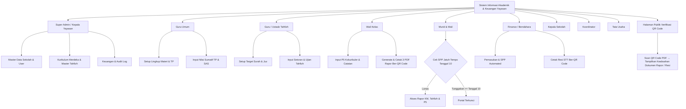

# Perencanaan Sistem Informasi Akademik (Kurikulum Merdeka & Tahfizh) & Keuangan Yayasan

Dokumen ini merangkum seluruh kebutuhan sistem informasi akademik dan keuangan yayasan yang telah diselaraskan dengan **Spesifikasi Sistem Rapor Digital Kurikulum Merdeka** (`SPESIFIKASI_SISTEM_RAPOR_DIGITAL.md`) serta **Model Pembelajaran & Evaluasi Khusus Tahfizh**. Dokumen ini menjadi acuan tunggal untuk arsitektur informasi, alur bisnis, desain database (ERD), spesifikasi cetak rapor, dan roadmap pengembangan.

---

## 1. Ringkasan Kebutuhan & Aturan Bisnis

### 1.1 Peran Pengguna (Role Aktor)

| Role | Hak Akses & Kebutuhan Utama |
|---|---|
| **Super Admin / Kepala Yayasan** | Akses penuh ke seluruh modul, Manajemen Master Data, Pengaturan Sistem, Pengaturan User, dan Audit Log |
| **Guru Umum** | Mengelola Kurikulum Merdeka (Lingkup Materi, TP), Input Nilai Sumatif TP & SAS, Absensi Siswa, dan Pengajuan Koreksi Nilai |
| **Guru / Ustadz Tahfizh** | Mengelola Kurikulum & Target Tahfizh (Surah, Juz, Tajwid), Input Setoran & Nilai Tahfizh, serta Catatan Perkembangan Keagamaan |
| **Wali Kelas** | Input Kehadiran, Catatan Wali Kelas, Nilai Ekskul, Nilai Kokurikuler (P5), serta Finalisasi & Terbitkan Rapor Ber-QR Code |
| **Murid & Wali Murid** | Akses Portal Murid untuk melihat Rapor Umum Kurikulum Merdeka, Rapor Tahfizh, Rapor P5, Absensi, dan Status Tagihan |
| **Finance / Bendahara** | Mengakses modul Keuangan (SPP, Infaq, Pengeluaran, Gaji Guru, Dana BOS) dan menerbitkan Resi Bukti Pembayaran Resmi (STT) Ber-QR Code |
| **Kepala Sekolah** | Memantau Nilai Rapor & Keuangan (*Read-Only*), menyetujui Leger, dan verifikasi/approval keabsahan penerbitan rapor |
| **Koordinator** | Meninjau, menyetujui, atau menolak Pengajuan Koreksi Nilai dari Guru (Umum & Tahfizh) |
| **Tata Usaha (TU)** | Kelola Direktori Karyawan, Jadwal Mengajar, Jadwal Piket Guru, Data Alumni, dan Manajemen Pengesahan Dokumen |

---

### 1.2 Dual Architecture: Kurikulum Merdeka Umum vs Model Tahfizh

Untuk mengakomodasi perbedaan proses belajar mengajar, sistem membagi model akademik menjadi dua jalur utama yang terintegrasi:

#### A. Akademik Umum (Kurikulum Merdeka)
- **Struktur Berjenjang**: `Mata Pelajaran` → `Lingkup Materi` (Bab/Materi Utama) → `Tujuan Pembelajaran (TP)` (Capaian Kompetensi Spesiifk).
- **Penilaian Formatif & Sumatif**:
  - Nilai Sumatif per TP (`nilai_sumatif_tp`): Angka 0–100 untuk setiap TP per siswa.
  - Sumatif Akhir Semester (`nilai_sas`): Nilai ujian akhir semester per mapel.
- **Kalkulasi Nilai Akhir Mapel**:
  $$\text{Rata-rata Lingkup Materi}_i = \text{AVERAGE}(\text{Nilai Sumatif TP dalam Lingkup Materi}_i)$$
  $$\text{Nilai Rapor Mapel} = \text{AVERAGE}(\text{Semua Rata-rata Lingkup Materi yang Terisi}, \text{Nilai SAS})$$
- **Mesin Auto-Narasi Deskripsi Capaian**:
  - Sistem secara otomatis mengidentifikasi TP dengan nilai **tertinggi** dan **terendah** milik siswa dalam satu mapel.
  - Menggabungkan `template_deskripsi` mapel (`frasa_tertinggi` dan `frasa_terendah`) dengan deskripsi TP terkait.
  - *Aturan Seri (Tie-Breaker)*: Jika terdapat beberapa TP dengan nilai tertinggi/terendah yang sama, TP dengan urutan paling awal (`urutan ASC`) yang dipilih secara otomatis agar hasilnya konsisten dan terdeterminasi.
  - *Opsi Override Guru*: Guru Mapel dapat meninjau dan mengedit teks deskripsi hasil auto-generate sebelum finalisasi.
- **Kokurikuler / Projek Penguatan Profil Pelajar Pancasila (P5)**:
  - Penilaian terpisah dari akademik, mencakup 7 (atau 8) Dimensi P5 dan Sub-dimensi.
  - 3 Jalur Proyek: `lintas_disiplin_ilmu`, `tujuh_kebiasaan_anak_indonesia_hebat`, `cara_lain`.
  - Evaluasi kualitatif (skala 1–4) di 5 Titik Sumatif per sub-dimensi + Auto-narasi P5.

#### B. Akademik Khusus Tahfizh
- **Struktur Kurikulum Tahfizh**: Terpisah dari Kurikulum Merdeka Umum! Menggunakan kategori materi Hafalan Surah/Juz, Target Ayat, Makhraj & Tajwid, serta Adab/Keagamaan.
- **Pengampu & Kelas Tahfizh**: Dikelola oleh Guru/Ustadz Tahfizh di Kelas Tahfizh tersendiri (bisa sama atau terpisah dari rombel umum).
- **Penilaian & Mutabaah**: Pencatatan riwayat setoran harian/mingguan, ujian kelancaran hafalan, dan predikat keagamaan.
- **Output Terpisah**: Menghasilkan **Rapor Tahfizh** khusus yang menyajikan detail hafalan surah/juz, nilai tajwid, serta catatan perkembangan spiritual anak.

---

### 1.3 Aturan Bisnis Kunci

1. **Perwalian & Dual Role Guru**:
   - Satu Kelas Umum didampingi Wali Kelas (Guru Umum). Kelas Tahfizh didampingi Ustadz Pembimbing Tahfizh.
   - Jika seorang guru mengajar mata pelajaran umum sekaligus tahfizh (*dual role*), penugasannya dicatat terpisah pada `guru_mapel_kelas` sesuai jenis mapelnya.
2. **Penguncian (Lock) Rapor & Portal SPP Tanggal 10**:
   - Tagihan SPP bulanan otomatis di-generate setiap tanggal 1 bulan berjalan via scheduled job idempotent (`app:generate-monthly-spp`).
   - Mulai **tanggal 10** bulan berjalan (atau jika terdapat tagihan *blocking* yang sudah melewati jatuh tempo `jatuh_tempo <= CURRENT_DATE`), portal nilai & rapor murid (baik Rapor Umum maupun Rapor Tahfizh) otomatis **terkunci (*lock*)**.
   - Pada tanggal 1–9 bulan berjalan, tagihan bulan berjalan belum mengunci portal jika tidak ada tunggakan bulan sebelumnya.
3. **Validasi Keabsahan Dokumen Berbasis QR Code (Tanpa Tanda Tangan Basah/Manual)**:
   - **Seluruh dokumen PDF resmi** (Rapor Akademik KM, Rapor Tahfizh, Rapor P5, dan Resi Pembayaran STT) **tidak lagi menggunakan tanda tangan fisik/basah maupun tanda tangan manual/gambar**.
   - Sebagai gantinya, setiap dokumen PDF dilengkapi dengan **Blok QR Code Keabsahan Dokumen**.
   - Setiap dokumen yang diterbitkan memiliki `qr_code_hash` / UUID unik di database.
   - Saat QR Code di-scan (atau mengklik link verifikasi), browser akan mengarah ke URL publik resmi: `https://sekolah.sch.id/verifikasi/dokumen/{uuid}` yang menampilkan halaman validasi keabsahan dokumen:
     - Nama Siswa, NIS/NISN, Kelas, & Tahun Ajaran
     - Jenis Dokumen & Tanggal Pengesahan/Penerbitan
     - Status Keabsahan: **"DOKUMEN RESMI SAH & TERVERIFIKASI SISTEM"**
     - Nama Pejabat Pengesah (Kepala Sekolah / Wali Kelas / Bendahara Finance) beserta NIP/ID tanpa perlu tanda tangan basah.
4. **Alur Koreksi Nilai & Auto-Recalculate**:
   - Perubahan nilai yang sudah disubmit wajib melalui Pengajuan Koreksi Nilai (`pengajuan_koreksi_nilai`) ke **Koordinator**.
   - Persetujuan Koordinator secara otomatis memicu fungsi *re-calculate* snapshot `rapor_detail` dan auto-narasi deskripsi rapor untuk semester terkait.
5. **Jadwal Mengajar & Absensi Guru (Jam Masuk Dinamis)**:
   - Absensi Guru berbasis self check-in manual tanpa fingerprint.
   - **Guru Tahfizh**: Hari biasa masuk **06:45**. Hari piket (jadwal diatur TU) masuk **06:30**.
   - **Guru Umum**: Selalu masuk **09:30** dan tidak mendapatkan tugas piket.

---

## 2. Arsitektur Informasi (Sitemap per Role)



---

## 3. Flowchart Proses Bisnis & Verifikasi QR Code

### 3.1 Flowchart Verifikasi Keabsahan Dokumen via QR Code

```mermaid
flowchart TD
    A[Pihak Luar / Ortu Scan QR Code di PDF Rapor / Resi] --> B[Browser Membuka URL: /verifikasi/dokumen/{uuid}]
    B --> C{UUID Ditemukan & Valid?}
    C -- Tidak --> D[Tampilkan Peringatan: Dokumen Tidak Dikenali / Palsu]
    C -- Ya --> E[Tampilkan Halaman Validasi Resmi Sekolah]
    E --> F[Detail: Nama Murid, Jenis Dokumen, Tanggal Terbit, Status SAH, & Pejabat Pengesah]
```

---

## 4. Desain Database (ERD Lengkap)

### 4.1 Detail Struktur Tabel Database

#### Grup A — Master Data & User
- **`sekolah`**: `id`, `nama_sekolah`, `npsn`, `nss`, `alamat`, `kode_pos`, `desa_kelurahan`, `kecamatan`, `kabupaten_kota`, `provinsi`, `website`, `email`, `nama_kepala_sekolah`, `nip_kepala_sekolah`, `tempat_tanggal_rapor`.
- **`users`**: `id`, `nama`, `username`, `email`, `password`, `role_id`, `no_hp`, `alamat`, `status`, `deleted_at`.
- **`guru`**: `id`, `user_id`, `nip`, `jenis_guru` ENUM('umum', 'tahfidz', 'keduanya'), `tanggal_masuk`, `status_aktif`, `deleted_at`.
- **`siswa`**: `id`, `user_id`, `nis`, `nisn` (UNIQUE), `jenis_kelamin`, `tempat_lahir`, `tanggal_lahir`, `agama`, `pendidikan_sebelumnya`, `alamat`, `tinggi_badan`, `berat_badan`, `kondisi_pendengaran`, `kondisi_penglihatan`, `kondisi_gigi`, `kelas_id`, `tanggal_masuk`, `status` ENUM('aktif', 'lulus', 'pindah', 'keluar'), `tahun_lulus`, `catatan_alumni`, `deleted_at`.
- **`wali_siswa`**: `id`, `siswa_id`, `tipe` ENUM('ayah', 'ibu', 'wali'), `nama`, `pekerjaan`, `alamat`, `no_telepon`.
- **`tahun_ajaran`**: `id`, `nama`, `status_aktif`.
- **`semester`**: `id`, `tahun_ajaran_id`, `semester` ENUM('ganjil', 'genap'), `tanggal_mulai`, `tanggal_selesai`, `status_aktif`.
- **`kelas`**: `id`, `nama_kelas`, `tingkat`, `semester_id`, `guru_umum_id`, `guru_tahfidz_id`, `jenis_kelas` ENUM('umum', 'tahfidz', 'kombinasi'), `deleted_at`.
- **`siswa_kelas`**: `id`, `siswa_id`, `kelas_id`, `semester_id`, `status` ENUM('aktif', 'pindah', 'naik_kelas', 'tinggal_kelas').
- **`mata_pelajaran`**: `id`, `nama_mapel`, `jenis` ENUM('intrakurikuler_umum', 'tahfidz', 'ekstrakurikuler'), `urutan`, `kkm` DECIMAL(5,2) DEFAULT 70.00.

#### Grup B — Master & Penilaian Kurikulum Merdeka (dengan Hash QR Code)
- **`lingkup_materi`**: `id`, `mapel_id`, `nama_lingkup_materi`, `kategori`, `urutan` (1..10).
- **`tujuan_pembelajaran`**: `id`, `lingkup_materi_id`, `deskripsi_tp`, `urutan` (1..5).
- **`template_deskripsi`**: `id`, `mapel_id`, `frasa_tertinggi`, `frasa_terendah`.
- **`nilai_sumatif_tp`**: `id`, `siswa_id`, `tp_id`, `semester_id`, `nilai` NUMERIC(5,2). UNIQUE(siswa_id, tp_id, semester_id).
- **`nilai_sas`**: `id`, `siswa_id`, `mapel_id`, `semester_id`, `nilai` NUMERIC(5,2). UNIQUE(siswa_id, mapel_id, semester_id).
- **`rapor`**: `id`, `siswa_id`, `semester_id`, `kelas_id`, `catatan_wali_kelas`, `tanggal_terbit`, `qr_code_hash` VARCHAR(64) UNIQUE, `status_terbit` BOOLEAN DEFAULT true. UNIQUE(siswa_id, semester_id).
- **`rapor_detail`**: `id`, `rapor_id`, `mapel_id`, `nilai_akhir`, `predikat`, `deskripsi_tertinggi`, `deskripsi_terendah`, `narasi_capaian_full`. UNIQUE(rapor_id, mapel_id).

#### Grup C — Master & Penilaian Tahfizh
- **`target_hafalan_tahfidz`**: `id`, `semester_id`, `tingkat`, `nama_surah`, `juz`, `target_ayat`.
- **`nilai_tahfidz`**: `id`, `siswa_id`, `semester_id`, `surah`, `juz`, `nilai_kelancaran`, `nilai_tajwid`, `predikat_keagamaan`, `catatan_ustadz`.
- **`rapor_tahfidz_detail`**: `id`, `rapor_id`, `total_juz_dihafal`, `daftar_surah_lulus`, `nilai_tajwid_rata`, `predikat_tahfidz`, `catatan_khusus`.

#### Grup D — Kokurikuler P5 (Profil Pelajar Pancasila)
- **`dimensi_p5`**: `id`, `nama_dimensi`, `urutan`.
- **`subdimensi_p5`**: `id`, `dimensi_id`, `nama_subdimensi`, `urutan`.
- **`proyek_p5`**: `id`, `nama_proyek` ENUM('lintas_disiplin', '7kaih', 'cara_lain').
- **`nilai_p5`**: `id`, `siswa_id`, `proyek_id`, `subdimensi_p5_id`, `titik_sumatif` (1..5), `nilai` (skala 1..4), `semester_id`.

#### Grup E — Keuangan, Payroll & Sistem (dengan Hash QR Code Resi)
- **`jenis_tagihan`**: `id`, `nama`, `kategori`, `default_nominal`, `is_blocking` BOOLEAN DEFAULT true.
- **`tagihan`**: `id`, `siswa_id`, `jenis_tagihan_id`, `tahun_ajaran_id`, `bulan`, `nominal`, `total_dibayar`, `status` ENUM('belum_bayar', 'sebagian', 'lunas', 'batal'), `jatuh_tempo`, `deleted_at`.
- **`pembayaran`**: `id`, `tagihan_id`, `no_resi` VARCHAR UNIQUE, `qr_code_hash` VARCHAR(64) UNIQUE, `tanggal_bayar`, `nominal_dibayar`, `kelebihan_bayar`, `metode_bayar`, `petugas_id`, `is_void` BOOLEAN DEFAULT false, `deleted_at`.
- **`pengeluaran`**, **`gaji_guru`**, **`peminjaman`**, **`dana_bos`**, **`audit_log`**, **`notifikasi`**, **`pengajuan_koreksi_nilai`**.

---

## 5. Spesifikasi Format Cetak PDF Rapor Digital & Resi (Ber-QR Code)

### 5.1 Format Cetak PDF Rapor Digital (3 Komponen Dokumen)

Setiap dokumen PDF resmi berformat A4 Potret **tidak menggunakan tanda tangan basah/manual**, melainkan digantikan oleh **Blok Pengesahan QR Code Keabsahan Dokumen**:

1. **Komponen 1: Sampul Rapor (Cover)**
   - Logo Yayasan/Sekolah, Kop Resmi, Identitas Siswa (Nama, NIS, NISN), Kelas, Semester, dan Tahun Ajaran.
2. **Komponen 2: Isi Rapor Akademik (Kurikulum Merdeka & Lembar Tahfizh)**
   - **Lembar Kurikulum Merdeka**: Tabel Nilai Akhir Mapel Intrakurikuler, Predikat, dan Kolom Deskripsi Auto-Narasi Capaian (Tertinggi & Terendah). Dilengkapi tabel Nilai Ekskul, Kehadiran (Sakit/Izin/Alfa), dan Catatan Wali Kelas.
   - **Lembar Tahfizh**: Tabel khusus capaian hafalan (Surah/Juz), evaluasi Tajwid/Makhraj, Predikat Keagamaan, dan Catatan Ustadz Tahfizh.
   - **Blok QR Code Keabsahan Dokumen** (di bagian kaki halaman):
     - Barcode QR Code (Auto-generated mengarah ke URL Verifikasi Dokumen).
     - Teks: *"Dokumen ini diterbitkan resmi secara digital dan sah tanpa tanda tangan basah. Scan QR Code di atas untuk memverifikasi keabsahan dokumen di portal resmi sekolah."*
     - Hash Seri Unik Dokumen (contoh: `DOC-KM-2026-8F92A1`).
     - Nama & NIP/ID Wali Kelas serta Kepala Sekolah.
3. **Komponen 3: Rapor Kokurikuler P5**
   - Halaman khusus rekapitulasi Projek Penguatan Profil Pelajar Pancasila per 7/8 Dimensi dan Sub-dimensi, grafik/skala kualitatif, narasi perkembangan karakter siswa, serta **Blok QR Code Keabsahan Dokumen**.

---

## 6. Tech Stack & Roadmap Pengembangan

- **Tech Stack**:
  - **Backend**: Laravel 13 + Livewire
  - **QR Code Engine**: `simplesoftwareio/simple-qrcode` (pembentukan QR Code otomatis pada PDF & Resi)
  - **PDF Export**: `barryvdh/laravel-dompdf` atau `spatie/laravel-pdf`
  - **Public Route Verifikasi**: `/verifikasi/dokumen/{uuid}`
- **Fase 1 — MVP**:
  - Master Data, Kurikulum Merdeka (TP + SAS + Auto-Narasi), Kurikulum Tahfizh, Modul P5, SPP Automated + Lock Tanggal 10, serta **Generator 3 PDF Rapor Ber-QR Code**.
- **Fase 2 — Perluasan**: Payroll Gaji Guru, Module Dana BOS, Integrasi Notifikasi WA/Email, dan **Resi STT Keuangan Ber-QR Code**.

---

## 7. Peninjauan Ulang & Audit Hasil Penyesuaian (Review Matrix)

| Area / Topik | Spesifikasi Rapor Excel (`SPESIFIKASI_SISTEM_RAPOR_DIGITAL.md`) | Penyesuaian di Perencanaan Ini | Status Review |
|---|---|---|---|
| **Keabsahan Dokumen** | Menggunakan kolom tanda tangan manual | **Diperbarui**: Menggunakan **QR Code Verification URL** di semua PDF Rapor & Resi (tanpa ttd basah) | ✅ 100% Fit |
| **Struktur Kurikulum** | Mapel → Lingkup Materi (maks 10) → TP (maks 5) | Diadopsi penuh di Master KM (fleksibel/dinamis di DB) | ✅ 100% Fit |
| **Model Evaluasi** | Nilai Sumatif TP + Nilai SAS | Disimpan long-format di `nilai_sumatif_tp` & `nilai_sas` | ✅ 100% Fit |
| **Auto-Narasi** | `LARGE`/`SMALL` + `frasa_tertinggi/terendah` + nama panggilan | Mesin Auto-Narasi DB/Code + Tie-breaker order rules | ✅ 100% Fit |
| **Kokurikuler P5** | 7 Dimensi × 3 Proyek × 5 Titik Sumatif (Kualitatif) | Disimpan di `dimensi_p5`, `proyek_p5`, `nilai_p5` + Rapor P5 PDF Ber-QR Code | ✅ 100% Fit |
| **Model Tahfizh** | Tidak diatur detail di Excel KM standar | Dipisahkan menjadi **Model Khusus Tahfizh** (Guru, Kelas & Rapor Tahfizh terpisah) | ✅ 100% Fit |
| **Keuangan & Lock** | Tidak ada di Excel | SPP Otomatis Tgl 1 + Lock Rapor Tgl 10 terintegrasi ke Rapor KM & Tahfizh | ✅ 100% Fit |
